# [📈 Live Status](https://upptime.noplagi.xyz): <!--live status--> **🟧 Partial outage**

This repository contains the open-source uptime monitor and status page for [NoPlagiarism](https://upptime.noplagi.xyz), powered by [Upptime](https://github.com/upptime/upptime).

With [Upptime](https://upptime.js.org), you can get your own unlimited and free uptime monitor and status page, powered entirely by a GitHub repository. We use [Issues](https://github.com/NoPlagiarism/services-personal-upptime/issues) as incident reports, [Actions](https://github.com/NoPlagiarism/services-personal-upptime/actions) as uptime monitors, and [Pages](https://upptime.noplagi.xyz) for the status page.

<!--start: status pages-->
<!-- This summary is generated by Upptime (https://github.com/upptime/upptime) -->
<!-- Do not edit this manually, your changes will be overwritten -->
<!-- prettier-ignore -->
| URL | Status | History | Response Time | Uptime |
| --- | ------ | ------- | ------------- | ------ |
|  [ProxiTok cringe.seitan-ayoub.lol](https://cringe.seitan-ayoub.lol) | 🟥 Down | [proxi-tok-cringe-seitan-ayoub-lol.yml](https://github.com/NoPlagiarism/services-personal-upptime/commits/HEAD/history/proxi-tok-cringe-seitan-ayoub-lol.yml) | 

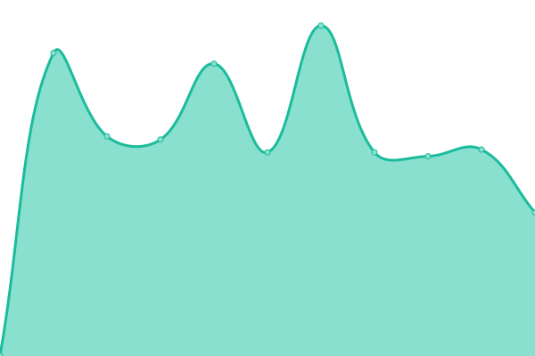 0ms
     
 | 

<a href="https://upptime.noplagi.xyz/history/proxi-tok-cringe-seitan-ayoub-lol">0.00%</a>
    

|  [ProxiTok cringe.whatever.social](https://cringe.whatever.social) | 🟩 Up | [proxi-tok-cringe-whatever-social.yml](https://github.com/NoPlagiarism/services-personal-upptime/commits/HEAD/history/proxi-tok-cringe-whatever-social.yml) | 

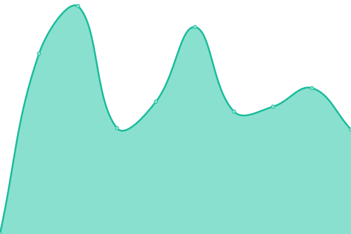 920ms
     
 | 

<a href="https://upptime.noplagi.xyz/history/proxi-tok-cringe-whatever-social">100.00%</a>
    

|  [ProxiTok proxitok.belloworld.it](https://proxitok.belloworld.it) | 🟩 Up | [proxi-tok-proxitok-belloworld-it.yml](https://github.com/NoPlagiarism/services-personal-upptime/commits/HEAD/history/proxi-tok-proxitok-belloworld-it.yml) | 

 3696ms
     
 | 

<a href="https://upptime.noplagi.xyz/history/proxi-tok-proxitok-belloworld-it">99.56%</a>
    

|  [ProxiTok proxitok.lunar.icu](https://proxitok.lunar.icu) | 🟩 Up | [proxi-tok-proxitok-lunar-icu.yml](https://github.com/NoPlagiarism/services-personal-upptime/commits/HEAD/history/proxi-tok-proxitok-lunar-icu.yml) | 

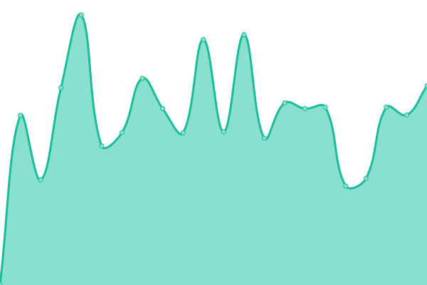 543ms
     
 | 

<a href="https://upptime.noplagi.xyz/history/proxi-tok-proxitok-lunar-icu">100.00%</a>
    

|  [ProxiTok proxitok.pabloferreiro.es](https://proxitok.pabloferreiro.es) | 🟥 Down | [proxi-tok-proxitok-pabloferreiro-es.yml](https://github.com/NoPlagiarism/services-personal-upptime/commits/HEAD/history/proxi-tok-proxitok-pabloferreiro-es.yml) | 

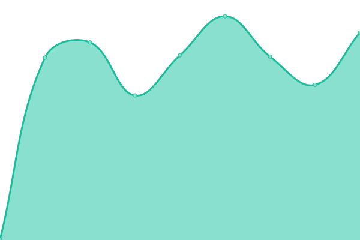 975ms
     
 | 

<a href="https://upptime.noplagi.xyz/history/proxi-tok-proxitok-pabloferreiro-es">0.00%</a>
    

|  [ProxiTok proxitok.privacy.com.de](https://proxitok.privacy.com.de) | 🟥 Down | [proxi-tok-proxitok-privacy-com-de.yml](https://github.com/NoPlagiarism/services-personal-upptime/commits/HEAD/history/proxi-tok-proxitok-privacy-com-de.yml) | 

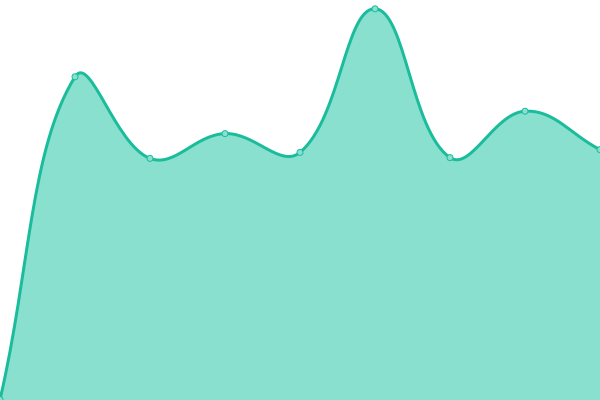 808ms
     
 | 

<a href="https://upptime.noplagi.xyz/history/proxi-tok-proxitok-privacy-com-de">0.00%</a>
    

|  [ProxiTok proxitok.privacydev.net](https://proxitok.privacydev.net) | 🟩 Up | [proxi-tok-proxitok-privacydev-net.yml](https://github.com/NoPlagiarism/services-personal-upptime/commits/HEAD/history/proxi-tok-proxitok-privacydev-net.yml) | 

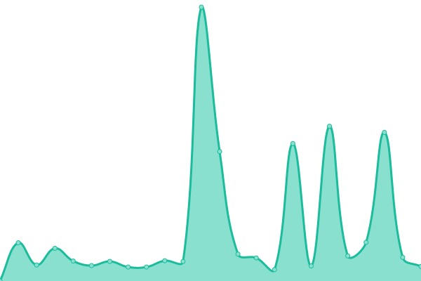 711ms
     
 | 

<a href="https://upptime.noplagi.xyz/history/proxi-tok-proxitok-privacydev-net">100.00%</a>
    

|  [ProxiTok proxitok.pussthecat.org](https://proxitok.pussthecat.org) | 🟩 Up | [proxi-tok-proxitok-pussthecat-org.yml](https://github.com/NoPlagiarism/services-personal-upptime/commits/HEAD/history/proxi-tok-proxitok-pussthecat-org.yml) | 

 659ms
     
 | 

<a href="https://upptime.noplagi.xyz/history/proxi-tok-proxitok-pussthecat-org">100.00%</a>
    

|  [ProxiTok proxitok.r4fo.com](https://proxitok.r4fo.com) | 🟩 Up | [proxi-tok-proxitok-r4fo-com.yml](https://github.com/NoPlagiarism/services-personal-upptime/commits/HEAD/history/proxi-tok-proxitok-r4fo-com.yml) | 

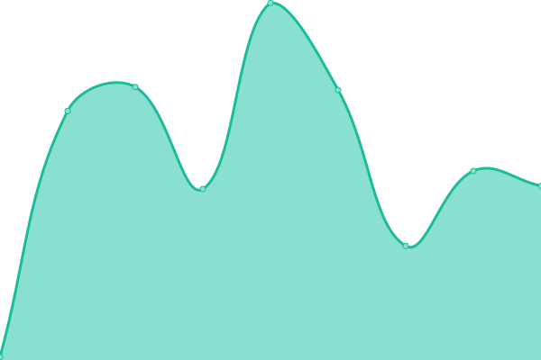 699ms
     
 | 

<a href="https://upptime.noplagi.xyz/history/proxi-tok-proxitok-r4fo-com">83.07%</a>
    

|  [ProxiTok tiktok.wpme.pl](https://tiktok.wpme.pl) | 🟩 Up | [proxi-tok-tiktok-wpme-pl.yml](https://github.com/NoPlagiarism/services-personal-upptime/commits/HEAD/history/proxi-tok-tiktok-wpme-pl.yml) | 

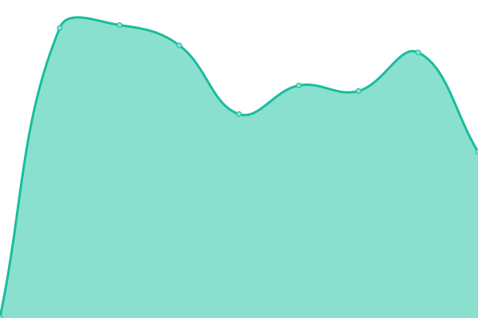 770ms
     
 | 

<a href="https://upptime.noplagi.xyz/history/proxi-tok-tiktok-wpme-pl">100.00%</a>
    

|  [ProxiTok tok.adminforge.de](https://tok.adminforge.de) | 🟩 Up | [proxi-tok-tok-adminforge-de.yml](https://github.com/NoPlagiarism/services-personal-upptime/commits/HEAD/history/proxi-tok-tok-adminforge-de.yml) | 

 603ms
     
 | 

<a href="https://upptime.noplagi.xyz/history/proxi-tok-tok-adminforge-de">100.00%</a>
    

|  [ProxiTok tok.artemislena.eu](https://tok.artemislena.eu) | 🟩 Up | [proxi-tok-tok-artemislena-eu.yml](https://github.com/NoPlagiarism/services-personal-upptime/commits/HEAD/history/proxi-tok-tok-artemislena-eu.yml) | 

 689ms
     
 | 

<a href="https://upptime.noplagi.xyz/history/proxi-tok-tok-artemislena-eu">100.00%</a>
    

|  [ProxiTok tok.habedieeh.re](https://tok.habedieeh.re) | 🟩 Up | [proxi-tok-tok-habedieeh-re.yml](https://github.com/NoPlagiarism/services-personal-upptime/commits/HEAD/history/proxi-tok-tok-habedieeh-re.yml) | 

 354ms
     
 | 

<a href="https://upptime.noplagi.xyz/history/proxi-tok-tok-habedieeh-re">100.00%</a>
    

|  [ProxiTok tt.opnxng.com](https://tt.opnxng.com) | 🟩 Up | [proxi-tok-tt-opnxng-com.yml](https://github.com/NoPlagiarism/services-personal-upptime/commits/HEAD/history/proxi-tok-tt-opnxng-com.yml) | 

 1253ms
     
 | 

<a href="https://upptime.noplagi.xyz/history/proxi-tok-tt-opnxng-com">100.00%</a>
    

|  [GotHub g.opnxng.com](https://g.opnxng.com) | 🟩 Up | [got-hub-g-opnxng-com.yml](https://github.com/NoPlagiarism/services-personal-upptime/commits/HEAD/history/got-hub-g-opnxng-com.yml) | 

 608ms
     
 | 

<a href="https://upptime.noplagi.xyz/history/got-hub-g-opnxng-com">100.00%</a>
    

|  [GotHub gh.owo.si](https://gh.owo.si) | 🟩 Up | [got-hub-gh-owo-si.yml](https://github.com/NoPlagiarism/services-personal-upptime/commits/HEAD/history/got-hub-gh-owo-si.yml) | 

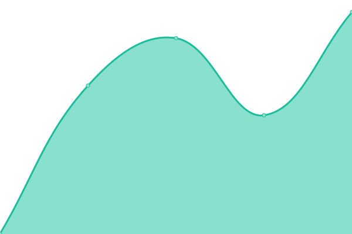 903ms
     
 | 

<a href="https://upptime.noplagi.xyz/history/got-hub-gh-owo-si">100.00%</a>
    

|  [GotHub gh.phreedom.club](https://gh.phreedom.club) | 🟩 Up | [got-hub-gh-phreedom-club.yml](https://github.com/NoPlagiarism/services-personal-upptime/commits/HEAD/history/got-hub-gh-phreedom-club.yml) | 

 1436ms
     
 | 

<a href="https://upptime.noplagi.xyz/history/got-hub-gh-phreedom-club">100.00%</a>
    

|  [GotHub gothub.dev.projectsegfau.lt](https://gothub.dev.projectsegfau.lt) | 🟩 Up | [got-hub-gothub-dev-projectsegfau-lt.yml](https://github.com/NoPlagiarism/services-personal-upptime/commits/HEAD/history/got-hub-gothub-dev-projectsegfau-lt.yml) | 

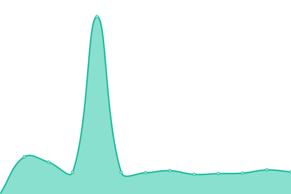 1647ms
     
 | 

<a href="https://upptime.noplagi.xyz/history/got-hub-gothub-dev-projectsegfau-lt">100.00%</a>
    

|  [GotHub gothub.ducks.party](https://gothub.ducks.party) | 🟩 Up | [got-hub-gothub-ducks-party.yml](https://github.com/NoPlagiarism/services-personal-upptime/commits/HEAD/history/got-hub-gothub-ducks-party.yml) | 

 682ms
     
 | 

<a href="https://upptime.noplagi.xyz/history/got-hub-gothub-ducks-party">100.00%</a>
    

|  [GotHub gothub.lunar.icu](https://gothub.lunar.icu) | 🟩 Up | [got-hub-gothub-lunar-icu.yml](https://github.com/NoPlagiarism/services-personal-upptime/commits/HEAD/history/got-hub-gothub-lunar-icu.yml) | 

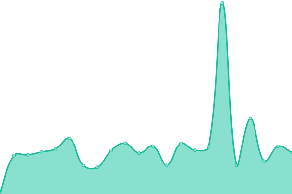 510ms
     
 | 

<a href="https://upptime.noplagi.xyz/history/got-hub-gothub-lunar-icu">100.00%</a>
    

|  [GotHub gothub.projectsegfau.lt](https://gothub.projectsegfau.lt) | 🟩 Up | [got-hub-gothub-projectsegfau-lt.yml](https://github.com/NoPlagiarism/services-personal-upptime/commits/HEAD/history/got-hub-gothub-projectsegfau-lt.yml) | 

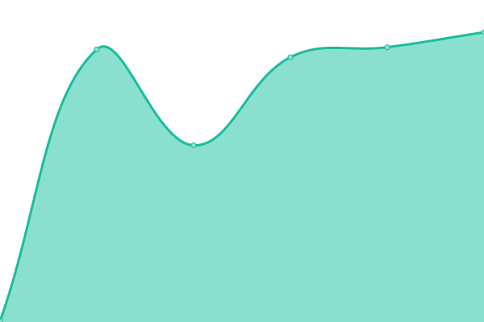 813ms
     
 | 

<a href="https://upptime.noplagi.xyz/history/got-hub-gothub-projectsegfau-lt">100.00%</a>
    

|  [GotHub gothub.r4fo.com](https://gothub.r4fo.com) | 🟩 Up | [got-hub-gothub-r4fo-com.yml](https://github.com/NoPlagiarism/services-personal-upptime/commits/HEAD/history/got-hub-gothub-r4fo-com.yml) | 

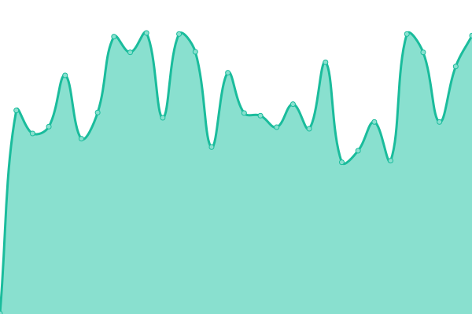 416ms
     
 | 

<a href="https://upptime.noplagi.xyz/history/got-hub-gothub-r4fo-com">83.82%</a>
    

|  [WikiLess wiki.adminforge.de](https://wiki.adminforge.de) | 🟩 Up | [wiki-less-wiki-adminforge-de.yml](https://github.com/NoPlagiarism/services-personal-upptime/commits/HEAD/history/wiki-less-wiki-adminforge-de.yml) | 

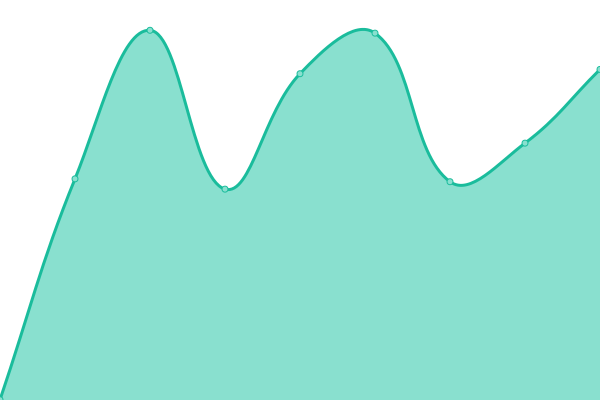 928ms
     
 | 

<a href="https://upptime.noplagi.xyz/history/wiki-less-wiki-adminforge-de">100.00%</a>
    

|  [WikiLess wiki.froth.zone](https://wiki.froth.zone) | 🟩 Up | [wiki-less-wiki-froth-zone.yml](https://github.com/NoPlagiarism/services-personal-upptime/commits/HEAD/history/wiki-less-wiki-froth-zone.yml) | 

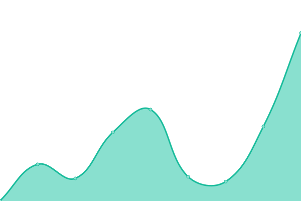 453ms
     
 | 

<a href="https://upptime.noplagi.xyz/history/wiki-less-wiki-froth-zone">100.00%</a>
    

|  [WikiLess wiki.phreedom.club](https://wiki.phreedom.club) | 🟩 Up | [wiki-less-wiki-phreedom-club.yml](https://github.com/NoPlagiarism/services-personal-upptime/commits/HEAD/history/wiki-less-wiki-phreedom-club.yml) | 

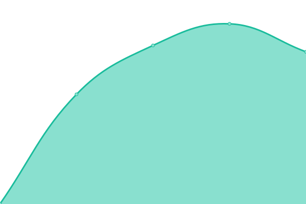 1266ms
     
 | 

<a href="https://upptime.noplagi.xyz/history/wiki-less-wiki-phreedom-club">100.00%</a>
    

|  [WikiLess wikiless.funami.tech](https://wikiless.funami.tech) | 🟩 Up | [wiki-less-wikiless-funami-tech.yml](https://github.com/NoPlagiarism/services-personal-upptime/commits/HEAD/history/wiki-less-wikiless-funami-tech.yml) | 

 876ms
     
 | 

<a href="https://upptime.noplagi.xyz/history/wiki-less-wikiless-funami-tech">100.00%</a>
    

|  [WikiLess wikiless.northboot.xyz](https://wikiless.northboot.xyz) | 🟩 Up | [wiki-less-wikiless-northboot-xyz.yml](https://github.com/NoPlagiarism/services-personal-upptime/commits/HEAD/history/wiki-less-wikiless-northboot-xyz.yml) | 

 1124ms
     
 | 

<a href="https://upptime.noplagi.xyz/history/wiki-less-wikiless-northboot-xyz">100.00%</a>
    

|  [WikiLess wikiless.org](https://wikiless.org) | 🟥 Down | [wiki-less-wikiless-org.yml](https://github.com/NoPlagiarism/services-personal-upptime/commits/HEAD/history/wiki-less-wikiless-org.yml) | 

 0ms
     
 | 

<a href="https://upptime.noplagi.xyz/history/wiki-less-wikiless-org">0.00%</a>
    

|  [WikiLess wikiless.rawbit.ninja](https://wikiless.rawbit.ninja) | 🟩 Up | [wiki-less-wikiless-rawbit-ninja.yml](https://github.com/NoPlagiarism/services-personal-upptime/commits/HEAD/history/wiki-less-wikiless-rawbit-ninja.yml) | 

 405ms
     
 | 

<a href="https://upptime.noplagi.xyz/history/wiki-less-wikiless-rawbit-ninja">100.00%</a>
    

|  [WikiLess wikiless.tiekoetter.com](https://wikiless.tiekoetter.com) | 🟩 Up | [wiki-less-wikiless-tiekoetter-com.yml](https://github.com/NoPlagiarism/services-personal-upptime/commits/HEAD/history/wiki-less-wikiless-tiekoetter-com.yml) | 

 1111ms
     
 | 

<a href="https://upptime.noplagi.xyz/history/wiki-less-wikiless-tiekoetter-com">99.81%</a>
    

|  [WikiLess wl.vern.cc](https://wl.vern.cc) | 🟩 Up | [wiki-less-wl-vern-cc.yml](https://github.com/NoPlagiarism/services-personal-upptime/commits/HEAD/history/wiki-less-wl-vern-cc.yml) | 

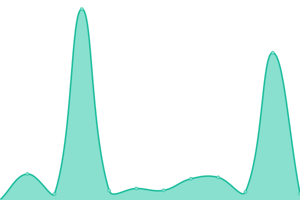 448ms
     
 | 

<a href="https://upptime.noplagi.xyz/history/wiki-less-wl-vern-cc">93.93%</a>
    

|  [librarian (discontinued) lbry.mywire.org](https://lbry.mywire.org) | 🟩 Up | [librarian-discontinued-lbry-mywire-org.yml](https://github.com/NoPlagiarism/services-personal-upptime/commits/HEAD/history/librarian-discontinued-lbry-mywire-org.yml) | 

 980ms
     
 | 

<a href="https://upptime.noplagi.xyz/history/librarian-discontinued-lbry-mywire-org">100.00%</a>
    

|  [librarian (discontinued) lbry.ooguy.com](https://lbry.ooguy.com) | 🟩 Up | [librarian-discontinued-lbry-ooguy-com.yml](https://github.com/NoPlagiarism/services-personal-upptime/commits/HEAD/history/librarian-discontinued-lbry-ooguy-com.yml) | 

 569ms
     
 | 

<a href="https://upptime.noplagi.xyz/history/librarian-discontinued-lbry-ooguy-com">100.00%</a>
    

|  [librarian (discontinued) lbry.projectsegfau.lt](https://lbry.projectsegfau.lt) | 🟩 Up | [librarian-discontinued-lbry-projectsegfau-lt.yml](https://github.com/NoPlagiarism/services-personal-upptime/commits/HEAD/history/librarian-discontinued-lbry-projectsegfau-lt.yml) | 

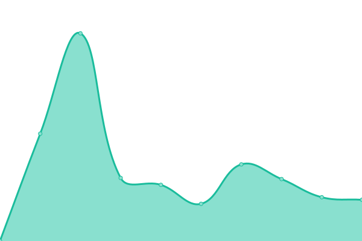 548ms
     
 | 

<a href="https://upptime.noplagi.xyz/history/librarian-discontinued-lbry-projectsegfau-lt">100.00%</a>
    

|  [librarian (discontinued) lbry.ramondia.net](https://lbry.ramondia.net) | 🟩 Up | [librarian-discontinued-lbry-ramondia-net.yml](https://github.com/NoPlagiarism/services-personal-upptime/commits/HEAD/history/librarian-discontinued-lbry-ramondia-net.yml) | 

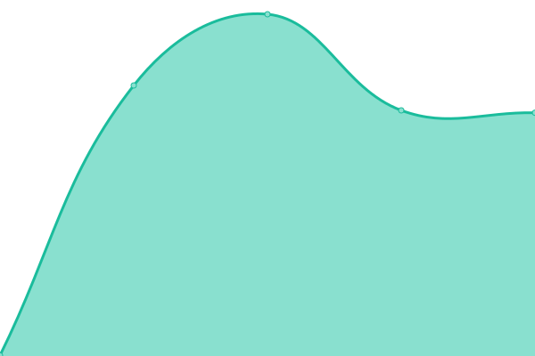 661ms
     
 | 

<a href="https://upptime.noplagi.xyz/history/librarian-discontinued-lbry-ramondia-net">100.00%</a>
    

|  [librarian (discontinued) lbry.slipfox.xyz](https://lbry.slipfox.xyz) | 🟩 Up | [librarian-discontinued-lbry-slipfox-xyz.yml](https://github.com/NoPlagiarism/services-personal-upptime/commits/HEAD/history/librarian-discontinued-lbry-slipfox-xyz.yml) | 

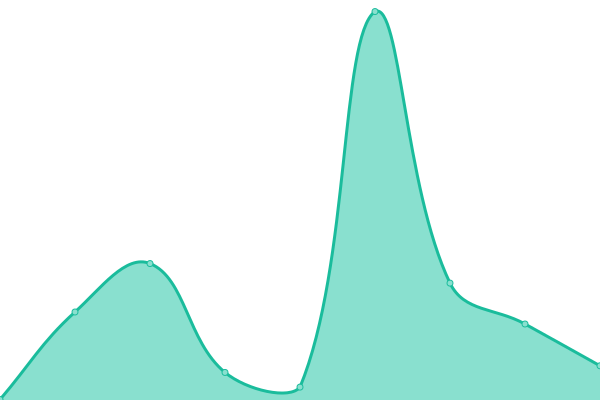 1080ms
     
 | 

<a href="https://upptime.noplagi.xyz/history/librarian-discontinued-lbry-slipfox-xyz">99.75%</a>
    

|  [librarian (discontinued) lbry.vern.cc](https://lbry.vern.cc) | 🟩 Up | [librarian-discontinued-lbry-vern-cc.yml](https://github.com/NoPlagiarism/services-personal-upptime/commits/HEAD/history/librarian-discontinued-lbry-vern-cc.yml) | 

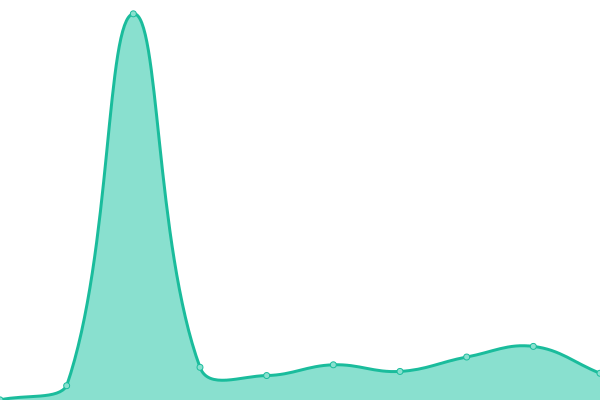 391ms
     
 | 

<a href="https://upptime.noplagi.xyz/history/librarian-discontinued-lbry-vern-cc">97.09%</a>
    

|  [librarian (discontinued) librarian.pussthecat.org](https://librarian.pussthecat.org) | 🟩 Up | [librarian-discontinued-librarian-pussthecat-org.yml](https://github.com/NoPlagiarism/services-personal-upptime/commits/HEAD/history/librarian-discontinued-librarian-pussthecat-org.yml) | 

 814ms
     
 | 

<a href="https://upptime.noplagi.xyz/history/librarian-discontinued-librarian-pussthecat-org">100.00%</a>
    

|  [AnonymousOverflow anonflow.aketawi.space](https://anonflow.aketawi.space) | 🟩 Up | [anonymous-overflow-anonflow-aketawi-space.yml](https://github.com/NoPlagiarism/services-personal-upptime/commits/HEAD/history/anonymous-overflow-anonflow-aketawi-space.yml) | 

 815ms
     
 | 

<a href="https://upptime.noplagi.xyz/history/anonymous-overflow-anonflow-aketawi-space">100.00%</a>
    

|  [AnonymousOverflow anonoverflow.frontendfriendly.xyz](https://anonoverflow.frontendfriendly.xyz) | 🟥 Down | [anonymous-overflow-anonoverflow-frontendfriendly-xyz.yml](https://github.com/NoPlagiarism/services-personal-upptime/commits/HEAD/history/anonymous-overflow-anonoverflow-frontendfriendly-xyz.yml) | 

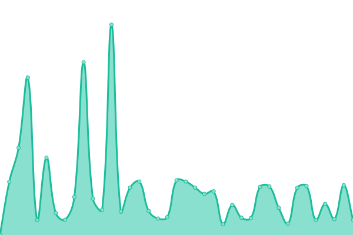 0ms
     
 | 

<a href="https://upptime.noplagi.xyz/history/anonymous-overflow-anonoverflow-frontendfriendly-xyz">100.00%</a>
    

|  [AnonymousOverflow anonoverflow.hyperreal.coffee](https://anonoverflow.hyperreal.coffee) | 🟩 Up | [anonymous-overflow-anonoverflow-hyperreal-coffee.yml](https://github.com/NoPlagiarism/services-personal-upptime/commits/HEAD/history/anonymous-overflow-anonoverflow-hyperreal-coffee.yml) | 

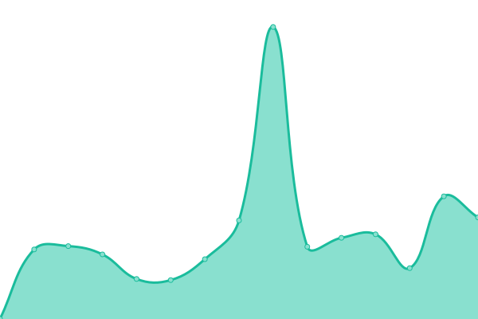 551ms
     
 | 

<a href="https://upptime.noplagi.xyz/history/anonymous-overflow-anonoverflow-hyperreal-coffee">100.00%</a>
    

|  [AnonymousOverflow anonymousoverflow.catsarch.com](https://anonymousoverflow.catsarch.com) | 🟩 Up | [anonymous-overflow-anonymousoverflow-catsarch-com.yml](https://github.com/NoPlagiarism/services-personal-upptime/commits/HEAD/history/anonymous-overflow-anonymousoverflow-catsarch-com.yml) | 

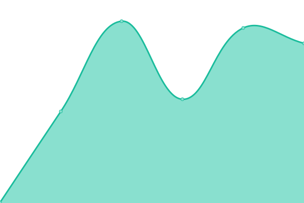 316ms
     
 | 

<a href="https://upptime.noplagi.xyz/history/anonymous-overflow-anonymousoverflow-catsarch-com">100.00%</a>
    

|  [AnonymousOverflow anonymousoverflow.gitro.xyz](https://anonymousoverflow.gitro.xyz) | 🟩 Up | [anonymous-overflow-anonymousoverflow-gitro-xyz.yml](https://github.com/NoPlagiarism/services-personal-upptime/commits/HEAD/history/anonymous-overflow-anonymousoverflow-gitro-xyz.yml) | 

 494ms
     
 | 

<a href="https://upptime.noplagi.xyz/history/anonymous-overflow-anonymousoverflow-gitro-xyz">100.00%</a>
    

|  [AnonymousOverflow anonymousoverflow.privacyfucking.rocks](https://anonymousoverflow.privacyfucking.rocks) | 🟥 Down | [anonymous-overflow-anonymousoverflow-privacyfucking-rocks.yml](https://github.com/NoPlagiarism/services-personal-upptime/commits/HEAD/history/anonymous-overflow-anonymousoverflow-privacyfucking-rocks.yml) | 

 0ms
     
 | 

<a href="https://upptime.noplagi.xyz/history/anonymous-overflow-anonymousoverflow-privacyfucking-rocks">100.00%</a>
    

|  [AnonymousOverflow anonymousoverflow.privacyredirect.com](https://anonymousoverflow.privacyredirect.com) | 🟩 Up | [anonymous-overflow-anonymousoverflow-privacyredirect-com.yml](https://github.com/NoPlagiarism/services-personal-upptime/commits/HEAD/history/anonymous-overflow-anonymousoverflow-privacyredirect-com.yml) | 

 538ms
     
 | 

<a href="https://upptime.noplagi.xyz/history/anonymous-overflow-anonymousoverflow-privacyredirect-com">100.00%</a>
    

|  [AnonymousOverflow ao.bloat.cat](https://ao.bloat.cat) | 🟩 Up | [anonymous-overflow-ao-bloat-cat.yml](https://github.com/NoPlagiarism/services-personal-upptime/commits/HEAD/history/anonymous-overflow-ao-bloat-cat.yml) | 

 670ms
     
 | 

<a href="https://upptime.noplagi.xyz/history/anonymous-overflow-ao-bloat-cat">100.00%</a>
    

|  [AnonymousOverflow ao.bunk.lol](https://ao.bunk.lol) | 🟩 Up | [anonymous-overflow-ao-bunk-lol.yml](https://github.com/NoPlagiarism/services-personal-upptime/commits/HEAD/history/anonymous-overflow-ao-bunk-lol.yml) | 

 817ms
     
 | 

<a href="https://upptime.noplagi.xyz/history/anonymous-overflow-ao-bunk-lol">100.00%</a>
    

|  [AnonymousOverflow ao.ngn.tf](https://ao.ngn.tf) | 🟩 Up | [anonymous-overflow-ao-ngn-tf.yml](https://github.com/NoPlagiarism/services-personal-upptime/commits/HEAD/history/anonymous-overflow-ao-ngn-tf.yml) | 

 739ms
     
 | 

<a href="https://upptime.noplagi.xyz/history/anonymous-overflow-ao-ngn-tf">86.82%</a>
    

|  [AnonymousOverflow ao.owo.si](https://ao.owo.si) | 🟩 Up | [anonymous-overflow-ao-owo-si.yml](https://github.com/NoPlagiarism/services-personal-upptime/commits/HEAD/history/anonymous-overflow-ao-owo-si.yml) | 

 581ms
     
 | 

<a href="https://upptime.noplagi.xyz/history/anonymous-overflow-ao-owo-si">100.00%</a>
    

|  [AnonymousOverflow ao.rootdo.com](https://ao.rootdo.com) | 🟩 Up | [anonymous-overflow-ao-rootdo-com.yml](https://github.com/NoPlagiarism/services-personal-upptime/commits/HEAD/history/anonymous-overflow-ao-rootdo-com.yml) | 

 502ms
     
 | 

<a href="https://upptime.noplagi.xyz/history/anonymous-overflow-ao-rootdo-com">100.00%</a>
    

|  [AnonymousOverflow ao.vern.cc](https://ao.vern.cc) | 🟩 Up | [anonymous-overflow-ao-vern-cc.yml](https://github.com/NoPlagiarism/services-personal-upptime/commits/HEAD/history/anonymous-overflow-ao-vern-cc.yml) | 

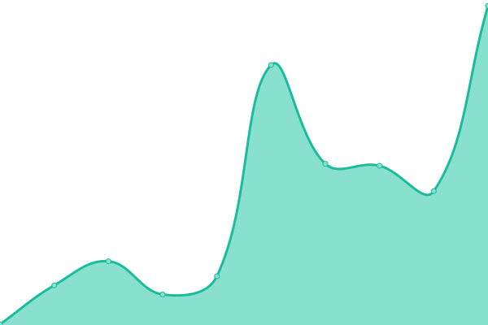 292ms
     
 | 

<a href="https://upptime.noplagi.xyz/history/anonymous-overflow-ao-vern-cc">97.10%</a>
    

|  [AnonymousOverflow code.whatever.social](https://code.whatever.social) | 🟩 Up | [anonymous-overflow-code-whatever-social.yml](https://github.com/NoPlagiarism/services-personal-upptime/commits/HEAD/history/anonymous-overflow-code-whatever-social.yml) | 

 1498ms
     
 | 

<a href="https://upptime.noplagi.xyz/history/anonymous-overflow-code-whatever-social">100.00%</a>
    

|  [AnonymousOverflow code.xbdm.fun](https://code.xbdm.fun) | 🟥 Down | [anonymous-overflow-code-xbdm-fun.yml](https://github.com/NoPlagiarism/services-personal-upptime/commits/HEAD/history/anonymous-overflow-code-xbdm-fun.yml) | 

 0ms
     
 | 

<a href="https://upptime.noplagi.xyz/history/anonymous-overflow-code-xbdm-fun">0.00%</a>
    

|  [AnonymousOverflow exchange.seitan-ayoub.lol](https://exchange.seitan-ayoub.lol) | 🟥 Down | [anonymous-overflow-exchange-seitan-ayoub-lol.yml](https://github.com/NoPlagiarism/services-personal-upptime/commits/HEAD/history/anonymous-overflow-exchange-seitan-ayoub-lol.yml) | 

 0ms
     
 | 

<a href="https://upptime.noplagi.xyz/history/anonymous-overflow-exchange-seitan-ayoub-lol">0.00%</a>
    

|  [AnonymousOverflow o.iii.st](https://o.iii.st) | 🟥 Down | [anonymous-overflow-o-iii-st.yml](https://github.com/NoPlagiarism/services-personal-upptime/commits/HEAD/history/anonymous-overflow-o-iii-st.yml) | 

 0ms
     
 | 

<a href="https://upptime.noplagi.xyz/history/anonymous-overflow-o-iii-st">0.00%</a>
    

|  [AnonymousOverflow o.sudovanilla.org](https://o.sudovanilla.org) | 🟩 Up | [anonymous-overflow-o-sudovanilla-org.yml](https://github.com/NoPlagiarism/services-personal-upptime/commits/HEAD/history/anonymous-overflow-o-sudovanilla-org.yml) | 

 436ms
     
 | 

<a href="https://upptime.noplagi.xyz/history/anonymous-overflow-o-sudovanilla-org">100.00%</a>
    

|  [AnonymousOverflow overflow.adminforge.de](https://overflow.adminforge.de) | 🟩 Up | [anonymous-overflow-overflow-adminforge-de.yml](https://github.com/NoPlagiarism/services-personal-upptime/commits/HEAD/history/anonymous-overflow-overflow-adminforge-de.yml) | 

 532ms
     
 | 

<a href="https://upptime.noplagi.xyz/history/anonymous-overflow-overflow-adminforge-de">100.00%</a>
    

|  [AnonymousOverflow overflow.canine.tools](https://overflow.canine.tools) | 🟩 Up | [anonymous-overflow-overflow-canine-tools.yml](https://github.com/NoPlagiarism/services-personal-upptime/commits/HEAD/history/anonymous-overflow-overflow-canine-tools.yml) | 

 370ms
     
 | 

<a href="https://upptime.noplagi.xyz/history/anonymous-overflow-overflow-canine-tools">100.00%</a>
    

|  [AnonymousOverflow overflow.darkness.services](https://overflow.darkness.services) | 🟥 Down | [anonymous-overflow-overflow-darkness-services.yml](https://github.com/NoPlagiarism/services-personal-upptime/commits/HEAD/history/anonymous-overflow-overflow-darkness-services.yml) | 

 278ms
     
 | 

<a href="https://upptime.noplagi.xyz/history/anonymous-overflow-overflow-darkness-services">99.02%</a>
    

|  [AnonymousOverflow overflow.datura.network](https://overflow.datura.network) | 🟥 Down | [anonymous-overflow-overflow-datura-network.yml](https://github.com/NoPlagiarism/services-personal-upptime/commits/HEAD/history/anonymous-overflow-overflow-datura-network.yml) | 

 0ms
     
 | 

<a href="https://upptime.noplagi.xyz/history/anonymous-overflow-overflow-datura-network">0.00%</a>
    

|  [AnonymousOverflow overflow.ducks.party](https://overflow.ducks.party) | 🟩 Up | [anonymous-overflow-overflow-ducks-party.yml](https://github.com/NoPlagiarism/services-personal-upptime/commits/HEAD/history/anonymous-overflow-overflow-ducks-party.yml) | 

 683ms
     
 | 

<a href="https://upptime.noplagi.xyz/history/anonymous-overflow-overflow-ducks-party">100.00%</a>
    

|  [AnonymousOverflow overflow.einfachzocken.eu](https://overflow.einfachzocken.eu) | 🟩 Up | [anonymous-overflow-overflow-einfachzocken-eu.yml](https://github.com/NoPlagiarism/services-personal-upptime/commits/HEAD/history/anonymous-overflow-overflow-einfachzocken-eu.yml) | 

 553ms
     
 | 

<a href="https://upptime.noplagi.xyz/history/anonymous-overflow-overflow-einfachzocken-eu">100.00%</a>
    

|  [AnonymousOverflow overflow.fascinated.cc](https://overflow.fascinated.cc) | 🟥 Down | [anonymous-overflow-overflow-fascinated-cc.yml](https://github.com/NoPlagiarism/services-personal-upptime/commits/HEAD/history/anonymous-overflow-overflow-fascinated-cc.yml) | 

 2959ms
     
 | 

<a href="https://upptime.noplagi.xyz/history/anonymous-overflow-overflow-fascinated-cc">0.00%</a>
    

|  [AnonymousOverflow overflow.freedit.eu](https://overflow.freedit.eu) | 🟩 Up | [anonymous-overflow-overflow-freedit-eu.yml](https://github.com/NoPlagiarism/services-personal-upptime/commits/HEAD/history/anonymous-overflow-overflow-freedit-eu.yml) | 

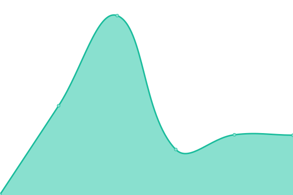 230ms
     
 | 

<a href="https://upptime.noplagi.xyz/history/anonymous-overflow-overflow-freedit-eu">99.45%</a>
    

|  [AnonymousOverflow overflow.hostux.net](https://overflow.hostux.net) | 🟩 Up | [anonymous-overflow-overflow-hostux-net.yml](https://github.com/NoPlagiarism/services-personal-upptime/commits/HEAD/history/anonymous-overflow-overflow-hostux-net.yml) | 

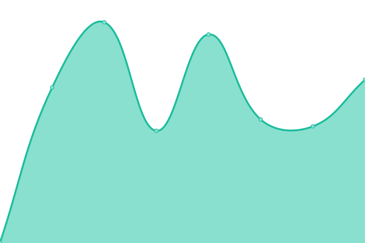 719ms
     
 | 

<a href="https://upptime.noplagi.xyz/history/anonymous-overflow-overflow-hostux-net">100.00%</a>
    

|  [AnonymousOverflow overflow.lunar.icu](https://overflow.lunar.icu) | 🟩 Up | [anonymous-overflow-overflow-lunar-icu.yml](https://github.com/NoPlagiarism/services-personal-upptime/commits/HEAD/history/anonymous-overflow-overflow-lunar-icu.yml) | 

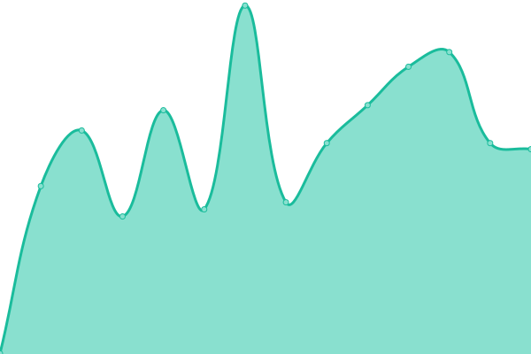 583ms
     
 | 

<a href="https://upptime.noplagi.xyz/history/anonymous-overflow-overflow-lunar-icu">100.00%</a>
    

|  [AnonymousOverflow overflow.projectsegfau.lt](https://overflow.projectsegfau.lt) | 🟩 Up | [anonymous-overflow-overflow-projectsegfau-lt.yml](https://github.com/NoPlagiarism/services-personal-upptime/commits/HEAD/history/anonymous-overflow-overflow-projectsegfau-lt.yml) | 

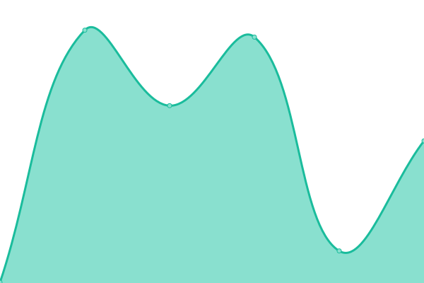 548ms
     
 | 

<a href="https://upptime.noplagi.xyz/history/anonymous-overflow-overflow-projectsegfau-lt">100.00%</a>
    

|  [AnonymousOverflow overflow.r4fo.com](https://overflow.r4fo.com) | 🟩 Up | [anonymous-overflow-overflow-r4fo-com.yml](https://github.com/NoPlagiarism/services-personal-upptime/commits/HEAD/history/anonymous-overflow-overflow-r4fo-com.yml) | 

 639ms
     
 | 

<a href="https://upptime.noplagi.xyz/history/anonymous-overflow-overflow-r4fo-com">85.91%</a>
    

|  [AnonymousOverflow overflow.seasi.dev](https://overflow.seasi.dev) | 🟩 Up | [anonymous-overflow-overflow-seasi-dev.yml](https://github.com/NoPlagiarism/services-personal-upptime/commits/HEAD/history/anonymous-overflow-overflow-seasi-dev.yml) | 

 721ms
     
 | 

<a href="https://upptime.noplagi.xyz/history/anonymous-overflow-overflow-seasi-dev">100.00%</a>
    

|  [AnonymousOverflow overflow.smnz.de](https://overflow.smnz.de) | 🟩 Up | [anonymous-overflow-overflow-smnz-de.yml](https://github.com/NoPlagiarism/services-personal-upptime/commits/HEAD/history/anonymous-overflow-overflow-smnz-de.yml) | 

 730ms
     
 | 

<a href="https://upptime.noplagi.xyz/history/anonymous-overflow-overflow-smnz-de">99.60%</a>
    

|  [AnonymousOverflow overflow.snine.nl](https://overflow.snine.nl) | 🟥 Down | [anonymous-overflow-overflow-snine-nl.yml](https://github.com/NoPlagiarism/services-personal-upptime/commits/HEAD/history/anonymous-overflow-overflow-snine-nl.yml) | 

 3263ms
     
 | 

<a href="https://upptime.noplagi.xyz/history/anonymous-overflow-overflow-snine-nl">0.00%</a>
    

|  [AnonymousOverflow soflow.nerdvpn.de](https://soflow.nerdvpn.de) | 🟩 Up | [anonymous-overflow-soflow-nerdvpn-de.yml](https://github.com/NoPlagiarism/services-personal-upptime/commits/HEAD/history/anonymous-overflow-soflow-nerdvpn-de.yml) | 

 897ms
     
 | 

<a href="https://upptime.noplagi.xyz/history/anonymous-overflow-soflow-nerdvpn-de">100.00%</a>
    

|  [libreddit l.opnxng.com](https://l.opnxng.com) | 🟥 Down | [libreddit-l-opnxng-com.yml](https://github.com/NoPlagiarism/services-personal-upptime/commits/HEAD/history/libreddit-l-opnxng-com.yml) | 

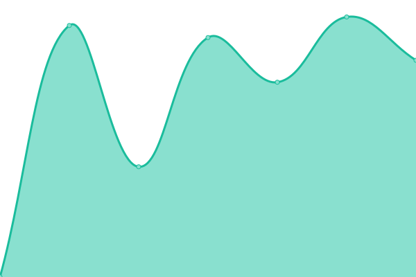 3628ms
     
 | 

<a href="https://upptime.noplagi.xyz/history/libreddit-l-opnxng-com">88.79%</a>
    

|  [libreddit r.walkx.fyi](https://r.walkx.fyi) | 🟩 Up | [libreddit-r-walkx-fyi.yml](https://github.com/NoPlagiarism/services-personal-upptime/commits/HEAD/history/libreddit-r-walkx-fyi.yml) | 

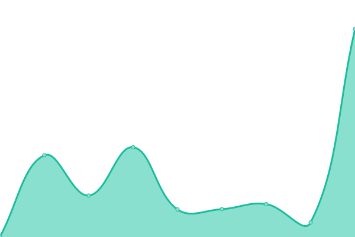 240ms
     
 | 

<a href="https://upptime.noplagi.xyz/history/libreddit-r-walkx-fyi">100.00%</a>
    

|  [libreddit reddit.rtrace.io](https://reddit.rtrace.io) | 🟩 Up | [libreddit-reddit-rtrace-io.yml](https://github.com/NoPlagiarism/services-personal-upptime/commits/HEAD/history/libreddit-reddit-rtrace-io.yml) | 

 1296ms
     
 | 

<a href="https://upptime.noplagi.xyz/history/libreddit-reddit-rtrace-io">99.61%</a>
    

|  [BreezeWiki antifandom.com](https://antifandom.com) | 🟩 Up | [breeze-wiki-antifandom-com.yml](https://github.com/NoPlagiarism/services-personal-upptime/commits/HEAD/history/breeze-wiki-antifandom-com.yml) | 

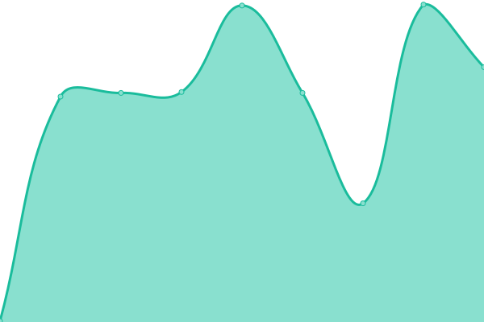 185ms
     
 | 

<a href="https://upptime.noplagi.xyz/history/breeze-wiki-antifandom-com">100.00%</a>
    

|  [BreezeWiki breeze.hostux.net](https://breeze.hostux.net) | 🟩 Up | [breeze-wiki-breeze-hostux-net.yml](https://github.com/NoPlagiarism/services-personal-upptime/commits/HEAD/history/breeze-wiki-breeze-hostux-net.yml) | 

 576ms
     
 | 

<a href="https://upptime.noplagi.xyz/history/breeze-wiki-breeze-hostux-net">100.00%</a>
    

|  [BreezeWiki breeze.mint.lgbt](https://breeze.mint.lgbt) | 🟩 Up | [breeze-wiki-breeze-mint-lgbt.yml](https://github.com/NoPlagiarism/services-personal-upptime/commits/HEAD/history/breeze-wiki-breeze-mint-lgbt.yml) | 

 1381ms
     
 | 

<a href="https://upptime.noplagi.xyz/history/breeze-wiki-breeze-mint-lgbt">99.46%</a>
    

|  [BreezeWiki breeze.nohost.network](https://breeze.nohost.network) | 🟩 Up | [breeze-wiki-breeze-nohost-network.yml](https://github.com/NoPlagiarism/services-personal-upptime/commits/HEAD/history/breeze-wiki-breeze-nohost-network.yml) | 

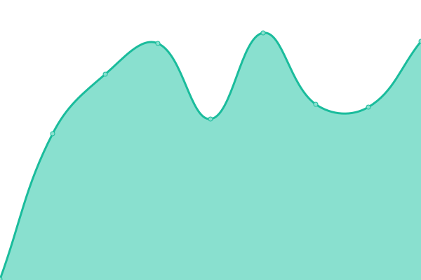 346ms
     
 | 

<a href="https://upptime.noplagi.xyz/history/breeze-wiki-breeze-nohost-network">100.00%</a>
    

|  [BreezeWiki breeze.whateveritworks.org](https://breeze.whateveritworks.org) | 🟥 Down | [breeze-wiki-breeze-whateveritworks-org.yml](https://github.com/NoPlagiarism/services-personal-upptime/commits/HEAD/history/breeze-wiki-breeze-whateveritworks-org.yml) | 

 0ms
     
 | 

<a href="https://upptime.noplagi.xyz/history/breeze-wiki-breeze-whateveritworks-org">0.00%</a>
    

|  [BreezeWiki breezewiki.4o1x5.dev](https://breezewiki.4o1x5.dev) | 🟩 Up | [breeze-wiki-breezewiki-4o1x5-dev.yml](https://github.com/NoPlagiarism/services-personal-upptime/commits/HEAD/history/breeze-wiki-breezewiki-4o1x5-dev.yml) | 

 609ms
     
 | 

<a href="https://upptime.noplagi.xyz/history/breeze-wiki-breezewiki-4o1x5-dev">100.00%</a>
    

|  [BreezeWiki breezewiki.catsarch.com](https://breezewiki.catsarch.com) | 🟩 Up | [breeze-wiki-breezewiki-catsarch-com.yml](https://github.com/NoPlagiarism/services-personal-upptime/commits/HEAD/history/breeze-wiki-breezewiki-catsarch-com.yml) | 

 326ms
     
 | 

<a href="https://upptime.noplagi.xyz/history/breeze-wiki-breezewiki-catsarch-com">100.00%</a>
    

|  [BreezeWiki breezewiki.catsarchywsyuss6jdxlypsw5dc7owd5u5tr6bujxb7o6xw2hipqehyd.onion](https://breezewiki.catsarchywsyuss6jdxlypsw5dc7owd5u5tr6bujxb7o6xw2hipqehyd.onion) | 🟥 Down | [breeze-wiki-breezewiki-catsarchywsyuss6jdxlypsw5dc7owd5u5tr6bujxb7o6xw2hipqehyd-onion.yml](https://github.com/NoPlagiarism/services-personal-upptime/commits/HEAD/history/breeze-wiki-breezewiki-catsarchywsyuss6jdxlypsw5dc7owd5u5tr6bujxb7o6xw2hipqehyd-onion.yml) | 

 0ms
     
 | 

<a href="https://upptime.noplagi.xyz/history/breeze-wiki-breezewiki-catsarchywsyuss6jdxlypsw5dc7owd5u5tr6bujxb7o6xw2hipqehyd-onion">100.00%</a>
    

|  [BreezeWiki breezewiki.coffee2m3bjsrrqqycx6ghkxrnejl2q6nl7pjw2j4clchjj6uk5zozad.onion](https://breezewiki.coffee2m3bjsrrqqycx6ghkxrnejl2q6nl7pjw2j4clchjj6uk5zozad.onion) | 🟥 Down | [breeze-wiki-breezewiki-coffee2m3bjsrrqqycx6ghkxrnejl2q6nl7pjw2j4clchjj6uk5zozad-onion.yml](https://github.com/NoPlagiarism/services-personal-upptime/commits/HEAD/history/breeze-wiki-breezewiki-coffee2m3bjsrrqqycx6ghkxrnejl2q6nl7pjw2j4clchjj6uk5zozad-onion.yml) | 

 0ms
     
 | 

<a href="https://upptime.noplagi.xyz/history/breeze-wiki-breezewiki-coffee2m3bjsrrqqycx6ghkxrnejl2q6nl7pjw2j4clchjj6uk5zozad-onion">100.00%</a>
    

|  [BreezeWiki breezewiki.com](https://breezewiki.com) | 🟩 Up | [breeze-wiki-breezewiki-com.yml](https://github.com/NoPlagiarism/services-personal-upptime/commits/HEAD/history/breeze-wiki-breezewiki-com.yml) | 

 597ms
     
 | 

<a href="https://upptime.noplagi.xyz/history/breeze-wiki-breezewiki-com">99.81%</a>
    

|  [BreezeWiki breezewiki.frontendfriendly.xyz](https://breezewiki.frontendfriendly.xyz) | 🟥 Down | [breeze-wiki-breezewiki-frontendfriendly-xyz.yml](https://github.com/NoPlagiarism/services-personal-upptime/commits/HEAD/history/breeze-wiki-breezewiki-frontendfriendly-xyz.yml) | 

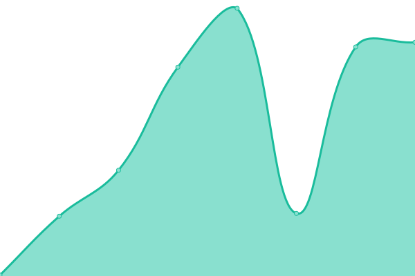 0ms
     
 | 

<a href="https://upptime.noplagi.xyz/history/breeze-wiki-breezewiki-frontendfriendly-xyz">0.01%</a>
    

|  [BreezeWiki breezewiki.hyperreal.coffee](https://breezewiki.hyperreal.coffee) | 🟩 Up | [breeze-wiki-breezewiki-hyperreal-coffee.yml](https://github.com/NoPlagiarism/services-personal-upptime/commits/HEAD/history/breeze-wiki-breezewiki-hyperreal-coffee.yml) | 

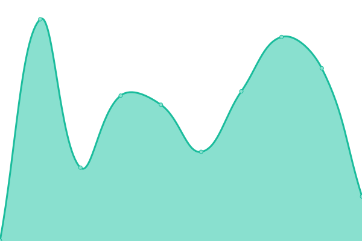 454ms
     
 | 

<a href="https://upptime.noplagi.xyz/history/breeze-wiki-breezewiki-hyperreal-coffee">100.00%</a>
    

|  [BreezeWiki breezewiki.nadeko.net](https://breezewiki.nadeko.net) | 🟩 Up | [breeze-wiki-breezewiki-nadeko-net.yml](https://github.com/NoPlagiarism/services-personal-upptime/commits/HEAD/history/breeze-wiki-breezewiki-nadeko-net.yml) | 

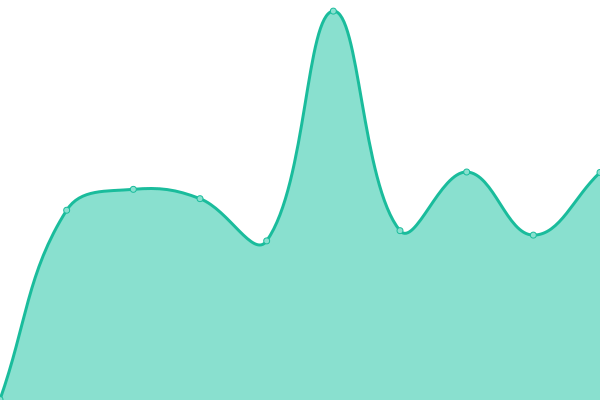 498ms
     
 | 

<a href="https://upptime.noplagi.xyz/history/breeze-wiki-breezewiki-nadeko-net">100.00%</a>
    

|  [BreezeWiki breezewiki.nadekonfkhwlxwwk4ycbvq42zvcjmvo5iakl4tajojjwxd4a5dcetuyd.onion](https://breezewiki.nadekonfkhwlxwwk4ycbvq42zvcjmvo5iakl4tajojjwxd4a5dcetuyd.onion) | 🟥 Down | [breeze-wiki-breezewiki-nadekonfkhwlxwwk4ycbvq42zvcjmvo5iakl4tajojjwxd4a5dcetuyd-onion.yml](https://github.com/NoPlagiarism/services-personal-upptime/commits/HEAD/history/breeze-wiki-breezewiki-nadekonfkhwlxwwk4ycbvq42zvcjmvo5iakl4tajojjwxd4a5dcetuyd-onion.yml) | 

 0ms
     
 | 

<a href="https://upptime.noplagi.xyz/history/breeze-wiki-breezewiki-nadekonfkhwlxwwk4ycbvq42zvcjmvo5iakl4tajojjwxd4a5dcetuyd-onion">100.00%</a>
    

|  [BreezeWiki breezewiki.pjsfkvpxlinjamtawaksbnnaqs2fc2mtvmozrzckxh7f3kis6yea25ad.onion](https://breezewiki.pjsfkvpxlinjamtawaksbnnaqs2fc2mtvmozrzckxh7f3kis6yea25ad.onion) | 🟥 Down | [breeze-wiki-breezewiki-pjsfkvpxlinjamtawaksbnnaqs2fc2mtvmozrzckxh7f3kis6yea25ad-onion.yml](https://github.com/NoPlagiarism/services-personal-upptime/commits/HEAD/history/breeze-wiki-breezewiki-pjsfkvpxlinjamtawaksbnnaqs2fc2mtvmozrzckxh7f3kis6yea25ad-onion.yml) | 

 0ms
     
 | 

<a href="https://upptime.noplagi.xyz/history/breeze-wiki-breezewiki-pjsfkvpxlinjamtawaksbnnaqs2fc2mtvmozrzckxh7f3kis6yea25ad-onion">100.00%</a>
    

|  [BreezeWiki breezewiki.private.coffee](https://breezewiki.private.coffee) | 🟩 Up | [breeze-wiki-breezewiki-private-coffee.yml](https://github.com/NoPlagiarism/services-personal-upptime/commits/HEAD/history/breeze-wiki-breezewiki-private-coffee.yml) | 

 1184ms
     
 | 

<a href="https://upptime.noplagi.xyz/history/breeze-wiki-breezewiki-private-coffee">100.00%</a>
    

|  [BreezeWiki breezewiki.pussthecat.org](https://breezewiki.pussthecat.org) | 🟩 Up | [breeze-wiki-breezewiki-pussthecat-org.yml](https://github.com/NoPlagiarism/services-personal-upptime/commits/HEAD/history/breeze-wiki-breezewiki-pussthecat-org.yml) | 

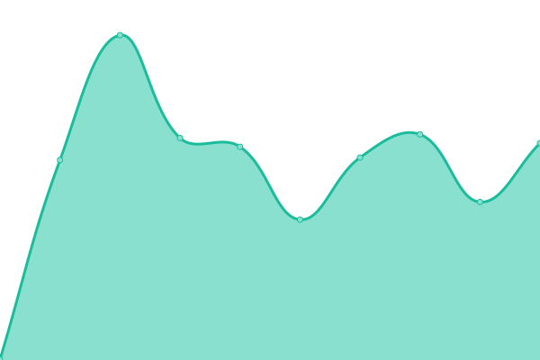 567ms
     
 | 

<a href="https://upptime.noplagi.xyz/history/breeze-wiki-breezewiki-pussthecat-org">97.02%</a>
    

|  [BreezeWiki breezewiki.r4fo.com](https://breezewiki.r4fo.com) | 🟥 Down | [breeze-wiki-breezewiki-r4fo-com.yml](https://github.com/NoPlagiarism/services-personal-upptime/commits/HEAD/history/breeze-wiki-breezewiki-r4fo-com.yml) | 

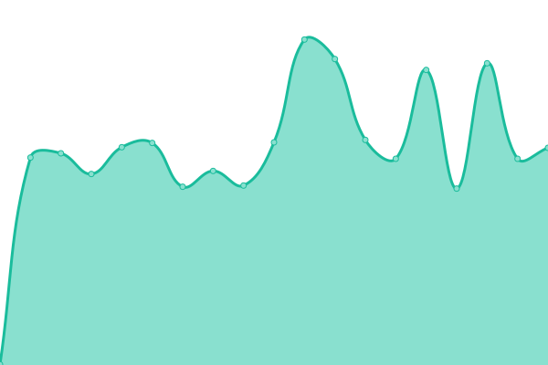 385ms
     
 | 

<a href="https://upptime.noplagi.xyz/history/breeze-wiki-breezewiki-r4fo-com">83.41%</a>
    

|  [BreezeWiki breezewiki.r4focoma7gu2zdwwcjjad47ysxt634lg73sxmdbkdozanwqslho5ohyd.onion](https://breezewiki.r4focoma7gu2zdwwcjjad47ysxt634lg73sxmdbkdozanwqslho5ohyd.onion) | 🟥 Down | [breeze-wiki-breezewiki-r4focoma7gu2zdwwcjjad47ysxt634lg73sxmdbkdozanwqslho5ohyd-onion.yml](https://github.com/NoPlagiarism/services-personal-upptime/commits/HEAD/history/breeze-wiki-breezewiki-r4focoma7gu2zdwwcjjad47ysxt634lg73sxmdbkdozanwqslho5ohyd-onion.yml) | 

 0ms
     
 | 

<a href="https://upptime.noplagi.xyz/history/breeze-wiki-breezewiki-r4focoma7gu2zdwwcjjad47ysxt634lg73sxmdbkdozanwqslho5ohyd-onion">100.00%</a>
    

|  [BreezeWiki breezewiki.woodland.cafe](https://breezewiki.woodland.cafe) | 🟩 Up | [breeze-wiki-breezewiki-woodland-cafe.yml](https://github.com/NoPlagiarism/services-personal-upptime/commits/HEAD/history/breeze-wiki-breezewiki-woodland-cafe.yml) | 

 726ms
     
 | 

<a href="https://upptime.noplagi.xyz/history/breeze-wiki-breezewiki-woodland-cafe">98.40%</a>
    

|  [BreezeWiki bw.artemislena.eu](https://bw.artemislena.eu) | 🟩 Up | [breeze-wiki-bw-artemislena-eu.yml](https://github.com/NoPlagiarism/services-personal-upptime/commits/HEAD/history/breeze-wiki-bw-artemislena-eu.yml) | 

 673ms
     
 | 

<a href="https://upptime.noplagi.xyz/history/breeze-wiki-bw-artemislena-eu">100.00%</a>
    

|  [BreezeWiki bw.hamstro.dev](https://bw.hamstro.dev) | 🟩 Up | [breeze-wiki-bw-hamstro-dev.yml](https://github.com/NoPlagiarism/services-personal-upptime/commits/HEAD/history/breeze-wiki-bw-hamstro-dev.yml) | 

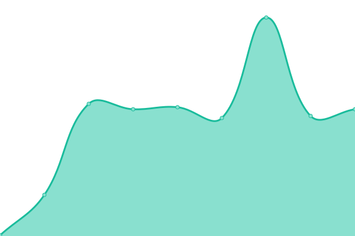 286ms
     
 | 

<a href="https://upptime.noplagi.xyz/history/breeze-wiki-bw-hamstro-dev">100.00%</a>
    

|  [BreezeWiki bw.projectsegfau.lt](https://bw.projectsegfau.lt) | 🟩 Up | [breeze-wiki-bw-projectsegfau-lt.yml](https://github.com/NoPlagiarism/services-personal-upptime/commits/HEAD/history/breeze-wiki-bw-projectsegfau-lt.yml) | 

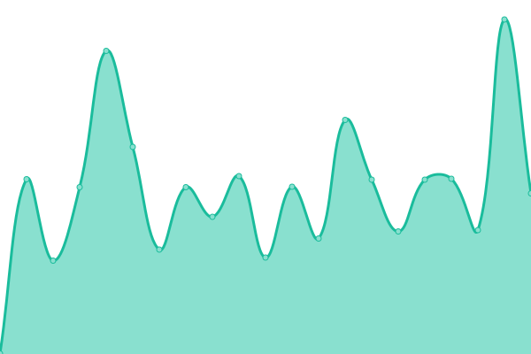 618ms
     
 | 

<a href="https://upptime.noplagi.xyz/history/breeze-wiki-bw-projectsegfau-lt">99.60%</a>
    

|  [BreezeWiki bw.skunky7dhv7nohsoalpwe3sxfz3fbkad7r3wk632riye25vqm3meqead.onion](https://bw.skunky7dhv7nohsoalpwe3sxfz3fbkad7r3wk632riye25vqm3meqead.onion) | 🟥 Down | [breeze-wiki-bw-skunky7dhv7nohsoalpwe3sxfz3fbkad7r3wk632riye25vqm3meqead-onion.yml](https://github.com/NoPlagiarism/services-personal-upptime/commits/HEAD/history/breeze-wiki-bw-skunky7dhv7nohsoalpwe3sxfz3fbkad7r3wk632riye25vqm3meqead-onion.yml) | 

 0ms
     
 | 

<a href="https://upptime.noplagi.xyz/history/breeze-wiki-bw-skunky7dhv7nohsoalpwe3sxfz3fbkad7r3wk632riye25vqm3meqead-onion">100.00%</a>
    

|  [BreezeWiki fan.blitzw.in](https://fan.blitzw.in) | 🟩 Up | [breeze-wiki-fan-blitzw-in.yml](https://github.com/NoPlagiarism/services-personal-upptime/commits/HEAD/history/breeze-wiki-fan-blitzw-in.yml) | 

 634ms
     
 | 

<a href="https://upptime.noplagi.xyz/history/breeze-wiki-fan-blitzw-in">100.00%</a>
    

|  [BreezeWiki fandom.reallyaweso.me](https://fandom.reallyaweso.me) | 🟩 Up | [breeze-wiki-fandom-reallyaweso-me.yml](https://github.com/NoPlagiarism/services-personal-upptime/commits/HEAD/history/breeze-wiki-fandom-reallyaweso-me.yml) | 

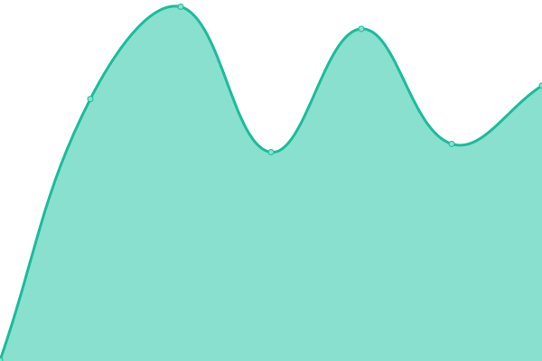 533ms
     
 | 

<a href="https://upptime.noplagi.xyz/history/breeze-wiki-fandom-reallyaweso-me">99.88%</a>
    

|  [BreezeWiki nerd.whatever.social](https://nerd.whatever.social) | 🟥 Down | [breeze-wiki-nerd-whatever-social.yml](https://github.com/NoPlagiarism/services-personal-upptime/commits/HEAD/history/breeze-wiki-nerd-whatever-social.yml) | 

 0ms
     
 | 

<a href="https://upptime.noplagi.xyz/history/breeze-wiki-nerd-whatever-social">0.01%</a>
    

|  [BreezeWiki z.opnxng.com](https://z.opnxng.com) | 🟩 Up | [breeze-wiki-z-opnxng-com.yml](https://github.com/NoPlagiarism/services-personal-upptime/commits/HEAD/history/breeze-wiki-z-opnxng-com.yml) | 

 666ms
     
 | 

<a href="https://upptime.noplagi.xyz/history/breeze-wiki-z-opnxng-com">98.99%</a>
    

|  [rimgo imgur.artemislena.eu](https://imgur.artemislena.eu) | 🟩 Up | [rimgo-imgur-artemislena-eu.yml](https://github.com/NoPlagiarism/services-personal-upptime/commits/HEAD/history/rimgo-imgur-artemislena-eu.yml) | 

 576ms
     
 | 

<a href="https://upptime.noplagi.xyz/history/rimgo-imgur-artemislena-eu">100.00%</a>
    

|  [rimgo rimgo.bus-hit.me](https://rimgo.bus-hit.me) | 🟩 Up | [rimgo-rimgo-bus-hit-me.yml](https://github.com/NoPlagiarism/services-personal-upptime/commits/HEAD/history/rimgo-rimgo-bus-hit-me.yml) | 

 350ms
     
 | 

<a href="https://upptime.noplagi.xyz/history/rimgo-rimgo-bus-hit-me">100.00%</a>
    

|  [rimgo rimgo.pussthecat.org](https://rimgo.pussthecat.org) | 🟩 Up | [rimgo-rimgo-pussthecat-org.yml](https://github.com/NoPlagiarism/services-personal-upptime/commits/HEAD/history/rimgo-rimgo-pussthecat-org.yml) | 

 655ms
     
 | 

<a href="https://upptime.noplagi.xyz/history/rimgo-rimgo-pussthecat-org">100.00%</a>
    

|  [rimgo rimgo.totaldarkness.net](https://rimgo.totaldarkness.net) | 🟩 Up | [rimgo-rimgo-totaldarkness-net.yml](https://github.com/NoPlagiarism/services-personal-upptime/commits/HEAD/history/rimgo-rimgo-totaldarkness-net.yml) | 

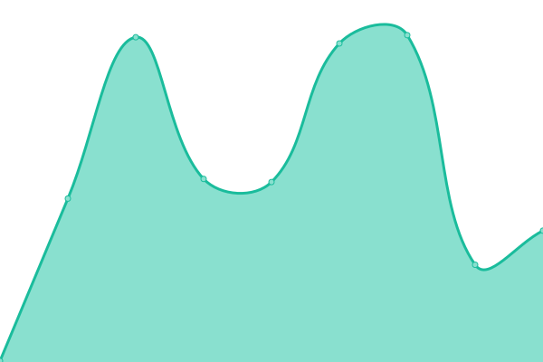 256ms
     
 | 

<a href="https://upptime.noplagi.xyz/history/rimgo-rimgo-totaldarkness-net">67.61%</a>
    

|  [RYD-Proxy ryd-proxy.kavin.rocks](https://ryd-proxy.kavin.rocks) | 🟩 Up | [ryd-proxy-ryd-proxy-kavin-rocks.yml](https://github.com/NoPlagiarism/services-personal-upptime/commits/HEAD/history/ryd-proxy-ryd-proxy-kavin-rocks.yml) | 

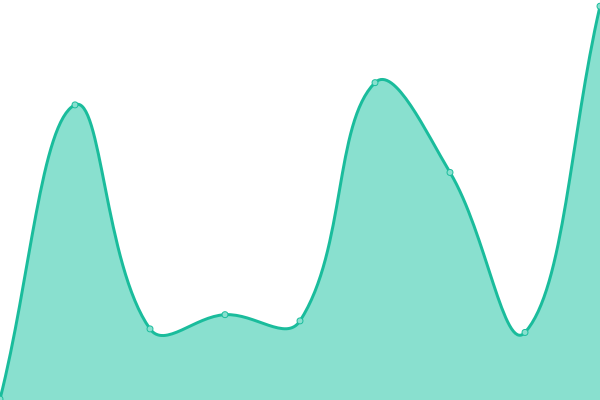 327ms
     
 | 

<a href="https://upptime.noplagi.xyz/history/ryd-proxy-ryd-proxy-kavin-rocks">100.00%</a>
    

|  [CloudTube cloudtube.jdelcampo.eu](https://cloudtube.jdelcampo.eu) | 🟥 Down | [cloud-tube-cloudtube-jdelcampo-eu.yml](https://github.com/NoPlagiarism/services-personal-upptime/commits/HEAD/history/cloud-tube-cloudtube-jdelcampo-eu.yml) | 

 0ms
     
 | 

<a href="https://upptime.noplagi.xyz/history/cloud-tube-cloudtube-jdelcampo-eu">0.00%</a>
    

|  [CloudTube tube.cadence.moe](https://tube.cadence.moe) | 🟩 Up | [cloud-tube-tube-cadence-moe.yml](https://github.com/NoPlagiarism/services-personal-upptime/commits/HEAD/history/cloud-tube-tube-cadence-moe.yml) | 

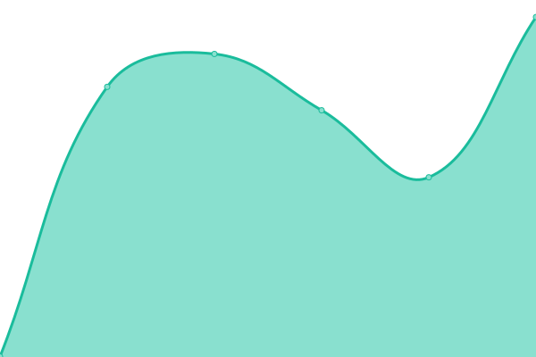 675ms
     
 | 

<a href="https://upptime.noplagi.xyz/history/cloud-tube-tube-cadence-moe">100.00%</a>
    

|  [CloudTube tube.mint.lgbt](https://tube.mint.lgbt) | 🟥 Down | [cloud-tube-tube-mint-lgbt.yml](https://github.com/NoPlagiarism/services-personal-upptime/commits/HEAD/history/cloud-tube-tube-mint-lgbt.yml) | 

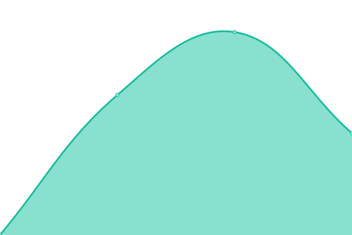 1737ms
     
 | 

<a href="https://upptime.noplagi.xyz/history/cloud-tube-tube-mint-lgbt">0.00%</a>
    

<!--end: status pages-->

[**Visit our status website →**](https://upptime.noplagi.xyz)

## 📄 License

- Powered by: [Upptime](https://github.com/upptime/upptime)
- Code: [MIT](./LICENSE) © [Anand Chowdhary](https://anandchowdhary.com), supported by [Pabio](https://pabio.com)
- Data in the `./history` directory: [Open Database License](https://opendatacommons.org/licenses/odbl/1-0/)
