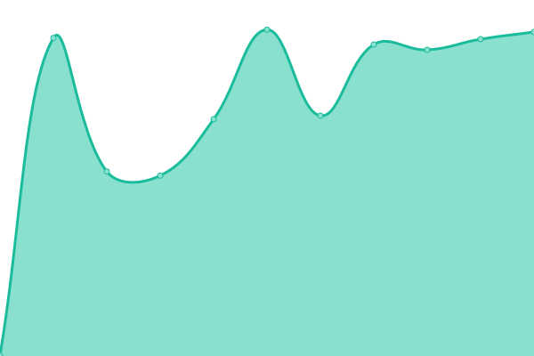
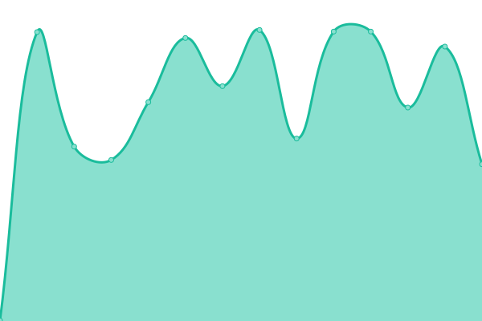

# [📈 Live Status](https://NoPlagiarism.github.io/services-personal-upptime): <!--live status--> **🟧 Partial outage**

This repository contains the open-source uptime monitor and status page for [NoPlagiarism](https://NoPlagiarism.github.io/services-personal-upptime), powered by [Upptime](https://github.com/upptime/upptime).

With [Upptime](https://upptime.js.org), you can get your own unlimited and free uptime monitor and status page, powered entirely by a GitHub repository. We use [Issues](https://github.com/NoPlagiarism/services-personal-upptime/issues) as incident reports, [Actions](https://github.com/NoPlagiarism/services-personal-upptime/actions) as uptime monitors, and [Pages](https://NoPlagiarism.github.io/services-personal-upptime) for the status page.

<!--start: status pages-->
<!-- This summary is generated by Upptime (https://github.com/upptime/upptime) -->
<!-- Do not edit this manually, your changes will be overwritten -->
<!-- prettier-ignore -->
| URL | Status | History | Response Time | Uptime |
| --- | ------ | ------- | ------------- | ------ |
|  [ProxiTok cringe.whatever.social](https://cringe.whatever.social) | 🟩 Up | [proxi-tok-cringe-whatever-social.yml](https://github.com/NoPlagiarism/services-personal-upptime/commits/HEAD/history/proxi-tok-cringe-whatever-social.yml) | 

 376ms
     
 | 

<a href="https://NoPlagiarism.github.io/services-personal-upptime/history/proxi-tok-cringe-whatever-social">100.00%</a>
    

|  [ProxiTok proxitok.esmailelbob.xyz](https://proxitok.esmailelbob.xyz) | 🟩 Up | [proxi-tok-proxitok-esmailelbob-xyz.yml](https://github.com/NoPlagiarism/services-personal-upptime/commits/HEAD/history/proxi-tok-proxitok-esmailelbob-xyz.yml) | 

 1557ms
     
 | 

<a href="https://NoPlagiarism.github.io/services-personal-upptime/history/proxi-tok-proxitok-esmailelbob-xyz">96.01%</a>
    

|  [ProxiTok proxitok.lunar.icu](https://proxitok.lunar.icu) | 🟩 Up | [proxi-tok-proxitok-lunar-icu.yml](https://github.com/NoPlagiarism/services-personal-upptime/commits/HEAD/history/proxi-tok-proxitok-lunar-icu.yml) | 

 561ms
     
 | 

<a href="https://NoPlagiarism.github.io/services-personal-upptime/history/proxi-tok-proxitok-lunar-icu">99.48%</a>
    

|  [ProxiTok proxitok.pabloferreiro.es](https://proxitok.pabloferreiro.es) | 🟩 Up | [proxi-tok-proxitok-pabloferreiro-es.yml](https://github.com/NoPlagiarism/services-personal-upptime/commits/HEAD/history/proxi-tok-proxitok-pabloferreiro-es.yml) | 

 631ms
     
 | 

<a href="https://NoPlagiarism.github.io/services-personal-upptime/history/proxi-tok-proxitok-pabloferreiro-es">100.00%</a>
    

|  [ProxiTok proxitok.privacy.com.de](https://proxitok.privacy.com.de) | 🟩 Up | [proxi-tok-proxitok-privacy-com-de.yml](https://github.com/NoPlagiarism/services-personal-upptime/commits/HEAD/history/proxi-tok-proxitok-privacy-com-de.yml) | 

 689ms
     
 | 

<a href="https://NoPlagiarism.github.io/services-personal-upptime/history/proxi-tok-proxitok-privacy-com-de">100.00%</a>
    

|  [ProxiTok proxitok.privacydev.net](https://proxitok.privacydev.net) | 🟩 Up | [proxi-tok-proxitok-privacydev-net.yml](https://github.com/NoPlagiarism/services-personal-upptime/commits/HEAD/history/proxi-tok-proxitok-privacydev-net.yml) | 

 1777ms
     
 | 

<a href="https://NoPlagiarism.github.io/services-personal-upptime/history/proxi-tok-proxitok-privacydev-net">100.00%</a>
    

|  [ProxiTok proxitok.pussthecat.org](https://proxitok.pussthecat.org) | 🟩 Up | [proxi-tok-proxitok-pussthecat-org.yml](https://github.com/NoPlagiarism/services-personal-upptime/commits/HEAD/history/proxi-tok-proxitok-pussthecat-org.yml) | 

 520ms
     
 | 

<a href="https://NoPlagiarism.github.io/services-personal-upptime/history/proxi-tok-proxitok-pussthecat-org">100.00%</a>
    

|  [ProxiTok tik.hostux.net](https://tik.hostux.net) | 🟩 Up | [proxi-tok-tik-hostux-net.yml](https://github.com/NoPlagiarism/services-personal-upptime/commits/HEAD/history/proxi-tok-tik-hostux-net.yml) | 

 383ms
     
 | 

<a href="https://NoPlagiarism.github.io/services-personal-upptime/history/proxi-tok-tik-hostux-net">100.00%</a>
    

|  [ProxiTok tiktok.chauvet.pro](https://tiktok.chauvet.pro) | 🟥 Down | [proxi-tok-tiktok-chauvet-pro.yml](https://github.com/NoPlagiarism/services-personal-upptime/commits/HEAD/history/proxi-tok-tiktok-chauvet-pro.yml) | 

 738ms
     
 | 

<a href="https://NoPlagiarism.github.io/services-personal-upptime/history/proxi-tok-tiktok-chauvet-pro">0.00%</a>
    

|  [ProxiTok tok.adminforge.de](https://tok.adminforge.de) | 🟩 Up | [proxi-tok-tok-adminforge-de.yml](https://github.com/NoPlagiarism/services-personal-upptime/commits/HEAD/history/proxi-tok-tok-adminforge-de.yml) | 

 575ms
     
 | 

<a href="https://NoPlagiarism.github.io/services-personal-upptime/history/proxi-tok-tok-adminforge-de">100.00%</a>
    

|  [ProxiTok tok.artemislena.eu](https://tok.artemislena.eu) | 🟩 Up | [proxi-tok-tok-artemislena-eu.yml](https://github.com/NoPlagiarism/services-personal-upptime/commits/HEAD/history/proxi-tok-tok-artemislena-eu.yml) | 

 669ms
     
 | 

<a href="https://NoPlagiarism.github.io/services-personal-upptime/history/proxi-tok-tok-artemislena-eu">100.00%</a>
    

|  [ProxiTok tok.habedieeh.re](https://tok.habedieeh.re) | 🟩 Up | [proxi-tok-tok-habedieeh-re.yml](https://github.com/NoPlagiarism/services-personal-upptime/commits/HEAD/history/proxi-tok-tok-habedieeh-re.yml) | 

 398ms
     
 | 

<a href="https://NoPlagiarism.github.io/services-personal-upptime/history/proxi-tok-tok-habedieeh-re">100.00%</a>
    

|  [ProxiTok tt.vern.cc](https://tt.vern.cc) | 🟩 Up | [proxi-tok-tt-vern-cc.yml](https://github.com/NoPlagiarism/services-personal-upptime/commits/HEAD/history/proxi-tok-tt-vern-cc.yml) | 

 233ms
     
 | 

<a href="https://NoPlagiarism.github.io/services-personal-upptime/history/proxi-tok-tt-vern-cc">100.00%</a>
    

|  [GotHub dev.gh.akisblack.dev](https://dev.gh.akisblack.dev) | 🟩 Up | [got-hub-dev-gh-akisblack-dev.yml](https://github.com/NoPlagiarism/services-personal-upptime/commits/HEAD/history/got-hub-dev-gh-akisblack-dev.yml) | 

 486ms
     
 | 

<a href="https://NoPlagiarism.github.io/services-personal-upptime/history/got-hub-dev-gh-akisblack-dev">100.00%</a>
    

|  [GotHub gh.akisblack.dev](https://gh.akisblack.dev) | 🟩 Up | [got-hub-gh-akisblack-dev.yml](https://github.com/NoPlagiarism/services-personal-upptime/commits/HEAD/history/got-hub-gh-akisblack-dev.yml) | 

 462ms
     
 | 

<a href="https://NoPlagiarism.github.io/services-personal-upptime/history/got-hub-gh-akisblack-dev">100.00%</a>
    

|  [GotHub gh.bloatcat.tk](https://gh.bloatcat.tk) | 🟩 Up | [got-hub-gh-bloatcat-tk.yml](https://github.com/NoPlagiarism/services-personal-upptime/commits/HEAD/history/got-hub-gh-bloatcat-tk.yml) | 

 1001ms
     
 | 

<a href="https://NoPlagiarism.github.io/services-personal-upptime/history/got-hub-gh-bloatcat-tk">100.00%</a>
    

|  [GotHub gh.dev.odyssey346.dev](https://gh.dev.odyssey346.dev) | 🟩 Up | [got-hub-gh-dev-odyssey346-dev.yml](https://github.com/NoPlagiarism/services-personal-upptime/commits/HEAD/history/got-hub-gh-dev-odyssey346-dev.yml) | 

 373ms
     
 | 

<a href="https://NoPlagiarism.github.io/services-personal-upptime/history/got-hub-gh-dev-odyssey346-dev">100.00%</a>
    

|  [GotHub gh.fascinated.cc](https://gh.fascinated.cc) | 🟩 Up | [got-hub-gh-fascinated-cc.yml](https://github.com/NoPlagiarism/services-personal-upptime/commits/HEAD/history/got-hub-gh-fascinated-cc.yml) | 

 445ms
     
 | 

<a href="https://NoPlagiarism.github.io/services-personal-upptime/history/got-hub-gh-fascinated-cc">100.00%</a>
    

|  [GotHub gh.odyssey346.dev](https://gh.odyssey346.dev) | 🟩 Up | [got-hub-gh-odyssey346-dev.yml](https://github.com/NoPlagiarism/services-personal-upptime/commits/HEAD/history/got-hub-gh-odyssey346-dev.yml) | 

 374ms
     
 | 

<a href="https://NoPlagiarism.github.io/services-personal-upptime/history/got-hub-gh-odyssey346-dev">100.00%</a>
    

|  [GotHub gh.phreedom.club](https://gh.phreedom.club) | 🟩 Up | [got-hub-gh-phreedom-club.yml](https://github.com/NoPlagiarism/services-personal-upptime/commits/HEAD/history/got-hub-gh-phreedom-club.yml) | 

 1073ms
     
 | 

<a href="https://NoPlagiarism.github.io/services-personal-upptime/history/got-hub-gh-phreedom-club">100.00%</a>
    

|  [GotHub gh.riverside.rocks](https://gh.riverside.rocks) | 🟥 Down | [got-hub-gh-riverside-rocks.yml](https://github.com/NoPlagiarism/services-personal-upptime/commits/HEAD/history/got-hub-gh-riverside-rocks.yml) | 

 260ms
     
 | 

<a href="https://NoPlagiarism.github.io/services-personal-upptime/history/got-hub-gh-riverside-rocks">86.38%</a>
    

|  [GotHub gh.whateveritworks.org](https://gh.whateveritworks.org) | 🟥 Down | [got-hub-gh-whateveritworks-org.yml](https://github.com/NoPlagiarism/services-personal-upptime/commits/HEAD/history/got-hub-gh-whateveritworks-org.yml) | 

 152ms
     
 | 

<a href="https://NoPlagiarism.github.io/services-personal-upptime/history/got-hub-gh-whateveritworks-org">13.95%</a>
    

|  [GotHub gothub.dev.projectsegfau.lt](https://gothub.dev.projectsegfau.lt) | 🟩 Up | [got-hub-gothub-dev-projectsegfau-lt.yml](https://github.com/NoPlagiarism/services-personal-upptime/commits/HEAD/history/got-hub-gothub-dev-projectsegfau-lt.yml) | 

 626ms
     
 | 

<a href="https://NoPlagiarism.github.io/services-personal-upptime/history/got-hub-gothub-dev-projectsegfau-lt">99.52%</a>
    

|  [GotHub gothub.esmailelbob.xyz](https://gothub.esmailelbob.xyz) | 🟩 Up | [got-hub-gothub-esmailelbob-xyz.yml](https://github.com/NoPlagiarism/services-personal-upptime/commits/HEAD/history/got-hub-gothub-esmailelbob-xyz.yml) | 

 1373ms
     
 | 

<a href="https://NoPlagiarism.github.io/services-personal-upptime/history/got-hub-gothub-esmailelbob-xyz">96.91%</a>
    

|  [GotHub gothub.lunar.icu](https://gothub.lunar.icu) | 🟩 Up | [got-hub-gothub-lunar-icu.yml](https://github.com/NoPlagiarism/services-personal-upptime/commits/HEAD/history/got-hub-gothub-lunar-icu.yml) | 

 494ms
     
 | 

<a href="https://NoPlagiarism.github.io/services-personal-upptime/history/got-hub-gothub-lunar-icu">99.47%</a>
    

|  [GotHub gothub.no-logs.com](https://gothub.no-logs.com) | 🟩 Up | [got-hub-gothub-no-logs-com.yml](https://github.com/NoPlagiarism/services-personal-upptime/commits/HEAD/history/got-hub-gothub-no-logs-com.yml) | 

 480ms
     
 | 

<a href="https://NoPlagiarism.github.io/services-personal-upptime/history/got-hub-gothub-no-logs-com">100.00%</a>
    

|  [GotHub gothub.projectsegfau.lt](https://gothub.projectsegfau.lt) | 🟩 Up | [got-hub-gothub-projectsegfau-lt.yml](https://github.com/NoPlagiarism/services-personal-upptime/commits/HEAD/history/got-hub-gothub-projectsegfau-lt.yml) | 

 493ms
     
 | 

<a href="https://NoPlagiarism.github.io/services-personal-upptime/history/got-hub-gothub-projectsegfau-lt">99.70%</a>
    

|  [WikiLess wiki.604kph.xyz](https://wiki.604kph.xyz) | 🟥 Down | [wiki-less-wiki-604kph-xyz.yml](https://github.com/NoPlagiarism/services-personal-upptime/commits/HEAD/history/wiki-less-wiki-604kph-xyz.yml) | 

 120ms
     
 | 

<a href="https://NoPlagiarism.github.io/services-personal-upptime/history/wiki-less-wiki-604kph-xyz">84.47%</a>
    

|  [WikiLess wiki.adminforge.de](https://wiki.adminforge.de) | 🟩 Up | [wiki-less-wiki-adminforge-de.yml](https://github.com/NoPlagiarism/services-personal-upptime/commits/HEAD/history/wiki-less-wiki-adminforge-de.yml) | 

 774ms
     
 | 

<a href="https://NoPlagiarism.github.io/services-personal-upptime/history/wiki-less-wiki-adminforge-de">100.00%</a>
    

|  [WikiLess wiki.froth.zone](https://wiki.froth.zone) | 🟩 Up | [wiki-less-wiki-froth-zone.yml](https://github.com/NoPlagiarism/services-personal-upptime/commits/HEAD/history/wiki-less-wiki-froth-zone.yml) | 

 241ms
     
 | 

<a href="https://NoPlagiarism.github.io/services-personal-upptime/history/wiki-less-wiki-froth-zone">96.97%</a>
    

|  [WikiLess wiki.privacytools.io](https://wiki.privacytools.io) | 🟩 Up | [wiki-less-wiki-privacytools-io.yml](https://github.com/NoPlagiarism/services-personal-upptime/commits/HEAD/history/wiki-less-wiki-privacytools-io.yml) | 

 960ms
     
 | 

<a href="https://NoPlagiarism.github.io/services-personal-upptime/history/wiki-less-wiki-privacytools-io">94.79%</a>
    

|  [WikiLess wiki.slipfox.xyz](https://wiki.slipfox.xyz) | 🟩 Up | [wiki-less-wiki-slipfox-xyz.yml](https://github.com/NoPlagiarism/services-personal-upptime/commits/HEAD/history/wiki-less-wiki-slipfox-xyz.yml) | 

 152ms
     
 | 

<a href="https://NoPlagiarism.github.io/services-personal-upptime/history/wiki-less-wiki-slipfox-xyz">100.00%</a>
    

|  [WikiLess wikiless.esmailelbob.xyz](https://wikiless.esmailelbob.xyz) | 🟩 Up | [wiki-less-wikiless-esmailelbob-xyz.yml](https://github.com/NoPlagiarism/services-personal-upptime/commits/HEAD/history/wiki-less-wikiless-esmailelbob-xyz.yml) | 

 1502ms
     
 | 

<a href="https://NoPlagiarism.github.io/services-personal-upptime/history/wiki-less-wikiless-esmailelbob-xyz">96.04%</a>
    

|  [WikiLess wikiless.funami.tech](https://wikiless.funami.tech) | 🟩 Up | [wiki-less-wikiless-funami-tech.yml](https://github.com/NoPlagiarism/services-personal-upptime/commits/HEAD/history/wiki-less-wikiless-funami-tech.yml) | 

 883ms
     
 | 

<a href="https://NoPlagiarism.github.io/services-personal-upptime/history/wiki-less-wikiless-funami-tech">100.00%</a>
    

|  [WikiLess wikiless.northboot.xyz](https://wikiless.northboot.xyz) | 🟩 Up | [wiki-less-wikiless-northboot-xyz.yml](https://github.com/NoPlagiarism/services-personal-upptime/commits/HEAD/history/wiki-less-wikiless-northboot-xyz.yml) | 

 985ms
     
 | 

<a href="https://NoPlagiarism.github.io/services-personal-upptime/history/wiki-less-wikiless-northboot-xyz">100.00%</a>
    

|  [WikiLess wikiless.org](https://wikiless.org) | 🟩 Up | [wiki-less-wikiless-org.yml](https://github.com/NoPlagiarism/services-personal-upptime/commits/HEAD/history/wiki-less-wikiless-org.yml) | 

 1245ms
     
 | 

<a href="https://NoPlagiarism.github.io/services-personal-upptime/history/wiki-less-wikiless-org">100.00%</a>
    

|  [WikiLess wikiless.rawbit.ninja](https://wikiless.rawbit.ninja) | 🟩 Up | [wiki-less-wikiless-rawbit-ninja.yml](https://github.com/NoPlagiarism/services-personal-upptime/commits/HEAD/history/wiki-less-wikiless-rawbit-ninja.yml) | 

 259ms
     
 | 

<a href="https://NoPlagiarism.github.io/services-personal-upptime/history/wiki-less-wikiless-rawbit-ninja">85.72%</a>
    

|  [WikiLess wikiless.tiekoetter.com](https://wikiless.tiekoetter.com) | 🟩 Up | [wiki-less-wikiless-tiekoetter-com.yml](https://github.com/NoPlagiarism/services-personal-upptime/commits/HEAD/history/wiki-less-wikiless-tiekoetter-com.yml) | 

 1003ms
     
 | 

<a href="https://NoPlagiarism.github.io/services-personal-upptime/history/wiki-less-wikiless-tiekoetter-com">95.13%</a>
    

|  [WikiLess wl.vern.cc](https://wl.vern.cc) | 🟩 Up | [wiki-less-wl-vern-cc.yml](https://github.com/NoPlagiarism/services-personal-upptime/commits/HEAD/history/wiki-less-wl-vern-cc.yml) | 

 326ms
     
 | 

<a href="https://NoPlagiarism.github.io/services-personal-upptime/history/wiki-less-wl-vern-cc">100.00%</a>
    

|  [librarian (discontinued) lbry.mywire.org](https://lbry.mywire.org) | 🟩 Up | [librarian-discontinued-lbry-mywire-org.yml](https://github.com/NoPlagiarism/services-personal-upptime/commits/HEAD/history/librarian-discontinued-lbry-mywire-org.yml) | 

 1185ms
     
 | 

<a href="https://NoPlagiarism.github.io/services-personal-upptime/history/librarian-discontinued-lbry-mywire-org">100.00%</a>
    

|  [librarian (discontinued) lbry.ooguy.com](https://lbry.ooguy.com) | 🟩 Up | [librarian-discontinued-lbry-ooguy-com.yml](https://github.com/NoPlagiarism/services-personal-upptime/commits/HEAD/history/librarian-discontinued-lbry-ooguy-com.yml) | 

 1133ms
     
 | 

<a href="https://NoPlagiarism.github.io/services-personal-upptime/history/librarian-discontinued-lbry-ooguy-com">98.40%</a>
    

|  [librarian (discontinued) lbry.projectsegfau.lt](https://lbry.projectsegfau.lt) | 🟩 Up | [librarian-discontinued-lbry-projectsegfau-lt.yml](https://github.com/NoPlagiarism/services-personal-upptime/commits/HEAD/history/librarian-discontinued-lbry-projectsegfau-lt.yml) | 

 632ms
     
 | 

<a href="https://NoPlagiarism.github.io/services-personal-upptime/history/librarian-discontinued-lbry-projectsegfau-lt">99.36%</a>
    

|  [librarian (discontinued) lbry.ramondia.net](https://lbry.ramondia.net) | 🟩 Up | [librarian-discontinued-lbry-ramondia-net.yml](https://github.com/NoPlagiarism/services-personal-upptime/commits/HEAD/history/librarian-discontinued-lbry-ramondia-net.yml) | 

 450ms
     
 | 

<a href="https://NoPlagiarism.github.io/services-personal-upptime/history/librarian-discontinued-lbry-ramondia-net">100.00%</a>
    

|  [librarian (discontinued) lbry.slipfox.xyz](https://lbry.slipfox.xyz) | 🟩 Up | [librarian-discontinued-lbry-slipfox-xyz.yml](https://github.com/NoPlagiarism/services-personal-upptime/commits/HEAD/history/librarian-discontinued-lbry-slipfox-xyz.yml) | 

 139ms
     
 | 

<a href="https://NoPlagiarism.github.io/services-personal-upptime/history/librarian-discontinued-lbry-slipfox-xyz">100.00%</a>
    

|  [librarian (discontinued) lbry.vern.cc](https://lbry.vern.cc) | 🟩 Up | [librarian-discontinued-lbry-vern-cc.yml](https://github.com/NoPlagiarism/services-personal-upptime/commits/HEAD/history/librarian-discontinued-lbry-vern-cc.yml) | 

 263ms
     
 | 

<a href="https://NoPlagiarism.github.io/services-personal-upptime/history/librarian-discontinued-lbry-vern-cc">100.00%</a>
    

|  [librarian (discontinued) librarian.esmailelbob.xyz](https://librarian.esmailelbob.xyz) | 🟩 Up | [librarian-discontinued-librarian-esmailelbob-xyz.yml](https://github.com/NoPlagiarism/services-personal-upptime/commits/HEAD/history/librarian-discontinued-librarian-esmailelbob-xyz.yml) | 

 1179ms
     
 | 

<a href="https://NoPlagiarism.github.io/services-personal-upptime/history/librarian-discontinued-librarian-esmailelbob-xyz">96.48%</a>
    

|  [librarian (discontinued) librarian.pussthecat.org](https://librarian.pussthecat.org) | 🟩 Up | [librarian-discontinued-librarian-pussthecat-org.yml](https://github.com/NoPlagiarism/services-personal-upptime/commits/HEAD/history/librarian-discontinued-librarian-pussthecat-org.yml) | 

 676ms
     
 | 

<a href="https://NoPlagiarism.github.io/services-personal-upptime/history/librarian-discontinued-librarian-pussthecat-org">100.00%</a>
    

|  [librarian (discontinued) odysee.owacon.moe](https://odysee.owacon.moe) | 🟩 Up | [librarian-discontinued-odysee-owacon-moe.yml](https://github.com/NoPlagiarism/services-personal-upptime/commits/HEAD/history/librarian-discontinued-odysee-owacon-moe.yml) | 

 1940ms
     
 | 

<a href="https://NoPlagiarism.github.io/services-personal-upptime/history/librarian-discontinued-odysee-owacon-moe">100.00%</a>
    

|  [librarian (discontinued) watch.whateveritworks.org](https://watch.whateveritworks.org) | 🟥 Down | [librarian-discontinued-watch-whateveritworks-org.yml](https://github.com/NoPlagiarism/services-personal-upptime/commits/HEAD/history/librarian-discontinued-watch-whateveritworks-org.yml) | 

 216ms
     
 | 

<a href="https://NoPlagiarism.github.io/services-personal-upptime/history/librarian-discontinued-watch-whateveritworks-org">13.96%</a>
    

|  [AnonymousOverflow ao.vern.cc](https://ao.vern.cc) | 🟩 Up | [anonymous-overflow-ao-vern-cc.yml](https://github.com/NoPlagiarism/services-personal-upptime/commits/HEAD/history/anonymous-overflow-ao-vern-cc.yml) | 

 203ms
     
 | 

<a href="https://NoPlagiarism.github.io/services-personal-upptime/history/anonymous-overflow-ao-vern-cc">100.00%</a>
    

|  [AnonymousOverflow code.whatever.social](https://code.whatever.social) | 🟩 Up | [anonymous-overflow-code-whatever-social.yml](https://github.com/NoPlagiarism/services-personal-upptime/commits/HEAD/history/anonymous-overflow-code-whatever-social.yml) | 

 404ms
     
 | 

<a href="https://NoPlagiarism.github.io/services-personal-upptime/history/anonymous-overflow-code-whatever-social">99.03%</a>
    

|  [AnonymousOverflow overflow.adminforge.de](https://overflow.adminforge.de) | 🟩 Up | [anonymous-overflow-overflow-adminforge-de.yml](https://github.com/NoPlagiarism/services-personal-upptime/commits/HEAD/history/anonymous-overflow-overflow-adminforge-de.yml) | 

 542ms
     
 | 

<a href="https://NoPlagiarism.github.io/services-personal-upptime/history/anonymous-overflow-overflow-adminforge-de">100.00%</a>
    

|  [AnonymousOverflow overflow.fascinated.cc](https://overflow.fascinated.cc) | 🟩 Up | [anonymous-overflow-overflow-fascinated-cc.yml](https://github.com/NoPlagiarism/services-personal-upptime/commits/HEAD/history/anonymous-overflow-overflow-fascinated-cc.yml) | 

 439ms
     
 | 

<a href="https://NoPlagiarism.github.io/services-personal-upptime/history/anonymous-overflow-overflow-fascinated-cc">100.00%</a>
    

|  [AnonymousOverflow overflow.hostux.net](https://overflow.hostux.net) | 🟩 Up | [anonymous-overflow-overflow-hostux-net.yml](https://github.com/NoPlagiarism/services-personal-upptime/commits/HEAD/history/anonymous-overflow-overflow-hostux-net.yml) | 

 357ms
     
 | 

<a href="https://NoPlagiarism.github.io/services-personal-upptime/history/anonymous-overflow-overflow-hostux-net">100.00%</a>
    

|  [AnonymousOverflow overflow.lunar.icu](https://overflow.lunar.icu) | 🟩 Up | [anonymous-overflow-overflow-lunar-icu.yml](https://github.com/NoPlagiarism/services-personal-upptime/commits/HEAD/history/anonymous-overflow-overflow-lunar-icu.yml) | 

 553ms
     
 | 

<a href="https://NoPlagiarism.github.io/services-personal-upptime/history/anonymous-overflow-overflow-lunar-icu">99.48%</a>
    

|  [AnonymousOverflow overflow.projectsegfau.lt](https://overflow.projectsegfau.lt) | 🟩 Up | [anonymous-overflow-overflow-projectsegfau-lt.yml](https://github.com/NoPlagiarism/services-personal-upptime/commits/HEAD/history/anonymous-overflow-overflow-projectsegfau-lt.yml) | 

 375ms
     
 | 

<a href="https://NoPlagiarism.github.io/services-personal-upptime/history/anonymous-overflow-overflow-projectsegfau-lt">99.70%</a>
    

|  [AnonymousOverflow overflow.smnz.de](https://overflow.smnz.de) | 🟩 Up | [anonymous-overflow-overflow-smnz-de.yml](https://github.com/NoPlagiarism/services-personal-upptime/commits/HEAD/history/anonymous-overflow-overflow-smnz-de.yml) | 

 751ms
     
 | 

<a href="https://NoPlagiarism.github.io/services-personal-upptime/history/anonymous-overflow-overflow-smnz-de">99.37%</a>
    

|  [libreddit bob.fr.to](https://bob.fr.to) | 🟥 Down | [libreddit-bob-fr-to.yml](https://github.com/NoPlagiarism/services-personal-upptime/commits/HEAD/history/libreddit-bob-fr-to.yml) | 

 6469ms
     
 | 

<a href="https://NoPlagiarism.github.io/services-personal-upptime/history/libreddit-bob-fr-to">0.01%</a>
    

|  [libreddit discuss.whatever.social](https://discuss.whatever.social) | 🟩 Up | [libreddit-discuss-whatever-social.yml](https://github.com/NoPlagiarism/services-personal-upptime/commits/HEAD/history/libreddit-discuss-whatever-social.yml) | 

 826ms
     
 | 

<a href="https://NoPlagiarism.github.io/services-personal-upptime/history/libreddit-discuss-whatever-social">100.00%</a>
    

|  [libreddit l.opnxng.com](https://l.opnxng.com) | 🟩 Up | [libreddit-l-opnxng-com.yml](https://github.com/NoPlagiarism/services-personal-upptime/commits/HEAD/history/libreddit-l-opnxng-com.yml) | 

 1884ms
     
 | 

<a href="https://NoPlagiarism.github.io/services-personal-upptime/history/libreddit-l-opnxng-com">100.00%</a>
    

|  [libreddit libreddit.bus-hit.me](https://libreddit.bus-hit.me) | 🟩 Up | [libreddit-libreddit-bus-hit-me.yml](https://github.com/NoPlagiarism/services-personal-upptime/commits/HEAD/history/libreddit-libreddit-bus-hit-me.yml) | 

 989ms
     
 | 

<a href="https://NoPlagiarism.github.io/services-personal-upptime/history/libreddit-libreddit-bus-hit-me">100.00%</a>
    

|  [libreddit libreddit.cachyos.org](https://libreddit.cachyos.org) | 🟩 Up | [libreddit-libreddit-cachyos-org.yml](https://github.com/NoPlagiarism/services-personal-upptime/commits/HEAD/history/libreddit-libreddit-cachyos-org.yml) | 

 1266ms
     
 | 

<a href="https://NoPlagiarism.github.io/services-personal-upptime/history/libreddit-libreddit-cachyos-org">100.00%</a>
    

|  [libreddit libreddit.dcs0.hu](https://libreddit.dcs0.hu) | 🟩 Up | [libreddit-libreddit-dcs0-hu.yml](https://github.com/NoPlagiarism/services-personal-upptime/commits/HEAD/history/libreddit-libreddit-dcs0-hu.yml) | 

 1766ms
     
 | 

<a href="https://NoPlagiarism.github.io/services-personal-upptime/history/libreddit-libreddit-dcs0-hu">100.00%</a>
    

|  [libreddit libreddit.de](https://libreddit.de) | 🟩 Up | [libreddit-libreddit-de.yml](https://github.com/NoPlagiarism/services-personal-upptime/commits/HEAD/history/libreddit-libreddit-de.yml) | 

 1162ms
     
 | 

<a href="https://NoPlagiarism.github.io/services-personal-upptime/history/libreddit-libreddit-de">100.00%</a>
    

|  [libreddit libreddit.domain.glass](https://libreddit.domain.glass) | 🟩 Up | [libreddit-libreddit-domain-glass.yml](https://github.com/NoPlagiarism/services-personal-upptime/commits/HEAD/history/libreddit-libreddit-domain-glass.yml) | 

 263ms
     
 | 

<a href="https://NoPlagiarism.github.io/services-personal-upptime/history/libreddit-libreddit-domain-glass">100.00%</a>
    

|  [libreddit libreddit.freedit.eu](https://libreddit.freedit.eu) | 🟩 Up | [libreddit-libreddit-freedit-eu.yml](https://github.com/NoPlagiarism/services-personal-upptime/commits/HEAD/history/libreddit-libreddit-freedit-eu.yml) | 

 755ms
     
 | 

<a href="https://NoPlagiarism.github.io/services-personal-upptime/history/libreddit-libreddit-freedit-eu">100.00%</a>
    

|  [libreddit libreddit.garudalinux.org](https://libreddit.garudalinux.org) | 🟩 Up | [libreddit-libreddit-garudalinux-org.yml](https://github.com/NoPlagiarism/services-personal-upptime/commits/HEAD/history/libreddit-libreddit-garudalinux-org.yml) | 

 226ms
     
 | 

<a href="https://NoPlagiarism.github.io/services-personal-upptime/history/libreddit-libreddit-garudalinux-org">100.00%</a>
    

|  [libreddit libreddit.hu](https://libreddit.hu) | 🟩 Up | [libreddit-libreddit-hu.yml](https://github.com/NoPlagiarism/services-personal-upptime/commits/HEAD/history/libreddit-libreddit-hu.yml) | 

 1137ms
     
 | 

<a href="https://NoPlagiarism.github.io/services-personal-upptime/history/libreddit-libreddit-hu">100.00%</a>
    

|  [libreddit libreddit.kavin.rocks](https://libreddit.kavin.rocks) | 🟩 Up | [libreddit-libreddit-kavin-rocks.yml](https://github.com/NoPlagiarism/services-personal-upptime/commits/HEAD/history/libreddit-libreddit-kavin-rocks.yml) | 

 1612ms
     
 | 

<a href="https://NoPlagiarism.github.io/services-personal-upptime/history/libreddit-libreddit-kavin-rocks">100.00%</a>
    

|  [libreddit libreddit.kutay.dev](https://libreddit.kutay.dev) | 🟩 Up | [libreddit-libreddit-kutay-dev.yml](https://github.com/NoPlagiarism/services-personal-upptime/commits/HEAD/history/libreddit-libreddit-kutay-dev.yml) | 

 1451ms
     
 | 

<a href="https://NoPlagiarism.github.io/services-personal-upptime/history/libreddit-libreddit-kutay-dev">100.00%</a>
    

|  [libreddit libreddit.kylrth.com](https://libreddit.kylrth.com) | 🟩 Up | [libreddit-libreddit-kylrth-com.yml](https://github.com/NoPlagiarism/services-personal-upptime/commits/HEAD/history/libreddit-libreddit-kylrth-com.yml) | 

 754ms
     
 | 

<a href="https://NoPlagiarism.github.io/services-personal-upptime/history/libreddit-libreddit-kylrth-com">100.00%</a>
    

|  [libreddit libreddit.lunar.icu](https://libreddit.lunar.icu) | 🟩 Up | [libreddit-libreddit-lunar-icu.yml](https://github.com/NoPlagiarism/services-personal-upptime/commits/HEAD/history/libreddit-libreddit-lunar-icu.yml) | 

 1114ms
     
 | 

<a href="https://NoPlagiarism.github.io/services-personal-upptime/history/libreddit-libreddit-lunar-icu">99.49%</a>
    

|  [libreddit libreddit.mha.fi](https://libreddit.mha.fi) | 🟩 Up | [libreddit-libreddit-mha-fi.yml](https://github.com/NoPlagiarism/services-personal-upptime/commits/HEAD/history/libreddit-libreddit-mha-fi.yml) | 

 1330ms
     
 | 

<a href="https://NoPlagiarism.github.io/services-personal-upptime/history/libreddit-libreddit-mha-fi">100.00%</a>
    

|  [libreddit libreddit.nl](https://libreddit.nl) | 🟩 Up | [libreddit-libreddit-nl.yml](https://github.com/NoPlagiarism/services-personal-upptime/commits/HEAD/history/libreddit-libreddit-nl.yml) | 

 1201ms
     
 | 

<a href="https://NoPlagiarism.github.io/services-personal-upptime/history/libreddit-libreddit-nl">100.00%</a>
    

|  [libreddit libreddit.northboot.xyz](https://libreddit.northboot.xyz) | 🟩 Up | [libreddit-libreddit-northboot-xyz.yml](https://github.com/NoPlagiarism/services-personal-upptime/commits/HEAD/history/libreddit-libreddit-northboot-xyz.yml) | 

 1826ms
     
 | 

<a href="https://NoPlagiarism.github.io/services-personal-upptime/history/libreddit-libreddit-northboot-xyz">100.00%</a>
    

|  [libreddit libreddit.oxymagnesium.com](https://libreddit.oxymagnesium.com) | 🟩 Up | [libreddit-libreddit-oxymagnesium-com.yml](https://github.com/NoPlagiarism/services-personal-upptime/commits/HEAD/history/libreddit-libreddit-oxymagnesium-com.yml) | 

 691ms
     
 | 

<a href="https://NoPlagiarism.github.io/services-personal-upptime/history/libreddit-libreddit-oxymagnesium-com">100.00%</a>
    

|  [libreddit libreddit.privacy.com.de](https://libreddit.privacy.com.de) | 🟩 Up | [libreddit-libreddit-privacy-com-de.yml](https://github.com/NoPlagiarism/services-personal-upptime/commits/HEAD/history/libreddit-libreddit-privacy-com-de.yml) | 

 1468ms
     
 | 

<a href="https://NoPlagiarism.github.io/services-personal-upptime/history/libreddit-libreddit-privacy-com-de">100.00%</a>
    

|  [libreddit libreddit.privacydev.net](https://libreddit.privacydev.net) | 🟩 Up | [libreddit-libreddit-privacydev-net.yml](https://github.com/NoPlagiarism/services-personal-upptime/commits/HEAD/history/libreddit-libreddit-privacydev-net.yml) | 

 1994ms
     
 | 

<a href="https://NoPlagiarism.github.io/services-personal-upptime/history/libreddit-libreddit-privacydev-net">98.64%</a>
    

|  [libreddit libreddit.projectsegfau.lt](https://libreddit.projectsegfau.lt) | 🟩 Up | [libreddit-libreddit-projectsegfau-lt.yml](https://github.com/NoPlagiarism/services-personal-upptime/commits/HEAD/history/libreddit-libreddit-projectsegfau-lt.yml) | 

 1055ms
     
 | 

<a href="https://NoPlagiarism.github.io/services-personal-upptime/history/libreddit-libreddit-projectsegfau-lt">99.70%</a>
    

|  [libreddit libreddit.pufe.org](https://libreddit.pufe.org) | 🟩 Up | [libreddit-libreddit-pufe-org.yml](https://github.com/NoPlagiarism/services-personal-upptime/commits/HEAD/history/libreddit-libreddit-pufe-org.yml) | 

 1203ms
     
 | 

<a href="https://NoPlagiarism.github.io/services-personal-upptime/history/libreddit-libreddit-pufe-org">95.82%</a>
    

|  [libreddit libreddit.pussthecat.org](https://libreddit.pussthecat.org) | 🟩 Up | [libreddit-libreddit-pussthecat-org.yml](https://github.com/NoPlagiarism/services-personal-upptime/commits/HEAD/history/libreddit-libreddit-pussthecat-org.yml) | 

 1002ms
     
 | 

<a href="https://NoPlagiarism.github.io/services-personal-upptime/history/libreddit-libreddit-pussthecat-org">100.00%</a>
    

|  [libreddit libreddit.spike.codes](https://libreddit.spike.codes) | 🟥 Down | [libreddit-libreddit-spike-codes.yml](https://github.com/NoPlagiarism/services-personal-upptime/commits/HEAD/history/libreddit-libreddit-spike-codes.yml) | 

 19390ms
     
 | 

<a href="https://NoPlagiarism.github.io/services-personal-upptime/history/libreddit-libreddit-spike-codes">2.86%</a>
    

|  [libreddit libreddit.strongthany.cc](https://libreddit.strongthany.cc) | 🟩 Up | [libreddit-libreddit-strongthany-cc.yml](https://github.com/NoPlagiarism/services-personal-upptime/commits/HEAD/history/libreddit-libreddit-strongthany-cc.yml) | 

 1169ms
     
 | 

<a href="https://NoPlagiarism.github.io/services-personal-upptime/history/libreddit-libreddit-strongthany-cc">100.00%</a>
    

|  [libreddit libreddit.tiekoetter.com](https://libreddit.tiekoetter.com) | 🟩 Up | [libreddit-libreddit-tiekoetter-com.yml](https://github.com/NoPlagiarism/services-personal-upptime/commits/HEAD/history/libreddit-libreddit-tiekoetter-com.yml) | 

 1326ms
     
 | 

<a href="https://NoPlagiarism.github.io/services-personal-upptime/history/libreddit-libreddit-tiekoetter-com">95.18%</a>
    

|  [libreddit libreddit.totaldarkness.net](https://libreddit.totaldarkness.net) | 🟩 Up | [libreddit-libreddit-totaldarkness-net.yml](https://github.com/NoPlagiarism/services-personal-upptime/commits/HEAD/history/libreddit-libreddit-totaldarkness-net.yml) | 

 1169ms
     
 | 

<a href="https://NoPlagiarism.github.io/services-personal-upptime/history/libreddit-libreddit-totaldarkness-net">100.00%</a>
    

|  [libreddit libreddit.tux.pizza](https://libreddit.tux.pizza) | 🟩 Up | [libreddit-libreddit-tux-pizza.yml](https://github.com/NoPlagiarism/services-personal-upptime/commits/HEAD/history/libreddit-libreddit-tux-pizza.yml) | 

 1043ms
     
 | 

<a href="https://NoPlagiarism.github.io/services-personal-upptime/history/libreddit-libreddit-tux-pizza">100.00%</a>
    

|  [libreddit lr.4201337.xyz](https://lr.4201337.xyz) | 🟩 Up | [libreddit-lr-4201337-xyz.yml](https://github.com/NoPlagiarism/services-personal-upptime/commits/HEAD/history/libreddit-lr-4201337-xyz.yml) | 

 1319ms
     
 | 

<a href="https://NoPlagiarism.github.io/services-personal-upptime/history/libreddit-lr-4201337-xyz">100.00%</a>
    

|  [libreddit lr.aeong.one](https://lr.aeong.one) | 🟥 Down | [libreddit-lr-aeong-one.yml](https://github.com/NoPlagiarism/services-personal-upptime/commits/HEAD/history/libreddit-lr-aeong-one.yml) | 

 89ms
     
 | 

<a href="https://NoPlagiarism.github.io/services-personal-upptime/history/libreddit-lr-aeong-one">0.00%</a>
    

|  [libreddit lr.artemislena.eu](https://lr.artemislena.eu) | 🟩 Up | [libreddit-lr-artemislena-eu.yml](https://github.com/NoPlagiarism/services-personal-upptime/commits/HEAD/history/libreddit-lr-artemislena-eu.yml) | 

 1584ms
     
 | 

<a href="https://NoPlagiarism.github.io/services-personal-upptime/history/libreddit-lr-artemislena-eu">100.00%</a>
    

|  [libreddit lr.mint.lgbt](https://lr.mint.lgbt) | 🟩 Up | [libreddit-lr-mint-lgbt.yml](https://github.com/NoPlagiarism/services-personal-upptime/commits/HEAD/history/libreddit-lr-mint-lgbt.yml) | 

 1239ms
     
 | 

<a href="https://NoPlagiarism.github.io/services-personal-upptime/history/libreddit-lr-mint-lgbt">100.00%</a>
    

|  [libreddit lr.odyssey346.dev](https://lr.odyssey346.dev) | 🟩 Up | [libreddit-lr-odyssey346-dev.yml](https://github.com/NoPlagiarism/services-personal-upptime/commits/HEAD/history/libreddit-lr-odyssey346-dev.yml) | 

 878ms
     
 | 

<a href="https://NoPlagiarism.github.io/services-personal-upptime/history/libreddit-lr-odyssey346-dev">100.00%</a>
    

|  [libreddit lr.riverside.rocks](https://lr.riverside.rocks) | 🟥 Down | [libreddit-lr-riverside-rocks.yml](https://github.com/NoPlagiarism/services-personal-upptime/commits/HEAD/history/libreddit-lr-riverside-rocks.yml) | 

 822ms
     
 | 

<a href="https://NoPlagiarism.github.io/services-personal-upptime/history/libreddit-lr-riverside-rocks">86.43%</a>
    

|  [libreddit lr.slipfox.xyz](https://lr.slipfox.xyz) | 🟩 Up | [libreddit-lr-slipfox-xyz.yml](https://github.com/NoPlagiarism/services-personal-upptime/commits/HEAD/history/libreddit-lr-slipfox-xyz.yml) | 

 497ms
     
 | 

<a href="https://NoPlagiarism.github.io/services-personal-upptime/history/libreddit-lr-slipfox-xyz">100.00%</a>
    

|  [libreddit lr.vern.cc](https://lr.vern.cc) | 🟩 Up | [libreddit-lr-vern-cc.yml](https://github.com/NoPlagiarism/services-personal-upptime/commits/HEAD/history/libreddit-lr-vern-cc.yml) | 

 513ms
     
 | 

<a href="https://NoPlagiarism.github.io/services-personal-upptime/history/libreddit-lr-vern-cc">100.00%</a>
    

|  [libreddit r.ahwx.org](https://r.ahwx.org) | 🟩 Up | [libreddit-r-ahwx-org.yml](https://github.com/NoPlagiarism/services-personal-upptime/commits/HEAD/history/libreddit-r-ahwx-org.yml) | 

 1435ms
     
 | 

<a href="https://NoPlagiarism.github.io/services-personal-upptime/history/libreddit-r-ahwx-org">100.00%</a>
    

|  [libreddit r.darklab.sh](https://r.darklab.sh) | 🟩 Up | [libreddit-r-darklab-sh.yml](https://github.com/NoPlagiarism/services-personal-upptime/commits/HEAD/history/libreddit-r-darklab-sh.yml) | 

 496ms
     
 | 

<a href="https://NoPlagiarism.github.io/services-personal-upptime/history/libreddit-r-darklab-sh">100.00%</a>
    

|  [libreddit r.nf](https://r.nf) | 🟩 Up | [libreddit-r-nf.yml](https://github.com/NoPlagiarism/services-personal-upptime/commits/HEAD/history/libreddit-r-nf.yml) | 

 603ms
     
 | 

<a href="https://NoPlagiarism.github.io/services-personal-upptime/history/libreddit-r-nf">100.00%</a>
    

|  [libreddit r.walkx.fyi](https://r.walkx.fyi) | 🟥 Down | [libreddit-r-walkx-fyi.yml](https://github.com/NoPlagiarism/services-personal-upptime/commits/HEAD/history/libreddit-r-walkx-fyi.yml) | 

 261ms
     
 | 

<a href="https://NoPlagiarism.github.io/services-personal-upptime/history/libreddit-r-walkx-fyi">0.00%</a>
    

|  [libreddit rd.funami.tech](https://rd.funami.tech) | 🟩 Up | [libreddit-rd-funami-tech.yml](https://github.com/NoPlagiarism/services-personal-upptime/commits/HEAD/history/libreddit-rd-funami-tech.yml) | 

 1932ms
     
 | 

<a href="https://NoPlagiarism.github.io/services-personal-upptime/history/libreddit-rd-funami-tech">100.00%</a>
    

|  [libreddit reddi.tk](https://reddi.tk) | 🟥 Down | [libreddit-reddi-tk.yml](https://github.com/NoPlagiarism/services-personal-upptime/commits/HEAD/history/libreddit-reddi-tk.yml) | 

 643ms
     
 | 

<a href="https://NoPlagiarism.github.io/services-personal-upptime/history/libreddit-reddi-tk">0.00%</a>
    

|  [libreddit reddit.baby](https://reddit.baby) | 🟩 Up | [libreddit-reddit-baby.yml](https://github.com/NoPlagiarism/services-personal-upptime/commits/HEAD/history/libreddit-reddit-baby.yml) | 

 1192ms
     
 | 

<a href="https://NoPlagiarism.github.io/services-personal-upptime/history/libreddit-reddit-baby">100.00%</a>
    

|  [libreddit reddit.dr460nf1r3.org](https://reddit.dr460nf1r3.org) | 🟩 Up | [libreddit-reddit-dr460nf1r3-org.yml](https://github.com/NoPlagiarism/services-personal-upptime/commits/HEAD/history/libreddit-reddit-dr460nf1r3-org.yml) | 

 1540ms
     
 | 

<a href="https://NoPlagiarism.github.io/services-personal-upptime/history/libreddit-reddit-dr460nf1r3-org">100.00%</a>
    

|  [libreddit reddit.invak.id](https://reddit.invak.id) | 🟩 Up | [libreddit-reddit-invak-id.yml](https://github.com/NoPlagiarism/services-personal-upptime/commits/HEAD/history/libreddit-reddit-invak-id.yml) | 

 1573ms
     
 | 

<a href="https://NoPlagiarism.github.io/services-personal-upptime/history/libreddit-reddit-invak-id">100.00%</a>
    

|  [libreddit reddit.leptons.xyz](https://reddit.leptons.xyz) | 🟩 Up | [libreddit-reddit-leptons-xyz.yml](https://github.com/NoPlagiarism/services-personal-upptime/commits/HEAD/history/libreddit-reddit-leptons-xyz.yml) | 

 1179ms
     
 | 

<a href="https://NoPlagiarism.github.io/services-personal-upptime/history/libreddit-reddit-leptons-xyz">100.00%</a>
    

|  [libreddit reddit.moe.ngo](https://reddit.moe.ngo) | 🟩 Up | [libreddit-reddit-moe-ngo.yml](https://github.com/NoPlagiarism/services-personal-upptime/commits/HEAD/history/libreddit-reddit-moe-ngo.yml) | 

 1236ms
     
 | 

<a href="https://NoPlagiarism.github.io/services-personal-upptime/history/libreddit-reddit-moe-ngo">100.00%</a>
    

|  [libreddit reddit.rtrace.io](https://reddit.rtrace.io) | 🟩 Up | [libreddit-reddit-rtrace-io.yml](https://github.com/NoPlagiarism/services-personal-upptime/commits/HEAD/history/libreddit-reddit-rtrace-io.yml) | 

 1673ms
     
 | 

<a href="https://NoPlagiarism.github.io/services-personal-upptime/history/libreddit-reddit-rtrace-io">100.00%</a>
    

|  [libreddit reddit.simo.sh](https://reddit.simo.sh) | 🟩 Up | [libreddit-reddit-simo-sh.yml](https://github.com/NoPlagiarism/services-personal-upptime/commits/HEAD/history/libreddit-reddit-simo-sh.yml) | 

 2050ms
     
 | 

<a href="https://NoPlagiarism.github.io/services-personal-upptime/history/libreddit-reddit-simo-sh">100.00%</a>
    

|  [libreddit reddit.smnz.de](https://reddit.smnz.de) | 🟩 Up | [libreddit-reddit-smnz-de.yml](https://github.com/NoPlagiarism/services-personal-upptime/commits/HEAD/history/libreddit-reddit-smnz-de.yml) | 

 1628ms
     
 | 

<a href="https://NoPlagiarism.github.io/services-personal-upptime/history/libreddit-reddit-smnz-de">99.66%</a>
    

|  [libreddit reddit.utsav2.dev](https://reddit.utsav2.dev) | 🟩 Up | [libreddit-reddit-utsav2-dev.yml](https://github.com/NoPlagiarism/services-personal-upptime/commits/HEAD/history/libreddit-reddit-utsav2-dev.yml) | 

 1308ms
     
 | 

<a href="https://NoPlagiarism.github.io/services-personal-upptime/history/libreddit-reddit-utsav2-dev">100.00%</a>
    

|  [libreddit safereddit.com](https://safereddit.com) | 🟩 Up | [libreddit-safereddit-com.yml](https://github.com/NoPlagiarism/services-personal-upptime/commits/HEAD/history/libreddit-safereddit-com.yml) | 

 710ms
     
 | 

<a href="https://NoPlagiarism.github.io/services-personal-upptime/history/libreddit-safereddit-com">100.00%</a>
    

|  [libreddit snoo.habedieeh.re](https://snoo.habedieeh.re) | 🟩 Up | [libreddit-snoo-habedieeh-re.yml](https://github.com/NoPlagiarism/services-personal-upptime/commits/HEAD/history/libreddit-snoo-habedieeh-re.yml) | 

 764ms
     
 | 

<a href="https://NoPlagiarism.github.io/services-personal-upptime/history/libreddit-snoo-habedieeh-re">100.00%</a>
    

|  [BreezeWiki antifandom.com](https://antifandom.com) | 🟩 Up | [breeze-wiki-antifandom-com.yml](https://github.com/NoPlagiarism/services-personal-upptime/commits/HEAD/history/breeze-wiki-antifandom-com.yml) | 

 243ms
     
 | 

<a href="https://NoPlagiarism.github.io/services-personal-upptime/history/breeze-wiki-antifandom-com">100.00%</a>
    

|  [BreezeWiki breeze.hostux.net](https://breeze.hostux.net) | 🟩 Up | [breeze-wiki-breeze-hostux-net.yml](https://github.com/NoPlagiarism/services-personal-upptime/commits/HEAD/history/breeze-wiki-breeze-hostux-net.yml) | 

 354ms
     
 | 

<a href="https://NoPlagiarism.github.io/services-personal-upptime/history/breeze-wiki-breeze-hostux-net">100.00%</a>
    

|  [BreezeWiki breeze.nohost.network](https://breeze.nohost.network) | 🟩 Up | [breeze-wiki-breeze-nohost-network.yml](https://github.com/NoPlagiarism/services-personal-upptime/commits/HEAD/history/breeze-wiki-breeze-nohost-network.yml) | 

 220ms
     
 | 

<a href="https://NoPlagiarism.github.io/services-personal-upptime/history/breeze-wiki-breeze-nohost-network">79.08%</a>
    

|  [BreezeWiki breezewiki.com](https://breezewiki.com) | 🟩 Up | [breeze-wiki-breezewiki-com.yml](https://github.com/NoPlagiarism/services-personal-upptime/commits/HEAD/history/breeze-wiki-breezewiki-com.yml) | 

 180ms
     
 | 

<a href="https://NoPlagiarism.github.io/services-personal-upptime/history/breeze-wiki-breezewiki-com">100.00%</a>
    

|  [BreezeWiki breezewiki.pussthecat.org](https://breezewiki.pussthecat.org) | 🟥 Down | [breeze-wiki-breezewiki-pussthecat-org.yml](https://github.com/NoPlagiarism/services-personal-upptime/commits/HEAD/history/breeze-wiki-breezewiki-pussthecat-org.yml) | 

 554ms
     
 | 

<a href="https://NoPlagiarism.github.io/services-personal-upptime/history/breeze-wiki-breezewiki-pussthecat-org">99.16%</a>
    

|  [BreezeWiki bw.artemislena.eu](https://bw.artemislena.eu) | 🟩 Up | [breeze-wiki-bw-artemislena-eu.yml](https://github.com/NoPlagiarism/services-personal-upptime/commits/HEAD/history/breeze-wiki-bw-artemislena-eu.yml) | 

 575ms
     
 | 

<a href="https://NoPlagiarism.github.io/services-personal-upptime/history/breeze-wiki-bw-artemislena-eu">99.81%</a>
    

|  [BreezeWiki bw.hamstro.dev](https://bw.hamstro.dev) | 🟩 Up | [breeze-wiki-bw-hamstro-dev.yml](https://github.com/NoPlagiarism/services-personal-upptime/commits/HEAD/history/breeze-wiki-bw-hamstro-dev.yml) | 

 167ms
     
 | 

<a href="https://NoPlagiarism.github.io/services-personal-upptime/history/breeze-wiki-bw-hamstro-dev">100.00%</a>
    

|  [BreezeWiki bw.projectsegfau.lt](https://bw.projectsegfau.lt) | 🟩 Up | [breeze-wiki-bw-projectsegfau-lt.yml](https://github.com/NoPlagiarism/services-personal-upptime/commits/HEAD/history/breeze-wiki-bw-projectsegfau-lt.yml) | 

 445ms
     
 | 

<a href="https://NoPlagiarism.github.io/services-personal-upptime/history/breeze-wiki-bw-projectsegfau-lt">98.80%</a>
    

|  [BreezeWiki nerd.whatever.social](https://nerd.whatever.social) | 🟩 Up | [breeze-wiki-nerd-whatever-social.yml](https://github.com/NoPlagiarism/services-personal-upptime/commits/HEAD/history/breeze-wiki-nerd-whatever-social.yml) | 

 235ms
     
 | 

<a href="https://NoPlagiarism.github.io/services-personal-upptime/history/breeze-wiki-nerd-whatever-social">100.00%</a>
    

|  [rimgo i.01r.xyz](https://i.01r.xyz) | 🟩 Up | [rimgo-i-01r-xyz.yml](https://github.com/NoPlagiarism/services-personal-upptime/commits/HEAD/history/rimgo-i-01r-xyz.yml) | 

 664ms
     
 | 

<a href="https://NoPlagiarism.github.io/services-personal-upptime/history/rimgo-i-01r-xyz">100.00%</a>
    

|  [rimgo i.habedieeh.re](https://i.habedieeh.re) | 🟩 Up | [rimgo-i-habedieeh-re.yml](https://github.com/NoPlagiarism/services-personal-upptime/commits/HEAD/history/rimgo-i-habedieeh-re.yml) | 

 360ms
     
 | 

<a href="https://NoPlagiarism.github.io/services-personal-upptime/history/rimgo-i-habedieeh-re">100.00%</a>
    

|  [rimgo imgur.010032.xyz](https://imgur.010032.xyz) | 🟥 Down | [rimgo-imgur-010032-xyz.yml](https://github.com/NoPlagiarism/services-personal-upptime/commits/HEAD/history/rimgo-imgur-010032-xyz.yml) | 

 665ms
     
 | 

<a href="https://NoPlagiarism.github.io/services-personal-upptime/history/rimgo-imgur-010032-xyz">0.00%</a>
    

|  [rimgo imgur.artemislena.eu](https://imgur.artemislena.eu) | 🟩 Up | [rimgo-imgur-artemislena-eu.yml](https://github.com/NoPlagiarism/services-personal-upptime/commits/HEAD/history/rimgo-imgur-artemislena-eu.yml) | 

 634ms
     
 | 

<a href="https://NoPlagiarism.github.io/services-personal-upptime/history/rimgo-imgur-artemislena-eu">100.00%</a>
    

|  [rimgo ri.zzls.xyz](https://ri.zzls.xyz) | 🟩 Up | [rimgo-ri-zzls-xyz.yml](https://github.com/NoPlagiarism/services-personal-upptime/commits/HEAD/history/rimgo-ri-zzls-xyz.yml) | 

 443ms
     
 | 

<a href="https://NoPlagiarism.github.io/services-personal-upptime/history/rimgo-ri-zzls-xyz">95.95%</a>
    

|  [rimgo rim.odyssey346.dev](https://rim.odyssey346.dev) | 🟩 Up | [rimgo-rim-odyssey346-dev.yml](https://github.com/NoPlagiarism/services-personal-upptime/commits/HEAD/history/rimgo-rim-odyssey346-dev.yml) | 

 363ms
     
 | 

<a href="https://NoPlagiarism.github.io/services-personal-upptime/history/rimgo-rim-odyssey346-dev">100.00%</a>
    

|  [rimgo rimgo.bus-hit.me](https://rimgo.bus-hit.me) | 🟩 Up | [rimgo-rimgo-bus-hit-me.yml](https://github.com/NoPlagiarism/services-personal-upptime/commits/HEAD/history/rimgo-rimgo-bus-hit-me.yml) | 

 286ms
     
 | 

<a href="https://NoPlagiarism.github.io/services-personal-upptime/history/rimgo-rimgo-bus-hit-me">100.00%</a>
    

|  [rimgo rimgo.eu.projectsegfau.lt](https://rimgo.eu.projectsegfau.lt) | 🟩 Up | [rimgo-rimgo-eu-projectsegfau-lt.yml](https://github.com/NoPlagiarism/services-personal-upptime/commits/HEAD/history/rimgo-rimgo-eu-projectsegfau-lt.yml) | 

 683ms
     
 | 

<a href="https://NoPlagiarism.github.io/services-personal-upptime/history/rimgo-rimgo-eu-projectsegfau-lt">100.00%</a>
    

|  [rimgo rimgo.fascinated.cc](https://rimgo.fascinated.cc) | 🟩 Up | [rimgo-rimgo-fascinated-cc.yml](https://github.com/NoPlagiarism/services-personal-upptime/commits/HEAD/history/rimgo-rimgo-fascinated-cc.yml) | 

 449ms
     
 | 

<a href="https://NoPlagiarism.github.io/services-personal-upptime/history/rimgo-rimgo-fascinated-cc">100.00%</a>
    

|  [rimgo rimgo.hostux.net](https://rimgo.hostux.net) | 🟩 Up | [rimgo-rimgo-hostux-net.yml](https://github.com/NoPlagiarism/services-personal-upptime/commits/HEAD/history/rimgo-rimgo-hostux-net.yml) | 

 356ms
     
 | 

<a href="https://NoPlagiarism.github.io/services-personal-upptime/history/rimgo-rimgo-hostux-net">100.00%</a>
    

|  [rimgo rimgo.in.projectsegfau.lt](https://rimgo.in.projectsegfau.lt) | 🟩 Up | [rimgo-rimgo-in-projectsegfau-lt.yml](https://github.com/NoPlagiarism/services-personal-upptime/commits/HEAD/history/rimgo-rimgo-in-projectsegfau-lt.yml) | 

 958ms
     
 | 

<a href="https://NoPlagiarism.github.io/services-personal-upptime/history/rimgo-rimgo-in-projectsegfau-lt">63.60%</a>
    

|  [rimgo rimgo.kling.gg](https://rimgo.kling.gg) | 🟩 Up | [rimgo-rimgo-kling-gg.yml](https://github.com/NoPlagiarism/services-personal-upptime/commits/HEAD/history/rimgo-rimgo-kling-gg.yml) | 

 2410ms
     
 | 

<a href="https://NoPlagiarism.github.io/services-personal-upptime/history/rimgo-rimgo-kling-gg">100.00%</a>
    

|  [rimgo rimgo.lunar.icu](https://rimgo.lunar.icu) | 🟩 Up | [rimgo-rimgo-lunar-icu.yml](https://github.com/NoPlagiarism/services-personal-upptime/commits/HEAD/history/rimgo-rimgo-lunar-icu.yml) | 

 503ms
     
 | 

<a href="https://NoPlagiarism.github.io/services-personal-upptime/history/rimgo-rimgo-lunar-icu">99.49%</a>
    

|  [rimgo rimgo.privacytools.io](https://rimgo.privacytools.io) | 🟥 Down | [rimgo-rimgo-privacytools-io.yml](https://github.com/NoPlagiarism/services-personal-upptime/commits/HEAD/history/rimgo-rimgo-privacytools-io.yml) | 

 3608ms
     
 | 

<a href="https://NoPlagiarism.github.io/services-personal-upptime/history/rimgo-rimgo-privacytools-io">0.00%</a>
    

|  [rimgo rimgo.pussthecat.org](https://rimgo.pussthecat.org) | 🟩 Up | [rimgo-rimgo-pussthecat-org.yml](https://github.com/NoPlagiarism/services-personal-upptime/commits/HEAD/history/rimgo-rimgo-pussthecat-org.yml) | 

 844ms
     
 | 

<a href="https://NoPlagiarism.github.io/services-personal-upptime/history/rimgo-rimgo-pussthecat-org">100.00%</a>
    

|  [rimgo rimgo.totaldarkness.net](https://rimgo.totaldarkness.net) | 🟩 Up | [rimgo-rimgo-totaldarkness-net.yml](https://github.com/NoPlagiarism/services-personal-upptime/commits/HEAD/history/rimgo-rimgo-totaldarkness-net.yml) | 

 243ms
     
 | 

<a href="https://NoPlagiarism.github.io/services-personal-upptime/history/rimgo-rimgo-totaldarkness-net">100.00%</a>
    

|  [rimgo rimgo.us.projectsegfau.lt](https://rimgo.us.projectsegfau.lt) | 🟩 Up | [rimgo-rimgo-us-projectsegfau-lt.yml](https://github.com/NoPlagiarism/services-personal-upptime/commits/HEAD/history/rimgo-rimgo-us-projectsegfau-lt.yml) | 

 297ms
     
 | 

<a href="https://NoPlagiarism.github.io/services-personal-upptime/history/rimgo-rimgo-us-projectsegfau-lt">99.70%</a>
    

|  [rimgo rimgo.vern.cc](https://rimgo.vern.cc) | 🟩 Up | [rimgo-rimgo-vern-cc.yml](https://github.com/NoPlagiarism/services-personal-upptime/commits/HEAD/history/rimgo-rimgo-vern-cc.yml) | 

 197ms
     
 | 

<a href="https://NoPlagiarism.github.io/services-personal-upptime/history/rimgo-rimgo-vern-cc">100.00%</a>
    

|  [rimgo rimgo.whateveritworks.org](https://rimgo.whateveritworks.org) | 🟥 Down | [rimgo-rimgo-whateveritworks-org.yml](https://github.com/NoPlagiarism/services-personal-upptime/commits/HEAD/history/rimgo-rimgo-whateveritworks-org.yml) | 

 183ms
     
 | 

<a href="https://NoPlagiarism.github.io/services-personal-upptime/history/rimgo-rimgo-whateveritworks-org">11.30%</a>
    

|  [RYD-Proxy ryd-proxy.kavin.rocks](https://ryd-proxy.kavin.rocks) | 🟥 Down | [ryd-proxy-ryd-proxy-kavin-rocks.yml](https://github.com/NoPlagiarism/services-personal-upptime/commits/HEAD/history/ryd-proxy-ryd-proxy-kavin-rocks.yml) | 

 2402ms
     
 | 

<a href="https://NoPlagiarism.github.io/services-personal-upptime/history/ryd-proxy-ryd-proxy-kavin-rocks">0.00%</a>
    

|  [RYD-Proxy ryd-proxy.privacydev.net](https://ryd-proxy.privacydev.net) | 🟥 Down | [ryd-proxy-ryd-proxy-privacydev-net.yml](https://github.com/NoPlagiarism/services-personal-upptime/commits/HEAD/history/ryd-proxy-ryd-proxy-privacydev-net.yml) | 

 0ms
     
 | 

<a href="https://NoPlagiarism.github.io/services-personal-upptime/history/ryd-proxy-ryd-proxy-privacydev-net">0.00%</a>
    

|  [RYD-Proxy ryd-proxy.whateveritworks.org](https://ryd-proxy.whateveritworks.org) | 🟥 Down | [ryd-proxy-ryd-proxy-whateveritworks-org.yml](https://github.com/NoPlagiarism/services-personal-upptime/commits/HEAD/history/ryd-proxy-ryd-proxy-whateveritworks-org.yml) | 

 135ms
     
 | 

<a href="https://NoPlagiarism.github.io/services-personal-upptime/history/ryd-proxy-ryd-proxy-whateveritworks-org">0.00%</a>
    

<!--end: status pages-->

[**Visit our status website →**](https://NoPlagiarism.github.io/services-personal-upptime)

## 📄 License

- Powered by: [Upptime](https://github.com/upptime/upptime)
- Code: [MIT](./LICENSE) © [NoPlagiarism](https://NoPlagiarism.github.io/services-personal-upptime)
- Data in the `./history` directory: [Open Database License](https://opendatacommons.org/licenses/odbl/1-0/)
