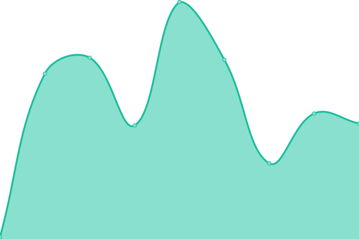

# [📈 Live Status](https://status.noplagi.xyz): <!--live status--> **🟧 Partial outage**

This repository contains the open-source uptime monitor and status page for [NoPlagiarism](https://status.noplagi.xyz), powered by [Upptime](https://github.com/upptime/upptime).

With [Upptime](https://upptime.js.org), you can get your own unlimited and free uptime monitor and status page, powered entirely by a GitHub repository. We use [Issues](https://github.com/NoPlagiarism/services-personal-upptime/issues) as incident reports, [Actions](https://github.com/NoPlagiarism/services-personal-upptime/actions) as uptime monitors, and [Pages](https://status.noplagi.xyz) for the status page.

<!--start: status pages-->
<!-- This summary is generated by Upptime (https://github.com/upptime/upptime) -->
<!-- Do not edit this manually, your changes will be overwritten -->
<!-- prettier-ignore -->
| URL | Status | History | Response Time | Uptime |
| --- | ------ | ------- | ------------- | ------ |
|  [ProxiTok cringe.datura.network](https://cringe.datura.network) | 🟥 Down | [proxi-tok-cringe-datura-network.yml](https://github.com/NoPlagiarism/services-personal-upptime/commits/HEAD/history/proxi-tok-cringe-datura-network.yml) | 

 0ms
     
 | 

<a href="https://upptime.noplagi.xyz/history/proxi-tok-cringe-datura-network">100.00%</a>
    

|  [ProxiTok cringe.seitan-ayoub.lol](https://cringe.seitan-ayoub.lol) | 🟩 Up | [proxi-tok-cringe-seitan-ayoub-lol.yml](https://github.com/NoPlagiarism/services-personal-upptime/commits/HEAD/history/proxi-tok-cringe-seitan-ayoub-lol.yml) | 

 484ms
     
 | 

<a href="https://upptime.noplagi.xyz/history/proxi-tok-cringe-seitan-ayoub-lol">98.93%</a>
    

|  [ProxiTok cringe.whatever.social](https://cringe.whatever.social) | 🟩 Up | [proxi-tok-cringe-whatever-social.yml](https://github.com/NoPlagiarism/services-personal-upptime/commits/HEAD/history/proxi-tok-cringe-whatever-social.yml) | 

 721ms
     
 | 

<a href="https://upptime.noplagi.xyz/history/proxi-tok-cringe-whatever-social">100.00%</a>
    

|  [ProxiTok cringe.whateveritworks.org](https://cringe.whateveritworks.org) | 🟩 Up | [proxi-tok-cringe-whateveritworks-org.yml](https://github.com/NoPlagiarism/services-personal-upptime/commits/HEAD/history/proxi-tok-cringe-whateveritworks-org.yml) | 

 559ms
     
 | 

<a href="https://upptime.noplagi.xyz/history/proxi-tok-cringe-whateveritworks-org">100.00%</a>
    

|  [ProxiTok proxitok.esmailelbob.xyz](https://proxitok.esmailelbob.xyz) | 🟥 Down | [proxi-tok-proxitok-esmailelbob-xyz.yml](https://github.com/NoPlagiarism/services-personal-upptime/commits/HEAD/history/proxi-tok-proxitok-esmailelbob-xyz.yml) | 

 440ms
     
 | 

<a href="https://upptime.noplagi.xyz/history/proxi-tok-proxitok-esmailelbob-xyz">0.00%</a>
    

|  [ProxiTok proxitok.kyun.li](https://proxitok.kyun.li) | 🟥 Down | [proxi-tok-proxitok-kyun-li.yml](https://github.com/NoPlagiarism/services-personal-upptime/commits/HEAD/history/proxi-tok-proxitok-kyun-li.yml) | 

 0ms
     
 | 

<a href="https://upptime.noplagi.xyz/history/proxi-tok-proxitok-kyun-li">0.00%</a>
    

|  [ProxiTok proxitok.lunar.icu](https://proxitok.lunar.icu) | 🟩 Up | [proxi-tok-proxitok-lunar-icu.yml](https://github.com/NoPlagiarism/services-personal-upptime/commits/HEAD/history/proxi-tok-proxitok-lunar-icu.yml) | 

 436ms
     
 | 

<a href="https://upptime.noplagi.xyz/history/proxi-tok-proxitok-lunar-icu">99.82%</a>
    

|  [ProxiTok proxitok.pabloferreiro.es](https://proxitok.pabloferreiro.es) | 🟩 Up | [proxi-tok-proxitok-pabloferreiro-es.yml](https://github.com/NoPlagiarism/services-personal-upptime/commits/HEAD/history/proxi-tok-proxitok-pabloferreiro-es.yml) | 

 571ms
     
 | 

<a href="https://upptime.noplagi.xyz/history/proxi-tok-proxitok-pabloferreiro-es">100.00%</a>
    

|  [ProxiTok proxitok.privacy.com.de](https://proxitok.privacy.com.de) | 🟥 Down | [proxi-tok-proxitok-privacy-com-de.yml](https://github.com/NoPlagiarism/services-personal-upptime/commits/HEAD/history/proxi-tok-proxitok-privacy-com-de.yml) | 

 626ms
     
 | 

<a href="https://upptime.noplagi.xyz/history/proxi-tok-proxitok-privacy-com-de">0.00%</a>
    

|  [ProxiTok proxitok.privacydev.net](https://proxitok.privacydev.net) | 🟩 Up | [proxi-tok-proxitok-privacydev-net.yml](https://github.com/NoPlagiarism/services-personal-upptime/commits/HEAD/history/proxi-tok-proxitok-privacydev-net.yml) | 

 833ms
     
 | 

<a href="https://upptime.noplagi.xyz/history/proxi-tok-proxitok-privacydev-net">99.63%</a>
    

|  [ProxiTok proxitok.pussthecat.org](https://proxitok.pussthecat.org) | 🟩 Up | [proxi-tok-proxitok-pussthecat-org.yml](https://github.com/NoPlagiarism/services-personal-upptime/commits/HEAD/history/proxi-tok-proxitok-pussthecat-org.yml) | 

 556ms
     
 | 

<a href="https://upptime.noplagi.xyz/history/proxi-tok-proxitok-pussthecat-org">100.00%</a>
    

|  [ProxiTok proxitok.r4fo.com](https://proxitok.r4fo.com) | 🟩 Up | [proxi-tok-proxitok-r4fo-com.yml](https://github.com/NoPlagiarism/services-personal-upptime/commits/HEAD/history/proxi-tok-proxitok-r4fo-com.yml) | 

 81ms
     
 | 

<a href="https://upptime.noplagi.xyz/history/proxi-tok-proxitok-r4fo-com">100.00%</a>
    

|  [ProxiTok proxitok.tinfoil-hat.net](https://proxitok.tinfoil-hat.net) | 🟩 Up | [proxi-tok-proxitok-tinfoil-hat-net.yml](https://github.com/NoPlagiarism/services-personal-upptime/commits/HEAD/history/proxi-tok-proxitok-tinfoil-hat-net.yml) | 

 404ms
     
 | 

<a href="https://upptime.noplagi.xyz/history/proxi-tok-proxitok-tinfoil-hat-net">100.00%</a>
    

|  [ProxiTok tik.hostux.net](https://tik.hostux.net) | 🟩 Up | [proxi-tok-tik-hostux-net.yml](https://github.com/NoPlagiarism/services-personal-upptime/commits/HEAD/history/proxi-tok-tik-hostux-net.yml) | 

 335ms
     
 | 

<a href="https://upptime.noplagi.xyz/history/proxi-tok-tik-hostux-net">100.00%</a>
    

|  [ProxiTok tiktok.wpme.pl](https://tiktok.wpme.pl) | 🟩 Up | [proxi-tok-tiktok-wpme-pl.yml](https://github.com/NoPlagiarism/services-personal-upptime/commits/HEAD/history/proxi-tok-tiktok-wpme-pl.yml) | 

 492ms
     
 | 

<a href="https://upptime.noplagi.xyz/history/proxi-tok-tiktok-wpme-pl">100.00%</a>
    

|  [ProxiTok tok.adminforge.de](https://tok.adminforge.de) | 🟩 Up | [proxi-tok-tok-adminforge-de.yml](https://github.com/NoPlagiarism/services-personal-upptime/commits/HEAD/history/proxi-tok-tok-adminforge-de.yml) | 

 656ms
     
 | 

<a href="https://upptime.noplagi.xyz/history/proxi-tok-tok-adminforge-de">99.89%</a>
    

|  [ProxiTok tok.artemislena.eu](https://tok.artemislena.eu) | 🟩 Up | [proxi-tok-tok-artemislena-eu.yml](https://github.com/NoPlagiarism/services-personal-upptime/commits/HEAD/history/proxi-tok-tok-artemislena-eu.yml) | 

 791ms
     
 | 

<a href="https://upptime.noplagi.xyz/history/proxi-tok-tok-artemislena-eu">99.75%</a>
    

|  [ProxiTok tok.habedieeh.re](https://tok.habedieeh.re) | 🟩 Up | [proxi-tok-tok-habedieeh-re.yml](https://github.com/NoPlagiarism/services-personal-upptime/commits/HEAD/history/proxi-tok-tok-habedieeh-re.yml) | 

 305ms
     
 | 

<a href="https://upptime.noplagi.xyz/history/proxi-tok-tok-habedieeh-re">100.00%</a>
    

|  [ProxiTok tt.opnxng.com](https://tt.opnxng.com) | 🟩 Up | [proxi-tok-tt-opnxng-com.yml](https://github.com/NoPlagiarism/services-personal-upptime/commits/HEAD/history/proxi-tok-tt-opnxng-com.yml) | 

 734ms
     
 | 

<a href="https://upptime.noplagi.xyz/history/proxi-tok-tt-opnxng-com">100.00%</a>
    

|  [ProxiTok tt.vern.cc](https://tt.vern.cc) | 🟩 Up | [proxi-tok-tt-vern-cc.yml](https://github.com/NoPlagiarism/services-personal-upptime/commits/HEAD/history/proxi-tok-tt-vern-cc.yml) | 

 188ms
     
 | 

<a href="https://upptime.noplagi.xyz/history/proxi-tok-tt-vern-cc">71.44%</a>
    

|  [GotHub g.opnxng.com](https://g.opnxng.com) | 🟩 Up | [got-hub-g-opnxng-com.yml](https://github.com/NoPlagiarism/services-personal-upptime/commits/HEAD/history/got-hub-g-opnxng-com.yml) | 

 704ms
     
 | 

<a href="https://upptime.noplagi.xyz/history/got-hub-g-opnxng-com">100.00%</a>
    

|  [GotHub gh.bloatcat.tk](https://gh.bloatcat.tk) | 🟩 Up | [got-hub-gh-bloatcat-tk.yml](https://github.com/NoPlagiarism/services-personal-upptime/commits/HEAD/history/got-hub-gh-bloatcat-tk.yml) | 

 1915ms
     
 | 

<a href="https://upptime.noplagi.xyz/history/got-hub-gh-bloatcat-tk">93.46%</a>
    

|  [GotHub gh.owo.si](https://gh.owo.si) | 🟩 Up | [got-hub-gh-owo-si.yml](https://github.com/NoPlagiarism/services-personal-upptime/commits/HEAD/history/got-hub-gh-owo-si.yml) | 

 765ms
     
 | 

<a href="https://upptime.noplagi.xyz/history/got-hub-gh-owo-si">100.00%</a>
    

|  [GotHub gh.whateveritworks.org](https://gh.whateveritworks.org) | 🟩 Up | [got-hub-gh-whateveritworks-org.yml](https://github.com/NoPlagiarism/services-personal-upptime/commits/HEAD/history/got-hub-gh-whateveritworks-org.yml) | 

 495ms
     
 | 

<a href="https://upptime.noplagi.xyz/history/got-hub-gh-whateveritworks-org">100.00%</a>
    

|  [GotHub gothub.dev.projectsegfau.lt](https://gothub.dev.projectsegfau.lt) | 🟩 Up | [got-hub-gothub-dev-projectsegfau-lt.yml](https://github.com/NoPlagiarism/services-personal-upptime/commits/HEAD/history/got-hub-gothub-dev-projectsegfau-lt.yml) | 

 1137ms
     
 | 

<a href="https://upptime.noplagi.xyz/history/got-hub-gothub-dev-projectsegfau-lt">99.21%</a>
    

|  [GotHub gothub.frontendfriendly.xyz](https://gothub.frontendfriendly.xyz) | 🟩 Up | [got-hub-gothub-frontendfriendly-xyz.yml](https://github.com/NoPlagiarism/services-personal-upptime/commits/HEAD/history/got-hub-gothub-frontendfriendly-xyz.yml) | 

 202ms
     
 | 

<a href="https://upptime.noplagi.xyz/history/got-hub-gothub-frontendfriendly-xyz">95.60%</a>
    

|  [GotHub gothub.lunar.icu](https://gothub.lunar.icu) | 🟩 Up | [got-hub-gothub-lunar-icu.yml](https://github.com/NoPlagiarism/services-personal-upptime/commits/HEAD/history/got-hub-gothub-lunar-icu.yml) | 

 480ms
     
 | 

<a href="https://upptime.noplagi.xyz/history/got-hub-gothub-lunar-icu">99.63%</a>
    

|  [GotHub gothub.no-logs.com](https://gothub.no-logs.com) | 🟩 Up | [got-hub-gothub-no-logs-com.yml](https://github.com/NoPlagiarism/services-personal-upptime/commits/HEAD/history/got-hub-gothub-no-logs-com.yml) | 

 435ms
     
 | 

<a href="https://upptime.noplagi.xyz/history/got-hub-gothub-no-logs-com">97.31%</a>
    

|  [GotHub gothub.projectsegfau.lt](https://gothub.projectsegfau.lt) | 🟩 Up | [got-hub-gothub-projectsegfau-lt.yml](https://github.com/NoPlagiarism/services-personal-upptime/commits/HEAD/history/got-hub-gothub-projectsegfau-lt.yml) | 

 327ms
     
 | 

<a href="https://upptime.noplagi.xyz/history/got-hub-gothub-projectsegfau-lt">100.00%</a>
    

|  [WikiLess wiki.adminforge.de](https://wiki.adminforge.de) | 🟩 Up | [wiki-less-wiki-adminforge-de.yml](https://github.com/NoPlagiarism/services-personal-upptime/commits/HEAD/history/wiki-less-wiki-adminforge-de.yml) | 

 847ms
     
 | 

<a href="https://upptime.noplagi.xyz/history/wiki-less-wiki-adminforge-de">99.89%</a>
    

|  [WikiLess wiki.froth.zone](https://wiki.froth.zone) | 🟩 Up | [wiki-less-wiki-froth-zone.yml](https://github.com/NoPlagiarism/services-personal-upptime/commits/HEAD/history/wiki-less-wiki-froth-zone.yml) | 

 147ms
     
 | 

<a href="https://upptime.noplagi.xyz/history/wiki-less-wiki-froth-zone">100.00%</a>
    

|  [WikiLess wiki.phreedom.club](https://wiki.phreedom.club) | 🟩 Up | [wiki-less-wiki-phreedom-club.yml](https://github.com/NoPlagiarism/services-personal-upptime/commits/HEAD/history/wiki-less-wiki-phreedom-club.yml) | 

 1573ms
     
 | 

<a href="https://upptime.noplagi.xyz/history/wiki-less-wiki-phreedom-club">98.64%</a>
    

|  [WikiLess wiki.privacytools.io](https://wiki.privacytools.io) | 🟩 Up | [wiki-less-wiki-privacytools-io.yml](https://github.com/NoPlagiarism/services-personal-upptime/commits/HEAD/history/wiki-less-wiki-privacytools-io.yml) | 

 1956ms
     
 | 

<a href="https://upptime.noplagi.xyz/history/wiki-less-wiki-privacytools-io">95.50%</a>
    

|  [WikiLess wikiless.esmailelbob.xyz](https://wikiless.esmailelbob.xyz) | 🟩 Up | [wiki-less-wikiless-esmailelbob-xyz.yml](https://github.com/NoPlagiarism/services-personal-upptime/commits/HEAD/history/wiki-less-wikiless-esmailelbob-xyz.yml) | 

 476ms
     
 | 

<a href="https://upptime.noplagi.xyz/history/wiki-less-wikiless-esmailelbob-xyz">98.07%</a>
    

|  [WikiLess wikiless.funami.tech](https://wikiless.funami.tech) | 🟩 Up | [wiki-less-wikiless-funami-tech.yml](https://github.com/NoPlagiarism/services-personal-upptime/commits/HEAD/history/wiki-less-wikiless-funami-tech.yml) | 

 900ms
     
 | 

<a href="https://upptime.noplagi.xyz/history/wiki-less-wikiless-funami-tech">99.84%</a>
    

|  [WikiLess wikiless.northboot.xyz](https://wikiless.northboot.xyz) | 🟩 Up | [wiki-less-wikiless-northboot-xyz.yml](https://github.com/NoPlagiarism/services-personal-upptime/commits/HEAD/history/wiki-less-wikiless-northboot-xyz.yml) | 

 850ms
     
 | 

<a href="https://upptime.noplagi.xyz/history/wiki-less-wikiless-northboot-xyz">99.90%</a>
    

|  [WikiLess wikiless.org](https://wikiless.org) | 🟩 Up | [wiki-less-wikiless-org.yml](https://github.com/NoPlagiarism/services-personal-upptime/commits/HEAD/history/wiki-less-wikiless-org.yml) | 

 930ms
     
 | 

<a href="https://upptime.noplagi.xyz/history/wiki-less-wikiless-org">100.00%</a>
    

|  [WikiLess wikiless.rawbit.ninja](https://wikiless.rawbit.ninja) | 🟩 Up | [wiki-less-wikiless-rawbit-ninja.yml](https://github.com/NoPlagiarism/services-personal-upptime/commits/HEAD/history/wiki-less-wikiless-rawbit-ninja.yml) | 

 204ms
     
 | 

<a href="https://upptime.noplagi.xyz/history/wiki-less-wikiless-rawbit-ninja">100.00%</a>
    

|  [WikiLess wikiless.tiekoetter.com](https://wikiless.tiekoetter.com) | 🟩 Up | [wiki-less-wikiless-tiekoetter-com.yml](https://github.com/NoPlagiarism/services-personal-upptime/commits/HEAD/history/wiki-less-wikiless-tiekoetter-com.yml) | 

 820ms
     
 | 

<a href="https://upptime.noplagi.xyz/history/wiki-less-wikiless-tiekoetter-com">100.00%</a>
    

|  [WikiLess wikiless.whateveritworks.org](https://wikiless.whateveritworks.org) | 🟩 Up | [wiki-less-wikiless-whateveritworks-org.yml](https://github.com/NoPlagiarism/services-personal-upptime/commits/HEAD/history/wiki-less-wikiless-whateveritworks-org.yml) | 

 660ms
     
 | 

<a href="https://upptime.noplagi.xyz/history/wiki-less-wikiless-whateveritworks-org">99.45%</a>
    

|  [WikiLess wl.vern.cc](https://wl.vern.cc) | 🟩 Up | [wiki-less-wl-vern-cc.yml](https://github.com/NoPlagiarism/services-personal-upptime/commits/HEAD/history/wiki-less-wl-vern-cc.yml) | 

 1136ms
     
 | 

<a href="https://upptime.noplagi.xyz/history/wiki-less-wl-vern-cc">70.87%</a>
    

|  [librarian (discontinued) lbry.mywire.org](https://lbry.mywire.org) | 🟩 Up | [librarian-discontinued-lbry-mywire-org.yml](https://github.com/NoPlagiarism/services-personal-upptime/commits/HEAD/history/librarian-discontinued-lbry-mywire-org.yml) | 

 1000ms
     
 | 

<a href="https://upptime.noplagi.xyz/history/librarian-discontinued-lbry-mywire-org">100.00%</a>
    

|  [librarian (discontinued) lbry.ooguy.com](https://lbry.ooguy.com) | 🟩 Up | [librarian-discontinued-lbry-ooguy-com.yml](https://github.com/NoPlagiarism/services-personal-upptime/commits/HEAD/history/librarian-discontinued-lbry-ooguy-com.yml) | 

 552ms
     
 | 

<a href="https://upptime.noplagi.xyz/history/librarian-discontinued-lbry-ooguy-com">100.00%</a>
    

|  [librarian (discontinued) lbry.projectsegfau.lt](https://lbry.projectsegfau.lt) | 🟩 Up | [librarian-discontinued-lbry-projectsegfau-lt.yml](https://github.com/NoPlagiarism/services-personal-upptime/commits/HEAD/history/librarian-discontinued-lbry-projectsegfau-lt.yml) | 

 451ms
     
 | 

<a href="https://upptime.noplagi.xyz/history/librarian-discontinued-lbry-projectsegfau-lt">100.00%</a>
    

|  [librarian (discontinued) lbry.ramondia.net](https://lbry.ramondia.net) | 🟩 Up | [librarian-discontinued-lbry-ramondia-net.yml](https://github.com/NoPlagiarism/services-personal-upptime/commits/HEAD/history/librarian-discontinued-lbry-ramondia-net.yml) | 

 490ms
     
 | 

<a href="https://upptime.noplagi.xyz/history/librarian-discontinued-lbry-ramondia-net">100.00%</a>
    

|  [librarian (discontinued) lbry.slipfox.xyz](https://lbry.slipfox.xyz) | 🟩 Up | [librarian-discontinued-lbry-slipfox-xyz.yml](https://github.com/NoPlagiarism/services-personal-upptime/commits/HEAD/history/librarian-discontinued-lbry-slipfox-xyz.yml) | 

 88ms
     
 | 

<a href="https://upptime.noplagi.xyz/history/librarian-discontinued-lbry-slipfox-xyz">99.31%</a>
    

|  [librarian (discontinued) lbry.vern.cc](https://lbry.vern.cc) | 🟩 Up | [librarian-discontinued-lbry-vern-cc.yml](https://github.com/NoPlagiarism/services-personal-upptime/commits/HEAD/history/librarian-discontinued-lbry-vern-cc.yml) | 

 197ms
     
 | 

<a href="https://upptime.noplagi.xyz/history/librarian-discontinued-lbry-vern-cc">71.45%</a>
    

|  [librarian (discontinued) librarian.pussthecat.org](https://librarian.pussthecat.org) | 🟩 Up | [librarian-discontinued-librarian-pussthecat-org.yml](https://github.com/NoPlagiarism/services-personal-upptime/commits/HEAD/history/librarian-discontinued-librarian-pussthecat-org.yml) | 

 657ms
     
 | 

<a href="https://upptime.noplagi.xyz/history/librarian-discontinued-librarian-pussthecat-org">100.00%</a>
    

|  [librarian (discontinued) watch.whateveritworks.org](https://watch.whateveritworks.org) | 🟩 Up | [librarian-discontinued-watch-whateveritworks-org.yml](https://github.com/NoPlagiarism/services-personal-upptime/commits/HEAD/history/librarian-discontinued-watch-whateveritworks-org.yml) | 

 780ms
     
 | 

<a href="https://upptime.noplagi.xyz/history/librarian-discontinued-watch-whateveritworks-org">100.00%</a>
    

|  [AnonymousOverflow anonoverflow.frontendfriendly.xyz](https://anonoverflow.frontendfriendly.xyz) | 🟩 Up | [anonymous-overflow-anonoverflow-frontendfriendly-xyz.yml](https://github.com/NoPlagiarism/services-personal-upptime/commits/HEAD/history/anonymous-overflow-anonoverflow-frontendfriendly-xyz.yml) | 

 177ms
     
 | 

<a href="https://upptime.noplagi.xyz/history/anonymous-overflow-anonoverflow-frontendfriendly-xyz">100.00%</a>
    

|  [AnonymousOverflow anonoverflow.hyperreal.coffee](https://anonoverflow.hyperreal.coffee) | 🟩 Up | [anonymous-overflow-anonoverflow-hyperreal-coffee.yml](https://github.com/NoPlagiarism/services-personal-upptime/commits/HEAD/history/anonymous-overflow-anonoverflow-hyperreal-coffee.yml) | 

 348ms
     
 | 

<a href="https://upptime.noplagi.xyz/history/anonymous-overflow-anonoverflow-hyperreal-coffee">97.23%</a>
    

|  [AnonymousOverflow anonymousoverflow.privacyfucking.rocks](https://anonymousoverflow.privacyfucking.rocks) | 🟩 Up | [anonymous-overflow-anonymousoverflow-privacyfucking-rocks.yml](https://github.com/NoPlagiarism/services-personal-upptime/commits/HEAD/history/anonymous-overflow-anonymousoverflow-privacyfucking-rocks.yml) | 

 547ms
     
 | 

<a href="https://upptime.noplagi.xyz/history/anonymous-overflow-anonymousoverflow-privacyfucking-rocks">100.00%</a>
    

|  [AnonymousOverflow ao.bloatcat.tk](https://ao.bloatcat.tk) | 🟩 Up | [anonymous-overflow-ao-bloatcat-tk.yml](https://github.com/NoPlagiarism/services-personal-upptime/commits/HEAD/history/anonymous-overflow-ao-bloatcat-tk.yml) | 

 1748ms
     
 | 

<a href="https://upptime.noplagi.xyz/history/anonymous-overflow-ao-bloatcat-tk">81.45%</a>
    

|  [AnonymousOverflow ao.ftw.lol](https://ao.ftw.lol) | 🟩 Up | [anonymous-overflow-ao-ftw-lol.yml](https://github.com/NoPlagiarism/services-personal-upptime/commits/HEAD/history/anonymous-overflow-ao-ftw-lol.yml) | 

 750ms
     
 | 

<a href="https://upptime.noplagi.xyz/history/anonymous-overflow-ao-ftw-lol">100.00%</a>
    

|  [AnonymousOverflow ao.vern.cc](https://ao.vern.cc) | 🟩 Up | [anonymous-overflow-ao-vern-cc.yml](https://github.com/NoPlagiarism/services-personal-upptime/commits/HEAD/history/anonymous-overflow-ao-vern-cc.yml) | 

 104ms
     
 | 

<a href="https://upptime.noplagi.xyz/history/anonymous-overflow-ao-vern-cc">17.04%</a>
    

|  [AnonymousOverflow code.whatever.social](https://code.whatever.social) | 🟩 Up | [anonymous-overflow-code-whatever-social.yml](https://github.com/NoPlagiarism/services-personal-upptime/commits/HEAD/history/anonymous-overflow-code-whatever-social.yml) | 

 749ms
     
 | 

<a href="https://upptime.noplagi.xyz/history/anonymous-overflow-code-whatever-social">100.00%</a>
    

|  [AnonymousOverflow exchange.seitan-ayoub.lol](https://exchange.seitan-ayoub.lol) | 🟩 Up | [anonymous-overflow-exchange-seitan-ayoub-lol.yml](https://github.com/NoPlagiarism/services-personal-upptime/commits/HEAD/history/anonymous-overflow-exchange-seitan-ayoub-lol.yml) | 

 501ms
     
 | 

<a href="https://upptime.noplagi.xyz/history/anonymous-overflow-exchange-seitan-ayoub-lol">98.93%</a>
    

|  [AnonymousOverflow overflow.adminforge.de](https://overflow.adminforge.de) | 🟩 Up | [anonymous-overflow-overflow-adminforge-de.yml](https://github.com/NoPlagiarism/services-personal-upptime/commits/HEAD/history/anonymous-overflow-overflow-adminforge-de.yml) | 

 593ms
     
 | 

<a href="https://upptime.noplagi.xyz/history/anonymous-overflow-overflow-adminforge-de">100.00%</a>
    

|  [AnonymousOverflow overflow.datura.network](https://overflow.datura.network) | 🟥 Down | [anonymous-overflow-overflow-datura-network.yml](https://github.com/NoPlagiarism/services-personal-upptime/commits/HEAD/history/anonymous-overflow-overflow-datura-network.yml) | 

 0ms
     
 | 

<a href="https://upptime.noplagi.xyz/history/anonymous-overflow-overflow-datura-network">0.00%</a>
    

|  [AnonymousOverflow overflow.fascinated.cc](https://overflow.fascinated.cc) | 🟩 Up | [anonymous-overflow-overflow-fascinated-cc.yml](https://github.com/NoPlagiarism/services-personal-upptime/commits/HEAD/history/anonymous-overflow-overflow-fascinated-cc.yml) | 

 439ms
     
 | 

<a href="https://upptime.noplagi.xyz/history/anonymous-overflow-overflow-fascinated-cc">99.75%</a>
    

|  [AnonymousOverflow overflow.hostux.net](https://overflow.hostux.net) | 🟩 Up | [anonymous-overflow-overflow-hostux-net.yml](https://github.com/NoPlagiarism/services-personal-upptime/commits/HEAD/history/anonymous-overflow-overflow-hostux-net.yml) | 

 357ms
     
 | 

<a href="https://upptime.noplagi.xyz/history/anonymous-overflow-overflow-hostux-net">100.00%</a>
    

|  [AnonymousOverflow overflow.lunar.icu](https://overflow.lunar.icu) | 🟩 Up | [anonymous-overflow-overflow-lunar-icu.yml](https://github.com/NoPlagiarism/services-personal-upptime/commits/HEAD/history/anonymous-overflow-overflow-lunar-icu.yml) | 

 391ms
     
 | 

<a href="https://upptime.noplagi.xyz/history/anonymous-overflow-overflow-lunar-icu">99.73%</a>
    

|  [AnonymousOverflow overflow.projectsegfau.lt](https://overflow.projectsegfau.lt) | 🟩 Up | [anonymous-overflow-overflow-projectsegfau-lt.yml](https://github.com/NoPlagiarism/services-personal-upptime/commits/HEAD/history/anonymous-overflow-overflow-projectsegfau-lt.yml) | 

 338ms
     
 | 

<a href="https://upptime.noplagi.xyz/history/anonymous-overflow-overflow-projectsegfau-lt">100.00%</a>
    

|  [AnonymousOverflow overflow.r4fo.com](https://overflow.r4fo.com) | 🟩 Up | [anonymous-overflow-overflow-r4fo-com.yml](https://github.com/NoPlagiarism/services-personal-upptime/commits/HEAD/history/anonymous-overflow-overflow-r4fo-com.yml) | 

 372ms
     
 | 

<a href="https://upptime.noplagi.xyz/history/anonymous-overflow-overflow-r4fo-com">99.92%</a>
    

|  [AnonymousOverflow overflow.smnz.de](https://overflow.smnz.de) | 🟩 Up | [anonymous-overflow-overflow-smnz-de.yml](https://github.com/NoPlagiarism/services-personal-upptime/commits/HEAD/history/anonymous-overflow-overflow-smnz-de.yml) | 

 721ms
     
 | 

<a href="https://upptime.noplagi.xyz/history/anonymous-overflow-overflow-smnz-de">100.00%</a>
    

|  [AnonymousOverflow overflow.sudovanilla.com](https://overflow.sudovanilla.com) | 🟩 Up | [anonymous-overflow-overflow-sudovanilla-com.yml](https://github.com/NoPlagiarism/services-personal-upptime/commits/HEAD/history/anonymous-overflow-overflow-sudovanilla-com.yml) | 

 204ms
     
 | 

<a href="https://upptime.noplagi.xyz/history/anonymous-overflow-overflow-sudovanilla-com">100.00%</a>
    

|  [libreddit libreddit.freedit.eu](https://libreddit.freedit.eu) | 🟩 Up | [libreddit-libreddit-freedit-eu.yml](https://github.com/NoPlagiarism/services-personal-upptime/commits/HEAD/history/libreddit-libreddit-freedit-eu.yml) | 

 567ms
     
 | 

<a href="https://upptime.noplagi.xyz/history/libreddit-libreddit-freedit-eu">100.00%</a>
    

|  [libreddit libreddit.kylrth.com](https://libreddit.kylrth.com) | 🟩 Up | [libreddit-libreddit-kylrth-com.yml](https://github.com/NoPlagiarism/services-personal-upptime/commits/HEAD/history/libreddit-libreddit-kylrth-com.yml) | 

 546ms
     
 | 

<a href="https://upptime.noplagi.xyz/history/libreddit-libreddit-kylrth-com">99.59%</a>
    

|  [libreddit libreddit.lunar.icu](https://libreddit.lunar.icu) | 🟩 Up | [libreddit-libreddit-lunar-icu.yml](https://github.com/NoPlagiarism/services-personal-upptime/commits/HEAD/history/libreddit-libreddit-lunar-icu.yml) | 

 2490ms
     
 | 

<a href="https://upptime.noplagi.xyz/history/libreddit-libreddit-lunar-icu">99.13%</a>
    

|  [libreddit libreddit.northboot.xyz](https://libreddit.northboot.xyz) | 🟩 Up | [libreddit-libreddit-northboot-xyz.yml](https://github.com/NoPlagiarism/services-personal-upptime/commits/HEAD/history/libreddit-libreddit-northboot-xyz.yml) | 

 1249ms
     
 | 

<a href="https://upptime.noplagi.xyz/history/libreddit-libreddit-northboot-xyz">99.90%</a>
    

|  [libreddit libreddit.projectsegfau.lt](https://libreddit.projectsegfau.lt) | 🟩 Up | [libreddit-libreddit-projectsegfau-lt.yml](https://github.com/NoPlagiarism/services-personal-upptime/commits/HEAD/history/libreddit-libreddit-projectsegfau-lt.yml) | 

 851ms
     
 | 

<a href="https://upptime.noplagi.xyz/history/libreddit-libreddit-projectsegfau-lt">100.00%</a>
    

|  [libreddit libreddit.strongthany.cc](https://libreddit.strongthany.cc) | 🟩 Up | [libreddit-libreddit-strongthany-cc.yml](https://github.com/NoPlagiarism/services-personal-upptime/commits/HEAD/history/libreddit-libreddit-strongthany-cc.yml) | 

 1235ms
     
 | 

<a href="https://upptime.noplagi.xyz/history/libreddit-libreddit-strongthany-cc">100.00%</a>
    

|  [libreddit libreddit.tux.pizza](https://libreddit.tux.pizza) | 🟩 Up | [libreddit-libreddit-tux-pizza.yml](https://github.com/NoPlagiarism/services-personal-upptime/commits/HEAD/history/libreddit-libreddit-tux-pizza.yml) | 

 720ms
     
 | 

<a href="https://upptime.noplagi.xyz/history/libreddit-libreddit-tux-pizza">99.92%</a>
    

|  [libreddit lr.artemislena.eu](https://lr.artemislena.eu) | 🟩 Up | [libreddit-lr-artemislena-eu.yml](https://github.com/NoPlagiarism/services-personal-upptime/commits/HEAD/history/libreddit-lr-artemislena-eu.yml) | 

 2699ms
     
 | 

<a href="https://upptime.noplagi.xyz/history/libreddit-lr-artemislena-eu">99.53%</a>
    

|  [libreddit reddit.invak.id](https://reddit.invak.id) | 🟩 Up | [libreddit-reddit-invak-id.yml](https://github.com/NoPlagiarism/services-personal-upptime/commits/HEAD/history/libreddit-reddit-invak-id.yml) | 

 1240ms
     
 | 

<a href="https://upptime.noplagi.xyz/history/libreddit-reddit-invak-id">99.08%</a>
    

|  [libreddit reddit.simo.sh](https://reddit.simo.sh) | 🟩 Up | [libreddit-reddit-simo-sh.yml](https://github.com/NoPlagiarism/services-personal-upptime/commits/HEAD/history/libreddit-reddit-simo-sh.yml) | 

 2140ms
     
 | 

<a href="https://upptime.noplagi.xyz/history/libreddit-reddit-simo-sh">100.00%</a>
    

|  [libreddit safereddit.com](https://safereddit.com) | 🟩 Up | [libreddit-safereddit-com.yml](https://github.com/NoPlagiarism/services-personal-upptime/commits/HEAD/history/libreddit-safereddit-com.yml) | 

 230ms
     
 | 

<a href="https://upptime.noplagi.xyz/history/libreddit-safereddit-com">99.82%</a>
    

|  [BreezeWiki antifandom.com](https://antifandom.com) | 🟩 Up | [breeze-wiki-antifandom-com.yml](https://github.com/NoPlagiarism/services-personal-upptime/commits/HEAD/history/breeze-wiki-antifandom-com.yml) | 

 252ms
     
 | 

<a href="https://upptime.noplagi.xyz/history/breeze-wiki-antifandom-com">100.00%</a>
    

|  [BreezeWiki breeze.hostux.net](https://breeze.hostux.net) | 🟩 Up | [breeze-wiki-breeze-hostux-net.yml](https://github.com/NoPlagiarism/services-personal-upptime/commits/HEAD/history/breeze-wiki-breeze-hostux-net.yml) | 

 317ms
     
 | 

<a href="https://upptime.noplagi.xyz/history/breeze-wiki-breeze-hostux-net">100.00%</a>
    

|  [BreezeWiki breeze.mint.lgbt](https://breeze.mint.lgbt) | 🟩 Up | [breeze-wiki-breeze-mint-lgbt.yml](https://github.com/NoPlagiarism/services-personal-upptime/commits/HEAD/history/breeze-wiki-breeze-mint-lgbt.yml) | 

 1285ms
     
 | 

<a href="https://upptime.noplagi.xyz/history/breeze-wiki-breeze-mint-lgbt">99.93%</a>
    

|  [BreezeWiki breeze.nohost.network](https://breeze.nohost.network) | 🟩 Up | [breeze-wiki-breeze-nohost-network.yml](https://github.com/NoPlagiarism/services-personal-upptime/commits/HEAD/history/breeze-wiki-breeze-nohost-network.yml) | 

 285ms
     
 | 

<a href="https://upptime.noplagi.xyz/history/breeze-wiki-breeze-nohost-network">100.00%</a>
    

|  [BreezeWiki breeze.whateveritworks.org](https://breeze.whateveritworks.org) | 🟩 Up | [breeze-wiki-breeze-whateveritworks-org.yml](https://github.com/NoPlagiarism/services-personal-upptime/commits/HEAD/history/breeze-wiki-breeze-whateveritworks-org.yml) | 

 530ms
     
 | 

<a href="https://upptime.noplagi.xyz/history/breeze-wiki-breeze-whateveritworks-org">100.00%</a>
    

|  [BreezeWiki breezewiki.catsarch.com](https://breezewiki.catsarch.com) | 🟩 Up | [breeze-wiki-breezewiki-catsarch-com.yml](https://github.com/NoPlagiarism/services-personal-upptime/commits/HEAD/history/breeze-wiki-breezewiki-catsarch-com.yml) | 

 213ms
     
 | 

<a href="https://upptime.noplagi.xyz/history/breeze-wiki-breezewiki-catsarch-com">99.91%</a>
    

|  [BreezeWiki breezewiki.com](https://breezewiki.com) | 🟩 Up | [breeze-wiki-breezewiki-com.yml](https://github.com/NoPlagiarism/services-personal-upptime/commits/HEAD/history/breeze-wiki-breezewiki-com.yml) | 

 196ms
     
 | 

<a href="https://upptime.noplagi.xyz/history/breeze-wiki-breezewiki-com">100.00%</a>
    

|  [BreezeWiki breezewiki.frontendfriendly.xyz](https://breezewiki.frontendfriendly.xyz) | 🟩 Up | [breeze-wiki-breezewiki-frontendfriendly-xyz.yml](https://github.com/NoPlagiarism/services-personal-upptime/commits/HEAD/history/breeze-wiki-breezewiki-frontendfriendly-xyz.yml) | 

 219ms
     
 | 

<a href="https://upptime.noplagi.xyz/history/breeze-wiki-breezewiki-frontendfriendly-xyz">94.21%</a>
    

|  [BreezeWiki breezewiki.hyperreal.coffee](https://breezewiki.hyperreal.coffee) | 🟥 Down | [breeze-wiki-breezewiki-hyperreal-coffee.yml](https://github.com/NoPlagiarism/services-personal-upptime/commits/HEAD/history/breeze-wiki-breezewiki-hyperreal-coffee.yml) | 

 310ms
     
 | 

<a href="https://upptime.noplagi.xyz/history/breeze-wiki-breezewiki-hyperreal-coffee">97.69%</a>
    

|  [BreezeWiki breezewiki.pussthecat.org](https://breezewiki.pussthecat.org) | 🟩 Up | [breeze-wiki-breezewiki-pussthecat-org.yml](https://github.com/NoPlagiarism/services-personal-upptime/commits/HEAD/history/breeze-wiki-breezewiki-pussthecat-org.yml) | 

 486ms
     
 | 

<a href="https://upptime.noplagi.xyz/history/breeze-wiki-breezewiki-pussthecat-org">99.85%</a>
    

|  [BreezeWiki breezewiki.woodland.cafe](https://breezewiki.woodland.cafe) | 🟩 Up | [breeze-wiki-breezewiki-woodland-cafe.yml](https://github.com/NoPlagiarism/services-personal-upptime/commits/HEAD/history/breeze-wiki-breezewiki-woodland-cafe.yml) | 

 764ms
     
 | 

<a href="https://upptime.noplagi.xyz/history/breeze-wiki-breezewiki-woodland-cafe">100.00%</a>
    

|  [BreezeWiki bw.artemislena.eu](https://bw.artemislena.eu) | 🟩 Up | [breeze-wiki-bw-artemislena-eu.yml](https://github.com/NoPlagiarism/services-personal-upptime/commits/HEAD/history/breeze-wiki-bw-artemislena-eu.yml) | 

 875ms
     
 | 

<a href="https://upptime.noplagi.xyz/history/breeze-wiki-bw-artemislena-eu">99.74%</a>
    

|  [BreezeWiki bw.hamstro.dev](https://bw.hamstro.dev) | 🟩 Up | [breeze-wiki-bw-hamstro-dev.yml](https://github.com/NoPlagiarism/services-personal-upptime/commits/HEAD/history/breeze-wiki-bw-hamstro-dev.yml) | 

 105ms
     
 | 

<a href="https://upptime.noplagi.xyz/history/breeze-wiki-bw-hamstro-dev">100.00%</a>
    

|  [BreezeWiki bw.projectsegfau.lt](https://bw.projectsegfau.lt) | 🟩 Up | [breeze-wiki-bw-projectsegfau-lt.yml](https://github.com/NoPlagiarism/services-personal-upptime/commits/HEAD/history/breeze-wiki-bw-projectsegfau-lt.yml) | 

 289ms
     
 | 

<a href="https://upptime.noplagi.xyz/history/breeze-wiki-bw-projectsegfau-lt">97.97%</a>
    

|  [BreezeWiki bw.skunky7dhv7nohsoalpwe3sxfz3fbkad7r3wk632riye25vqm3meqead.onion](https://bw.skunky7dhv7nohsoalpwe3sxfz3fbkad7r3wk632riye25vqm3meqead.onion) | 🟥 Down | [breeze-wiki-bw-skunky7dhv7nohsoalpwe3sxfz3fbkad7r3wk632riye25vqm3meqead-onion.yml](https://github.com/NoPlagiarism/services-personal-upptime/commits/HEAD/history/breeze-wiki-bw-skunky7dhv7nohsoalpwe3sxfz3fbkad7r3wk632riye25vqm3meqead-onion.yml) | 

 0ms
     
 | 

<a href="https://upptime.noplagi.xyz/history/breeze-wiki-bw-skunky7dhv7nohsoalpwe3sxfz3fbkad7r3wk632riye25vqm3meqead-onion">100.00%</a>
    

|  [BreezeWiki nerd.whatever.social](https://nerd.whatever.social) | 🟥 Down | [breeze-wiki-nerd-whatever-social.yml](https://github.com/NoPlagiarism/services-personal-upptime/commits/HEAD/history/breeze-wiki-nerd-whatever-social.yml) | 

 0ms
     
 | 

<a href="https://upptime.noplagi.xyz/history/breeze-wiki-nerd-whatever-social">0.00%</a>
    

|  [BreezeWiki z.opnxng.com](https://z.opnxng.com) | 🟩 Up | [breeze-wiki-z-opnxng-com.yml](https://github.com/NoPlagiarism/services-personal-upptime/commits/HEAD/history/breeze-wiki-z-opnxng-com.yml) | 

 711ms
     
 | 

<a href="https://upptime.noplagi.xyz/history/breeze-wiki-z-opnxng-com">100.00%</a>
    

|  [rimgo imgur.artemislena.eu](https://imgur.artemislena.eu) | 🟩 Up | [rimgo-imgur-artemislena-eu.yml](https://github.com/NoPlagiarism/services-personal-upptime/commits/HEAD/history/rimgo-imgur-artemislena-eu.yml) | 

 663ms
     
 | 

<a href="https://upptime.noplagi.xyz/history/rimgo-imgur-artemislena-eu">99.89%</a>
    

|  [rimgo rimgo.bus-hit.me](https://rimgo.bus-hit.me) | 🟩 Up | [rimgo-rimgo-bus-hit-me.yml](https://github.com/NoPlagiarism/services-personal-upptime/commits/HEAD/history/rimgo-rimgo-bus-hit-me.yml) | 

 332ms
     
 | 

<a href="https://upptime.noplagi.xyz/history/rimgo-rimgo-bus-hit-me">100.00%</a>
    

|  [rimgo rimgo.pussthecat.org](https://rimgo.pussthecat.org) | 🟩 Up | [rimgo-rimgo-pussthecat-org.yml](https://github.com/NoPlagiarism/services-personal-upptime/commits/HEAD/history/rimgo-rimgo-pussthecat-org.yml) | 

 453ms
     
 | 

<a href="https://upptime.noplagi.xyz/history/rimgo-rimgo-pussthecat-org">100.00%</a>
    

|  [rimgo rimgo.totaldarkness.net](https://rimgo.totaldarkness.net) | 🟩 Up | [rimgo-rimgo-totaldarkness-net.yml](https://github.com/NoPlagiarism/services-personal-upptime/commits/HEAD/history/rimgo-rimgo-totaldarkness-net.yml) | 

 205ms
     
 | 

<a href="https://upptime.noplagi.xyz/history/rimgo-rimgo-totaldarkness-net">100.00%</a>
    

|  [RYD-Proxy ryd-proxy.kavin.rocks](https://ryd-proxy.kavin.rocks) | 🟩 Up | [ryd-proxy-ryd-proxy-kavin-rocks.yml](https://github.com/NoPlagiarism/services-personal-upptime/commits/HEAD/history/ryd-proxy-ryd-proxy-kavin-rocks.yml) | 

 197ms
     
 | 

<a href="https://upptime.noplagi.xyz/history/ryd-proxy-ryd-proxy-kavin-rocks">100.00%</a>
    

|  [RYD-Proxy ryd-proxy.whateveritworks.org](https://ryd-proxy.whateveritworks.org) | 🟩 Up | [ryd-proxy-ryd-proxy-whateveritworks-org.yml](https://github.com/NoPlagiarism/services-personal-upptime/commits/HEAD/history/ryd-proxy-ryd-proxy-whateveritworks-org.yml) | 

 453ms
     
 | 

<a href="https://upptime.noplagi.xyz/history/ryd-proxy-ryd-proxy-whateveritworks-org">100.00%</a>
    

<!--end: status pages-->

[**Visit our status website →**](https://status.noplagi.xyz)

## 📄 License

- Powered by: [Upptime](https://github.com/upptime/upptime)
- Code: [MIT](./LICENSE) © [NoPlagiarism](https://status.noplagi.xyz)
- Data in the `./history` directory: [Open Database License](https://opendatacommons.org/licenses/odbl/1-0/)
