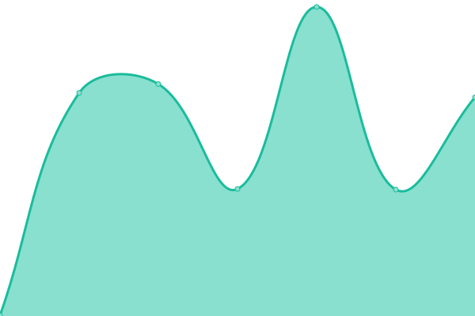

# [📈 Live Status](https://status.noplagi.xyz): <!--live status--> **🟧 Partial outage**

This repository contains the open-source uptime monitor and status page for [NoPlagiarism](https://status.noplagi.xyz), powered by [Upptime](https://github.com/upptime/upptime).

With [Upptime](https://upptime.js.org), you can get your own unlimited and free uptime monitor and status page, powered entirely by a GitHub repository. We use [Issues](https://github.com/NoPlagiarism/services-personal-upptime/issues) as incident reports, [Actions](https://github.com/NoPlagiarism/services-personal-upptime/actions) as uptime monitors, and [Pages](https://status.noplagi.xyz) for the status page.

<!--start: status pages-->
<!-- This summary is generated by Upptime (https://github.com/upptime/upptime) -->
<!-- Do not edit this manually, your changes will be overwritten -->
<!-- prettier-ignore -->
| URL | Status | History | Response Time | Uptime |
| --- | ------ | ------- | ------------- | ------ |
|  [ProxiTok cringe.whatever.social](https://cringe.whatever.social) | 🟩 Up | [proxi-tok-cringe-whatever-social.yml](https://github.com/NoPlagiarism/services-personal-upptime/commits/HEAD/history/proxi-tok-cringe-whatever-social.yml) | 

 840ms
     
 | 

<a href="https://upptime.noplagi.xyz/history/proxi-tok-cringe-whatever-social">88.85%</a>
    

|  [ProxiTok cringe.whateveritworks.org](https://cringe.whateveritworks.org) | 🟩 Up | [proxi-tok-cringe-whateveritworks-org.yml](https://github.com/NoPlagiarism/services-personal-upptime/commits/HEAD/history/proxi-tok-cringe-whateveritworks-org.yml) | 

 566ms
     
 | 

<a href="https://upptime.noplagi.xyz/history/proxi-tok-cringe-whateveritworks-org">100.00%</a>
    

|  [ProxiTok proxitok.esmailelbob.xyz](https://proxitok.esmailelbob.xyz) | 🟩 Up | [proxi-tok-proxitok-esmailelbob-xyz.yml](https://github.com/NoPlagiarism/services-personal-upptime/commits/HEAD/history/proxi-tok-proxitok-esmailelbob-xyz.yml) | 

 1038ms
     
 | 

<a href="https://upptime.noplagi.xyz/history/proxi-tok-proxitok-esmailelbob-xyz">100.00%</a>
    

|  [ProxiTok proxitok.lunar.icu](https://proxitok.lunar.icu) | 🟩 Up | [proxi-tok-proxitok-lunar-icu.yml](https://github.com/NoPlagiarism/services-personal-upptime/commits/HEAD/history/proxi-tok-proxitok-lunar-icu.yml) | 

 422ms
     
 | 

<a href="https://upptime.noplagi.xyz/history/proxi-tok-proxitok-lunar-icu">99.82%</a>
    

|  [ProxiTok proxitok.pabloferreiro.es](https://proxitok.pabloferreiro.es) | 🟩 Up | [proxi-tok-proxitok-pabloferreiro-es.yml](https://github.com/NoPlagiarism/services-personal-upptime/commits/HEAD/history/proxi-tok-proxitok-pabloferreiro-es.yml) | 

 549ms
     
 | 

<a href="https://upptime.noplagi.xyz/history/proxi-tok-proxitok-pabloferreiro-es">100.00%</a>
    

|  [ProxiTok proxitok.privacy.com.de](https://proxitok.privacy.com.de) | 🟥 Down | [proxi-tok-proxitok-privacy-com-de.yml](https://github.com/NoPlagiarism/services-personal-upptime/commits/HEAD/history/proxi-tok-proxitok-privacy-com-de.yml) | 

 737ms
     
 | 

<a href="https://upptime.noplagi.xyz/history/proxi-tok-proxitok-privacy-com-de">0.00%</a>
    

|  [ProxiTok proxitok.privacydev.net](https://proxitok.privacydev.net) | 🟩 Up | [proxi-tok-proxitok-privacydev-net.yml](https://github.com/NoPlagiarism/services-personal-upptime/commits/HEAD/history/proxi-tok-proxitok-privacydev-net.yml) | 

 775ms
     
 | 

<a href="https://upptime.noplagi.xyz/history/proxi-tok-proxitok-privacydev-net">100.00%</a>
    

|  [ProxiTok proxitok.pussthecat.org](https://proxitok.pussthecat.org) | 🟩 Up | [proxi-tok-proxitok-pussthecat-org.yml](https://github.com/NoPlagiarism/services-personal-upptime/commits/HEAD/history/proxi-tok-proxitok-pussthecat-org.yml) | 

 725ms
     
 | 

<a href="https://upptime.noplagi.xyz/history/proxi-tok-proxitok-pussthecat-org">100.00%</a>
    

|  [ProxiTok tik.hostux.net](https://tik.hostux.net) | 🟩 Up | [proxi-tok-tik-hostux-net.yml](https://github.com/NoPlagiarism/services-personal-upptime/commits/HEAD/history/proxi-tok-tik-hostux-net.yml) | 

 385ms
     
 | 

<a href="https://upptime.noplagi.xyz/history/proxi-tok-tik-hostux-net">71.55%</a>
    

|  [ProxiTok tok.adminforge.de](https://tok.adminforge.de) | 🟩 Up | [proxi-tok-tok-adminforge-de.yml](https://github.com/NoPlagiarism/services-personal-upptime/commits/HEAD/history/proxi-tok-tok-adminforge-de.yml) | 

 733ms
     
 | 

<a href="https://upptime.noplagi.xyz/history/proxi-tok-tok-adminforge-de">99.91%</a>
    

|  [ProxiTok tok.artemislena.eu](https://tok.artemislena.eu) | 🟩 Up | [proxi-tok-tok-artemislena-eu.yml](https://github.com/NoPlagiarism/services-personal-upptime/commits/HEAD/history/proxi-tok-tok-artemislena-eu.yml) | 

 636ms
     
 | 

<a href="https://upptime.noplagi.xyz/history/proxi-tok-tok-artemislena-eu">99.81%</a>
    

|  [ProxiTok tok.habedieeh.re](https://tok.habedieeh.re) | 🟩 Up | [proxi-tok-tok-habedieeh-re.yml](https://github.com/NoPlagiarism/services-personal-upptime/commits/HEAD/history/proxi-tok-tok-habedieeh-re.yml) | 

 402ms
     
 | 

<a href="https://upptime.noplagi.xyz/history/proxi-tok-tok-habedieeh-re">100.00%</a>
    

|  [ProxiTok tt.vern.cc](https://tt.vern.cc) | 🟩 Up | [proxi-tok-tt-vern-cc.yml](https://github.com/NoPlagiarism/services-personal-upptime/commits/HEAD/history/proxi-tok-tt-vern-cc.yml) | 

 220ms
     
 | 

<a href="https://upptime.noplagi.xyz/history/proxi-tok-tt-vern-cc">100.00%</a>
    

|  [GotHub g.opnxng.com](https://g.opnxng.com) | 🟩 Up | [got-hub-g-opnxng-com.yml](https://github.com/NoPlagiarism/services-personal-upptime/commits/HEAD/history/got-hub-g-opnxng-com.yml) | 

 657ms
     
 | 

<a href="https://upptime.noplagi.xyz/history/got-hub-g-opnxng-com">100.00%</a>
    

|  [GotHub gh.bloatcat.tk](https://gh.bloatcat.tk) | 🟩 Up | [got-hub-gh-bloatcat-tk.yml](https://github.com/NoPlagiarism/services-personal-upptime/commits/HEAD/history/got-hub-gh-bloatcat-tk.yml) | 

 758ms
     
 | 

<a href="https://upptime.noplagi.xyz/history/got-hub-gh-bloatcat-tk">100.00%</a>
    

|  [GotHub gh.owo.si](https://gh.owo.si) | 🟩 Up | [got-hub-gh-owo-si.yml](https://github.com/NoPlagiarism/services-personal-upptime/commits/HEAD/history/got-hub-gh-owo-si.yml) | 

 741ms
     
 | 

<a href="https://upptime.noplagi.xyz/history/got-hub-gh-owo-si">100.00%</a>
    

|  [GotHub gh.whateveritworks.org](https://gh.whateveritworks.org) | 🟩 Up | [got-hub-gh-whateveritworks-org.yml](https://github.com/NoPlagiarism/services-personal-upptime/commits/HEAD/history/got-hub-gh-whateveritworks-org.yml) | 

 581ms
     
 | 

<a href="https://upptime.noplagi.xyz/history/got-hub-gh-whateveritworks-org">100.00%</a>
    

|  [GotHub gothub.dev.projectsegfau.lt](https://gothub.dev.projectsegfau.lt) | 🟩 Up | [got-hub-gothub-dev-projectsegfau-lt.yml](https://github.com/NoPlagiarism/services-personal-upptime/commits/HEAD/history/got-hub-gothub-dev-projectsegfau-lt.yml) | 

 910ms
     
 | 

<a href="https://upptime.noplagi.xyz/history/got-hub-gothub-dev-projectsegfau-lt">98.29%</a>
    

|  [GotHub gothub.frontendfriendly.xyz](https://gothub.frontendfriendly.xyz) | 🟩 Up | [got-hub-gothub-frontendfriendly-xyz.yml](https://github.com/NoPlagiarism/services-personal-upptime/commits/HEAD/history/got-hub-gothub-frontendfriendly-xyz.yml) | 

 205ms
     
 | 

<a href="https://upptime.noplagi.xyz/history/got-hub-gothub-frontendfriendly-xyz">100.00%</a>
    

|  [GotHub gothub.lunar.icu](https://gothub.lunar.icu) | 🟩 Up | [got-hub-gothub-lunar-icu.yml](https://github.com/NoPlagiarism/services-personal-upptime/commits/HEAD/history/got-hub-gothub-lunar-icu.yml) | 

 436ms
     
 | 

<a href="https://upptime.noplagi.xyz/history/got-hub-gothub-lunar-icu">99.68%</a>
    

|  [GotHub gothub.no-logs.com](https://gothub.no-logs.com) | 🟩 Up | [got-hub-gothub-no-logs-com.yml](https://github.com/NoPlagiarism/services-personal-upptime/commits/HEAD/history/got-hub-gothub-no-logs-com.yml) | 

 482ms
     
 | 

<a href="https://upptime.noplagi.xyz/history/got-hub-gothub-no-logs-com">100.00%</a>
    

|  [GotHub gothub.projectsegfau.lt](https://gothub.projectsegfau.lt) | 🟩 Up | [got-hub-gothub-projectsegfau-lt.yml](https://github.com/NoPlagiarism/services-personal-upptime/commits/HEAD/history/got-hub-gothub-projectsegfau-lt.yml) | 

 357ms
     
 | 

<a href="https://upptime.noplagi.xyz/history/got-hub-gothub-projectsegfau-lt">100.00%</a>
    

|  [WikiLess wiki.604kph.xyz](https://wiki.604kph.xyz) | 🟥 Down | [wiki-less-wiki-604kph-xyz.yml](https://github.com/NoPlagiarism/services-personal-upptime/commits/HEAD/history/wiki-less-wiki-604kph-xyz.yml) | 

 0ms
     
 | 

<a href="https://upptime.noplagi.xyz/history/wiki-less-wiki-604kph-xyz">0.00%</a>
    

|  [WikiLess wiki.adminforge.de](https://wiki.adminforge.de) | 🟩 Up | [wiki-less-wiki-adminforge-de.yml](https://github.com/NoPlagiarism/services-personal-upptime/commits/HEAD/history/wiki-less-wiki-adminforge-de.yml) | 

 987ms
     
 | 

<a href="https://upptime.noplagi.xyz/history/wiki-less-wiki-adminforge-de">100.00%</a>
    

|  [WikiLess wiki.froth.zone](https://wiki.froth.zone) | 🟥 Down | [wiki-less-wiki-froth-zone.yml](https://github.com/NoPlagiarism/services-personal-upptime/commits/HEAD/history/wiki-less-wiki-froth-zone.yml) | 

 0ms
     
 | 

<a href="https://upptime.noplagi.xyz/history/wiki-less-wiki-froth-zone">0.00%</a>
    

|  [WikiLess wiki.phreedom.club](https://wiki.phreedom.club) | 🟩 Up | [wiki-less-wiki-phreedom-club.yml](https://github.com/NoPlagiarism/services-personal-upptime/commits/HEAD/history/wiki-less-wiki-phreedom-club.yml) | 

 1716ms
     
 | 

<a href="https://upptime.noplagi.xyz/history/wiki-less-wiki-phreedom-club">98.93%</a>
    

|  [WikiLess wiki.privacytools.io](https://wiki.privacytools.io) | 🟩 Up | [wiki-less-wiki-privacytools-io.yml](https://github.com/NoPlagiarism/services-personal-upptime/commits/HEAD/history/wiki-less-wiki-privacytools-io.yml) | 

 650ms
     
 | 

<a href="https://upptime.noplagi.xyz/history/wiki-less-wiki-privacytools-io">99.93%</a>
    

|  [WikiLess wiki.slipfox.xyz](https://wiki.slipfox.xyz) | 🟩 Up | [wiki-less-wiki-slipfox-xyz.yml](https://github.com/NoPlagiarism/services-personal-upptime/commits/HEAD/history/wiki-less-wiki-slipfox-xyz.yml) | 

 202ms
     
 | 

<a href="https://upptime.noplagi.xyz/history/wiki-less-wiki-slipfox-xyz">99.53%</a>
    

|  [WikiLess wiki.sylentpunk.xyz](https://wiki.sylentpunk.xyz) | 🟥 Down | [wiki-less-wiki-sylentpunk-xyz.yml](https://github.com/NoPlagiarism/services-personal-upptime/commits/HEAD/history/wiki-less-wiki-sylentpunk-xyz.yml) | 

 0ms
     
 | 

<a href="https://upptime.noplagi.xyz/history/wiki-less-wiki-sylentpunk-xyz">0.00%</a>
    

|  [WikiLess wikiless.esmailelbob.xyz](https://wikiless.esmailelbob.xyz) | 🟩 Up | [wiki-less-wikiless-esmailelbob-xyz.yml](https://github.com/NoPlagiarism/services-personal-upptime/commits/HEAD/history/wiki-less-wikiless-esmailelbob-xyz.yml) | 

 828ms
     
 | 

<a href="https://upptime.noplagi.xyz/history/wiki-less-wikiless-esmailelbob-xyz">97.08%</a>
    

|  [WikiLess wikiless.fascinated.cc](https://wikiless.fascinated.cc) | 🟥 Down | [wiki-less-wikiless-fascinated-cc.yml](https://github.com/NoPlagiarism/services-personal-upptime/commits/HEAD/history/wiki-less-wikiless-fascinated-cc.yml) | 

 341ms
     
 | 

<a href="https://upptime.noplagi.xyz/history/wiki-less-wikiless-fascinated-cc">0.00%</a>
    

|  [WikiLess wikiless.funami.tech](https://wikiless.funami.tech) | 🟩 Up | [wiki-less-wikiless-funami-tech.yml](https://github.com/NoPlagiarism/services-personal-upptime/commits/HEAD/history/wiki-less-wikiless-funami-tech.yml) | 

 877ms
     
 | 

<a href="https://upptime.noplagi.xyz/history/wiki-less-wikiless-funami-tech">0.00%</a>
    

|  [WikiLess wikiless.northboot.xyz](https://wikiless.northboot.xyz) | 🟩 Up | [wiki-less-wikiless-northboot-xyz.yml](https://github.com/NoPlagiarism/services-personal-upptime/commits/HEAD/history/wiki-less-wikiless-northboot-xyz.yml) | 

 1199ms
     
 | 

<a href="https://upptime.noplagi.xyz/history/wiki-less-wikiless-northboot-xyz">100.00%</a>
    

|  [WikiLess wikiless.org](https://wikiless.org) | 🟩 Up | [wiki-less-wikiless-org.yml](https://github.com/NoPlagiarism/services-personal-upptime/commits/HEAD/history/wiki-less-wikiless-org.yml) | 

 1013ms
     
 | 

<a href="https://upptime.noplagi.xyz/history/wiki-less-wikiless-org">100.00%</a>
    

|  [WikiLess wikiless.pufe.org](https://wikiless.pufe.org) | 🟩 Up | [wiki-less-wikiless-pufe-org.yml](https://github.com/NoPlagiarism/services-personal-upptime/commits/HEAD/history/wiki-less-wikiless-pufe-org.yml) | 

 764ms
     
 | 

<a href="https://upptime.noplagi.xyz/history/wiki-less-wikiless-pufe-org">99.00%</a>
    

|  [WikiLess wikiless.rawbit.ninja](https://wikiless.rawbit.ninja) | 🟩 Up | [wiki-less-wikiless-rawbit-ninja.yml](https://github.com/NoPlagiarism/services-personal-upptime/commits/HEAD/history/wiki-less-wikiless-rawbit-ninja.yml) | 

 434ms
     
 | 

<a href="https://upptime.noplagi.xyz/history/wiki-less-wikiless-rawbit-ninja">100.00%</a>
    

|  [WikiLess wikiless.tiekoetter.com](https://wikiless.tiekoetter.com) | 🟩 Up | [wiki-less-wikiless-tiekoetter-com.yml](https://github.com/NoPlagiarism/services-personal-upptime/commits/HEAD/history/wiki-less-wikiless-tiekoetter-com.yml) | 

 1005ms
     
 | 

<a href="https://upptime.noplagi.xyz/history/wiki-less-wikiless-tiekoetter-com">100.00%</a>
    

|  [WikiLess wikiless.whateveritworks.org](https://wikiless.whateveritworks.org) | 🟩 Up | [wiki-less-wikiless-whateveritworks-org.yml](https://github.com/NoPlagiarism/services-personal-upptime/commits/HEAD/history/wiki-less-wikiless-whateveritworks-org.yml) | 

 681ms
     
 | 

<a href="https://upptime.noplagi.xyz/history/wiki-less-wikiless-whateveritworks-org">100.00%</a>
    

|  [WikiLess wl.vern.cc](https://wl.vern.cc) | 🟩 Up | [wiki-less-wl-vern-cc.yml](https://github.com/NoPlagiarism/services-personal-upptime/commits/HEAD/history/wiki-less-wl-vern-cc.yml) | 

 232ms
     
 | 

<a href="https://upptime.noplagi.xyz/history/wiki-less-wl-vern-cc">100.00%</a>
    

|  [librarian (discontinued) lbry.mywire.org](https://lbry.mywire.org) | 🟩 Up | [librarian-discontinued-lbry-mywire-org.yml](https://github.com/NoPlagiarism/services-personal-upptime/commits/HEAD/history/librarian-discontinued-lbry-mywire-org.yml) | 

 1029ms
     
 | 

<a href="https://upptime.noplagi.xyz/history/librarian-discontinued-lbry-mywire-org">100.00%</a>
    

|  [librarian (discontinued) lbry.ooguy.com](https://lbry.ooguy.com) | 🟩 Up | [librarian-discontinued-lbry-ooguy-com.yml](https://github.com/NoPlagiarism/services-personal-upptime/commits/HEAD/history/librarian-discontinued-lbry-ooguy-com.yml) | 

 782ms
     
 | 

<a href="https://upptime.noplagi.xyz/history/librarian-discontinued-lbry-ooguy-com">100.00%</a>
    

|  [librarian (discontinued) lbry.projectsegfau.lt](https://lbry.projectsegfau.lt) | 🟩 Up | [librarian-discontinued-lbry-projectsegfau-lt.yml](https://github.com/NoPlagiarism/services-personal-upptime/commits/HEAD/history/librarian-discontinued-lbry-projectsegfau-lt.yml) | 

 481ms
     
 | 

<a href="https://upptime.noplagi.xyz/history/librarian-discontinued-lbry-projectsegfau-lt">100.00%</a>
    

|  [librarian (discontinued) lbry.ramondia.net](https://lbry.ramondia.net) | 🟩 Up | [librarian-discontinued-lbry-ramondia-net.yml](https://github.com/NoPlagiarism/services-personal-upptime/commits/HEAD/history/librarian-discontinued-lbry-ramondia-net.yml) | 

 537ms
     
 | 

<a href="https://upptime.noplagi.xyz/history/librarian-discontinued-lbry-ramondia-net">100.00%</a>
    

|  [librarian (discontinued) lbry.slipfox.xyz](https://lbry.slipfox.xyz) | 🟩 Up | [librarian-discontinued-lbry-slipfox-xyz.yml](https://github.com/NoPlagiarism/services-personal-upptime/commits/HEAD/history/librarian-discontinued-lbry-slipfox-xyz.yml) | 

 154ms
     
 | 

<a href="https://upptime.noplagi.xyz/history/librarian-discontinued-lbry-slipfox-xyz">100.00%</a>
    

|  [librarian (discontinued) lbry.vern.cc](https://lbry.vern.cc) | 🟩 Up | [librarian-discontinued-lbry-vern-cc.yml](https://github.com/NoPlagiarism/services-personal-upptime/commits/HEAD/history/librarian-discontinued-lbry-vern-cc.yml) | 

 229ms
     
 | 

<a href="https://upptime.noplagi.xyz/history/librarian-discontinued-lbry-vern-cc">100.00%</a>
    

|  [librarian (discontinued) librarian.esmailelbob.xyz](https://librarian.esmailelbob.xyz) | 🟩 Up | [librarian-discontinued-librarian-esmailelbob-xyz.yml](https://github.com/NoPlagiarism/services-personal-upptime/commits/HEAD/history/librarian-discontinued-librarian-esmailelbob-xyz.yml) | 

 604ms
     
 | 

<a href="https://upptime.noplagi.xyz/history/librarian-discontinued-librarian-esmailelbob-xyz">99.02%</a>
    

|  [librarian (discontinued) librarian.pussthecat.org](https://librarian.pussthecat.org) | 🟩 Up | [librarian-discontinued-librarian-pussthecat-org.yml](https://github.com/NoPlagiarism/services-personal-upptime/commits/HEAD/history/librarian-discontinued-librarian-pussthecat-org.yml) | 

 606ms
     
 | 

<a href="https://upptime.noplagi.xyz/history/librarian-discontinued-librarian-pussthecat-org">100.00%</a>
    

|  [librarian (discontinued) odysee.owacon.moe](https://odysee.owacon.moe) | 🟥 Down | [librarian-discontinued-odysee-owacon-moe.yml](https://github.com/NoPlagiarism/services-personal-upptime/commits/HEAD/history/librarian-discontinued-odysee-owacon-moe.yml) | 

 1801ms
     
 | 

<a href="https://upptime.noplagi.xyz/history/librarian-discontinued-odysee-owacon-moe">0.96%</a>
    

|  [librarian (discontinued) watch.whateveritworks.org](https://watch.whateveritworks.org) | 🟩 Up | [librarian-discontinued-watch-whateveritworks-org.yml](https://github.com/NoPlagiarism/services-personal-upptime/commits/HEAD/history/librarian-discontinued-watch-whateveritworks-org.yml) | 

 950ms
     
 | 

<a href="https://upptime.noplagi.xyz/history/librarian-discontinued-watch-whateveritworks-org">100.00%</a>
    

|  [AnonymousOverflow anonoverflow.frontendfriendly.xyz](https://anonoverflow.frontendfriendly.xyz) | 🟩 Up | [anonymous-overflow-anonoverflow-frontendfriendly-xyz.yml](https://github.com/NoPlagiarism/services-personal-upptime/commits/HEAD/history/anonymous-overflow-anonoverflow-frontendfriendly-xyz.yml) | 

 199ms
     
 | 

<a href="https://upptime.noplagi.xyz/history/anonymous-overflow-anonoverflow-frontendfriendly-xyz">100.00%</a>
    

|  [AnonymousOverflow ao.bloatcat.tk](https://ao.bloatcat.tk) | 🟩 Up | [anonymous-overflow-ao-bloatcat-tk.yml](https://github.com/NoPlagiarism/services-personal-upptime/commits/HEAD/history/anonymous-overflow-ao-bloatcat-tk.yml) | 

 710ms
     
 | 

<a href="https://upptime.noplagi.xyz/history/anonymous-overflow-ao-bloatcat-tk">100.00%</a>
    

|  [AnonymousOverflow ao.vern.cc](https://ao.vern.cc) | 🟩 Up | [anonymous-overflow-ao-vern-cc.yml](https://github.com/NoPlagiarism/services-personal-upptime/commits/HEAD/history/anonymous-overflow-ao-vern-cc.yml) | 

 227ms
     
 | 

<a href="https://upptime.noplagi.xyz/history/anonymous-overflow-ao-vern-cc">100.00%</a>
    

|  [AnonymousOverflow code.whatever.social](https://code.whatever.social) | 🟩 Up | [anonymous-overflow-code-whatever-social.yml](https://github.com/NoPlagiarism/services-personal-upptime/commits/HEAD/history/anonymous-overflow-code-whatever-social.yml) | 

 547ms
     
 | 

<a href="https://upptime.noplagi.xyz/history/anonymous-overflow-code-whatever-social">94.69%</a>
    

|  [AnonymousOverflow overflow.adminforge.de](https://overflow.adminforge.de) | 🟩 Up | [anonymous-overflow-overflow-adminforge-de.yml](https://github.com/NoPlagiarism/services-personal-upptime/commits/HEAD/history/anonymous-overflow-overflow-adminforge-de.yml) | 

 724ms
     
 | 

<a href="https://upptime.noplagi.xyz/history/anonymous-overflow-overflow-adminforge-de">100.00%</a>
    

|  [AnonymousOverflow overflow.datura.network](https://overflow.datura.network) | 🟥 Down | [anonymous-overflow-overflow-datura-network.yml](https://github.com/NoPlagiarism/services-personal-upptime/commits/HEAD/history/anonymous-overflow-overflow-datura-network.yml) | 

 0ms
     
 | 

<a href="https://upptime.noplagi.xyz/history/anonymous-overflow-overflow-datura-network">0.00%</a>
    

|  [AnonymousOverflow overflow.fascinated.cc](https://overflow.fascinated.cc) | 🟥 Down | [anonymous-overflow-overflow-fascinated-cc.yml](https://github.com/NoPlagiarism/services-personal-upptime/commits/HEAD/history/anonymous-overflow-overflow-fascinated-cc.yml) | 

 321ms
     
 | 

<a href="https://upptime.noplagi.xyz/history/anonymous-overflow-overflow-fascinated-cc">0.00%</a>
    

|  [AnonymousOverflow overflow.hostux.net](https://overflow.hostux.net) | 🟩 Up | [anonymous-overflow-overflow-hostux-net.yml](https://github.com/NoPlagiarism/services-personal-upptime/commits/HEAD/history/anonymous-overflow-overflow-hostux-net.yml) | 

 390ms
     
 | 

<a href="https://upptime.noplagi.xyz/history/anonymous-overflow-overflow-hostux-net">99.81%</a>
    

|  [AnonymousOverflow overflow.lunar.icu](https://overflow.lunar.icu) | 🟩 Up | [anonymous-overflow-overflow-lunar-icu.yml](https://github.com/NoPlagiarism/services-personal-upptime/commits/HEAD/history/anonymous-overflow-overflow-lunar-icu.yml) | 

 394ms
     
 | 

<a href="https://upptime.noplagi.xyz/history/anonymous-overflow-overflow-lunar-icu">99.57%</a>
    

|  [AnonymousOverflow overflow.projectsegfau.lt](https://overflow.projectsegfau.lt) | 🟩 Up | [anonymous-overflow-overflow-projectsegfau-lt.yml](https://github.com/NoPlagiarism/services-personal-upptime/commits/HEAD/history/anonymous-overflow-overflow-projectsegfau-lt.yml) | 

 545ms
     
 | 

<a href="https://upptime.noplagi.xyz/history/anonymous-overflow-overflow-projectsegfau-lt">100.00%</a>
    

|  [AnonymousOverflow overflow.smnz.de](https://overflow.smnz.de) | 🟩 Up | [anonymous-overflow-overflow-smnz-de.yml](https://github.com/NoPlagiarism/services-personal-upptime/commits/HEAD/history/anonymous-overflow-overflow-smnz-de.yml) | 

 963ms
     
 | 

<a href="https://upptime.noplagi.xyz/history/anonymous-overflow-overflow-smnz-de">100.00%</a>
    

|  [libreddit l.opnxng.com](https://l.opnxng.com) | 🟩 Up | [libreddit-l-opnxng-com.yml](https://github.com/NoPlagiarism/services-personal-upptime/commits/HEAD/history/libreddit-l-opnxng-com.yml) | 

 1756ms
     
 | 

<a href="https://upptime.noplagi.xyz/history/libreddit-l-opnxng-com">100.00%</a>
    

|  [libreddit libreddit.bus-hit.me](https://libreddit.bus-hit.me) | 🟩 Up | [libreddit-libreddit-bus-hit-me.yml](https://github.com/NoPlagiarism/services-personal-upptime/commits/HEAD/history/libreddit-libreddit-bus-hit-me.yml) | 

 847ms
     
 | 

<a href="https://upptime.noplagi.xyz/history/libreddit-libreddit-bus-hit-me">100.00%</a>
    

|  [libreddit libreddit.cachyos.org](https://libreddit.cachyos.org) | 🟥 Down | [libreddit-libreddit-cachyos-org.yml](https://github.com/NoPlagiarism/services-personal-upptime/commits/HEAD/history/libreddit-libreddit-cachyos-org.yml) | 

 390ms
     
 | 

<a href="https://upptime.noplagi.xyz/history/libreddit-libreddit-cachyos-org">0.00%</a>
    

|  [libreddit libreddit.domain.glass](https://libreddit.domain.glass) | 🟥 Down | [libreddit-libreddit-domain-glass.yml](https://github.com/NoPlagiarism/services-personal-upptime/commits/HEAD/history/libreddit-libreddit-domain-glass.yml) | 

 363ms
     
 | 

<a href="https://upptime.noplagi.xyz/history/libreddit-libreddit-domain-glass">64.37%</a>
    

|  [libreddit libreddit.freedit.eu](https://libreddit.freedit.eu) | 🟩 Up | [libreddit-libreddit-freedit-eu.yml](https://github.com/NoPlagiarism/services-personal-upptime/commits/HEAD/history/libreddit-libreddit-freedit-eu.yml) | 

 757ms
     
 | 

<a href="https://upptime.noplagi.xyz/history/libreddit-libreddit-freedit-eu">100.00%</a>
    

|  [libreddit libreddit.kavin.rocks](https://libreddit.kavin.rocks) | 🟩 Up | [libreddit-libreddit-kavin-rocks.yml](https://github.com/NoPlagiarism/services-personal-upptime/commits/HEAD/history/libreddit-libreddit-kavin-rocks.yml) | 

 1457ms
     
 | 

<a href="https://upptime.noplagi.xyz/history/libreddit-libreddit-kavin-rocks">100.00%</a>
    

|  [libreddit libreddit.kutay.dev](https://libreddit.kutay.dev) | 🟩 Up | [libreddit-libreddit-kutay-dev.yml](https://github.com/NoPlagiarism/services-personal-upptime/commits/HEAD/history/libreddit-libreddit-kutay-dev.yml) | 

 1065ms
     
 | 

<a href="https://upptime.noplagi.xyz/history/libreddit-libreddit-kutay-dev">100.00%</a>
    

|  [libreddit libreddit.kylrth.com](https://libreddit.kylrth.com) | 🟩 Up | [libreddit-libreddit-kylrth-com.yml](https://github.com/NoPlagiarism/services-personal-upptime/commits/HEAD/history/libreddit-libreddit-kylrth-com.yml) | 

 730ms
     
 | 

<a href="https://upptime.noplagi.xyz/history/libreddit-libreddit-kylrth-com">100.00%</a>
    

|  [libreddit libreddit.mha.fi](https://libreddit.mha.fi) | 🟩 Up | [libreddit-libreddit-mha-fi.yml](https://github.com/NoPlagiarism/services-personal-upptime/commits/HEAD/history/libreddit-libreddit-mha-fi.yml) | 

 839ms
     
 | 

<a href="https://upptime.noplagi.xyz/history/libreddit-libreddit-mha-fi">100.00%</a>
    

|  [libreddit libreddit.northboot.xyz](https://libreddit.northboot.xyz) | 🟩 Up | [libreddit-libreddit-northboot-xyz.yml](https://github.com/NoPlagiarism/services-personal-upptime/commits/HEAD/history/libreddit-libreddit-northboot-xyz.yml) | 

 1500ms
     
 | 

<a href="https://upptime.noplagi.xyz/history/libreddit-libreddit-northboot-xyz">100.00%</a>
    

|  [libreddit libreddit.oxymagnesium.com](https://libreddit.oxymagnesium.com) | 🟩 Up | [libreddit-libreddit-oxymagnesium-com.yml](https://github.com/NoPlagiarism/services-personal-upptime/commits/HEAD/history/libreddit-libreddit-oxymagnesium-com.yml) | 

 660ms
     
 | 

<a href="https://upptime.noplagi.xyz/history/libreddit-libreddit-oxymagnesium-com">100.00%</a>
    

|  [libreddit libreddit.privacy.com.de](https://libreddit.privacy.com.de) | 🟥 Down | [libreddit-libreddit-privacy-com-de.yml](https://github.com/NoPlagiarism/services-personal-upptime/commits/HEAD/history/libreddit-libreddit-privacy-com-de.yml) | 

 799ms
     
 | 

<a href="https://upptime.noplagi.xyz/history/libreddit-libreddit-privacy-com-de">30.84%</a>
    

|  [libreddit libreddit.privacydev.net](https://libreddit.privacydev.net) | 🟩 Up | [libreddit-libreddit-privacydev-net.yml](https://github.com/NoPlagiarism/services-personal-upptime/commits/HEAD/history/libreddit-libreddit-privacydev-net.yml) | 

 1332ms
     
 | 

<a href="https://upptime.noplagi.xyz/history/libreddit-libreddit-privacydev-net">100.00%</a>
    

|  [libreddit libreddit.pussthecat.org](https://libreddit.pussthecat.org) | 🟩 Up | [libreddit-libreddit-pussthecat-org.yml](https://github.com/NoPlagiarism/services-personal-upptime/commits/HEAD/history/libreddit-libreddit-pussthecat-org.yml) | 

 962ms
     
 | 

<a href="https://upptime.noplagi.xyz/history/libreddit-libreddit-pussthecat-org">100.00%</a>
    

|  [libreddit libreddit.spike.codes](https://libreddit.spike.codes) | 🟥 Down | [libreddit-libreddit-spike-codes.yml](https://github.com/NoPlagiarism/services-personal-upptime/commits/HEAD/history/libreddit-libreddit-spike-codes.yml) | 

 17586ms
     
 | 

<a href="https://upptime.noplagi.xyz/history/libreddit-libreddit-spike-codes">12.02%</a>
    

|  [libreddit libreddit.strongthany.cc](https://libreddit.strongthany.cc) | 🟩 Up | [libreddit-libreddit-strongthany-cc.yml](https://github.com/NoPlagiarism/services-personal-upptime/commits/HEAD/history/libreddit-libreddit-strongthany-cc.yml) | 

 1322ms
     
 | 

<a href="https://upptime.noplagi.xyz/history/libreddit-libreddit-strongthany-cc">100.00%</a>
    

|  [libreddit libreddit.tiekoetter.com](https://libreddit.tiekoetter.com) | 🟩 Up | [libreddit-libreddit-tiekoetter-com.yml](https://github.com/NoPlagiarism/services-personal-upptime/commits/HEAD/history/libreddit-libreddit-tiekoetter-com.yml) | 

 1099ms
     
 | 

<a href="https://upptime.noplagi.xyz/history/libreddit-libreddit-tiekoetter-com">100.00%</a>
    

|  [libreddit libreddit.tux.pizza](https://libreddit.tux.pizza) | 🟩 Up | [libreddit-libreddit-tux-pizza.yml](https://github.com/NoPlagiarism/services-personal-upptime/commits/HEAD/history/libreddit-libreddit-tux-pizza.yml) | 

 826ms
     
 | 

<a href="https://upptime.noplagi.xyz/history/libreddit-libreddit-tux-pizza">99.65%</a>
    

|  [libreddit lr.4201337.xyz](https://lr.4201337.xyz) | 🟩 Up | [libreddit-lr-4201337-xyz.yml](https://github.com/NoPlagiarism/services-personal-upptime/commits/HEAD/history/libreddit-lr-4201337-xyz.yml) | 

 1237ms
     
 | 

<a href="https://upptime.noplagi.xyz/history/libreddit-lr-4201337-xyz">99.49%</a>
    

|  [libreddit lr.aeong.one](https://lr.aeong.one) | 🟩 Up | [libreddit-lr-aeong-one.yml](https://github.com/NoPlagiarism/services-personal-upptime/commits/HEAD/history/libreddit-lr-aeong-one.yml) | 

 154ms
     
 | 

<a href="https://upptime.noplagi.xyz/history/libreddit-lr-aeong-one">100.00%</a>
    

|  [libreddit lr.artemislena.eu](https://lr.artemislena.eu) | 🟩 Up | [libreddit-lr-artemislena-eu.yml](https://github.com/NoPlagiarism/services-personal-upptime/commits/HEAD/history/libreddit-lr-artemislena-eu.yml) | 

 2381ms
     
 | 

<a href="https://upptime.noplagi.xyz/history/libreddit-lr-artemislena-eu">100.00%</a>
    

|  [libreddit lr.vern.cc](https://lr.vern.cc) | 🟩 Up | [libreddit-lr-vern-cc.yml](https://github.com/NoPlagiarism/services-personal-upptime/commits/HEAD/history/libreddit-lr-vern-cc.yml) | 

 185ms
     
 | 

<a href="https://upptime.noplagi.xyz/history/libreddit-lr-vern-cc">100.00%</a>
    

|  [libreddit r.walkx.fyi](https://r.walkx.fyi) | 🟩 Up | [libreddit-r-walkx-fyi.yml](https://github.com/NoPlagiarism/services-personal-upptime/commits/HEAD/history/libreddit-r-walkx-fyi.yml) | 

 298ms
     
 | 

<a href="https://upptime.noplagi.xyz/history/libreddit-r-walkx-fyi">100.00%</a>
    

|  [libreddit reddit.baby](https://reddit.baby) | 🟥 Down | [libreddit-reddit-baby.yml](https://github.com/NoPlagiarism/services-personal-upptime/commits/HEAD/history/libreddit-reddit-baby.yml) | 

 752ms
     
 | 

<a href="https://upptime.noplagi.xyz/history/libreddit-reddit-baby">30.84%</a>
    

|  [libreddit reddit.dr460nf1r3.org](https://reddit.dr460nf1r3.org) | 🟥 Down | [libreddit-reddit-dr460nf1r3-org.yml](https://github.com/NoPlagiarism/services-personal-upptime/commits/HEAD/history/libreddit-reddit-dr460nf1r3-org.yml) | 

 0ms
     
 | 

<a href="https://upptime.noplagi.xyz/history/libreddit-reddit-dr460nf1r3-org">0.06%</a>
    

|  [libreddit reddit.invak.id](https://reddit.invak.id) | 🟩 Up | [libreddit-reddit-invak-id.yml](https://github.com/NoPlagiarism/services-personal-upptime/commits/HEAD/history/libreddit-reddit-invak-id.yml) | 

 1452ms
     
 | 

<a href="https://upptime.noplagi.xyz/history/libreddit-reddit-invak-id">100.00%</a>
    

|  [libreddit reddit.leptons.xyz](https://reddit.leptons.xyz) | 🟩 Up | [libreddit-reddit-leptons-xyz.yml](https://github.com/NoPlagiarism/services-personal-upptime/commits/HEAD/history/libreddit-reddit-leptons-xyz.yml) | 

 1144ms
     
 | 

<a href="https://upptime.noplagi.xyz/history/libreddit-reddit-leptons-xyz">100.00%</a>
    

|  [libreddit reddit.simo.sh](https://reddit.simo.sh) | 🟩 Up | [libreddit-reddit-simo-sh.yml](https://github.com/NoPlagiarism/services-personal-upptime/commits/HEAD/history/libreddit-reddit-simo-sh.yml) | 

 1337ms
     
 | 

<a href="https://upptime.noplagi.xyz/history/libreddit-reddit-simo-sh">100.00%</a>
    

|  [libreddit reddit.utsav2.dev](https://reddit.utsav2.dev) | 🟩 Up | [libreddit-reddit-utsav2-dev.yml](https://github.com/NoPlagiarism/services-personal-upptime/commits/HEAD/history/libreddit-reddit-utsav2-dev.yml) | 

 844ms
     
 | 

<a href="https://upptime.noplagi.xyz/history/libreddit-reddit-utsav2-dev">100.00%</a>
    

|  [libreddit safereddit.com](https://safereddit.com) | 🟩 Up | [libreddit-safereddit-com.yml](https://github.com/NoPlagiarism/services-personal-upptime/commits/HEAD/history/libreddit-safereddit-com.yml) | 

 608ms
     
 | 

<a href="https://upptime.noplagi.xyz/history/libreddit-safereddit-com">100.00%</a>
    

|  [BreezeWiki antifandom.com](https://antifandom.com) | 🟩 Up | [breeze-wiki-antifandom-com.yml](https://github.com/NoPlagiarism/services-personal-upptime/commits/HEAD/history/breeze-wiki-antifandom-com.yml) | 

 236ms
     
 | 

<a href="https://upptime.noplagi.xyz/history/breeze-wiki-antifandom-com">100.00%</a>
    

|  [BreezeWiki breeze.hostux.net](https://breeze.hostux.net) | 🟩 Up | [breeze-wiki-breeze-hostux-net.yml](https://github.com/NoPlagiarism/services-personal-upptime/commits/HEAD/history/breeze-wiki-breeze-hostux-net.yml) | 

 380ms
     
 | 

<a href="https://upptime.noplagi.xyz/history/breeze-wiki-breeze-hostux-net">99.75%</a>
    

|  [BreezeWiki breeze.nohost.network](https://breeze.nohost.network) | 🟩 Up | [breeze-wiki-breeze-nohost-network.yml](https://github.com/NoPlagiarism/services-personal-upptime/commits/HEAD/history/breeze-wiki-breeze-nohost-network.yml) | 

 335ms
     
 | 

<a href="https://upptime.noplagi.xyz/history/breeze-wiki-breeze-nohost-network">95.51%</a>
    

|  [BreezeWiki breeze.whateveritworks.org](https://breeze.whateveritworks.org) | 🟩 Up | [breeze-wiki-breeze-whateveritworks-org.yml](https://github.com/NoPlagiarism/services-personal-upptime/commits/HEAD/history/breeze-wiki-breeze-whateveritworks-org.yml) | 

 510ms
     
 | 

<a href="https://upptime.noplagi.xyz/history/breeze-wiki-breeze-whateveritworks-org">100.00%</a>
    

|  [BreezeWiki breezewiki.com](https://breezewiki.com) | 🟩 Up | [breeze-wiki-breezewiki-com.yml](https://github.com/NoPlagiarism/services-personal-upptime/commits/HEAD/history/breeze-wiki-breezewiki-com.yml) | 

 200ms
     
 | 

<a href="https://upptime.noplagi.xyz/history/breeze-wiki-breezewiki-com">100.00%</a>
    

|  [BreezeWiki breezewiki.frontendfriendly.xyz](https://breezewiki.frontendfriendly.xyz) | 🟩 Up | [breeze-wiki-breezewiki-frontendfriendly-xyz.yml](https://github.com/NoPlagiarism/services-personal-upptime/commits/HEAD/history/breeze-wiki-breezewiki-frontendfriendly-xyz.yml) | 

 202ms
     
 | 

<a href="https://upptime.noplagi.xyz/history/breeze-wiki-breezewiki-frontendfriendly-xyz">100.00%</a>
    

|  [BreezeWiki breezewiki.pussthecat.org](https://breezewiki.pussthecat.org) | 🟩 Up | [breeze-wiki-breezewiki-pussthecat-org.yml](https://github.com/NoPlagiarism/services-personal-upptime/commits/HEAD/history/breeze-wiki-breezewiki-pussthecat-org.yml) | 

 551ms
     
 | 

<a href="https://upptime.noplagi.xyz/history/breeze-wiki-breezewiki-pussthecat-org">99.72%</a>
    

|  [BreezeWiki bw.artemislena.eu](https://bw.artemislena.eu) | 🟩 Up | [breeze-wiki-bw-artemislena-eu.yml](https://github.com/NoPlagiarism/services-personal-upptime/commits/HEAD/history/breeze-wiki-bw-artemislena-eu.yml) | 

 559ms
     
 | 

<a href="https://upptime.noplagi.xyz/history/breeze-wiki-bw-artemislena-eu">100.00%</a>
    

|  [BreezeWiki bw.hamstro.dev](https://bw.hamstro.dev) | 🟩 Up | [breeze-wiki-bw-hamstro-dev.yml](https://github.com/NoPlagiarism/services-personal-upptime/commits/HEAD/history/breeze-wiki-bw-hamstro-dev.yml) | 

 171ms
     
 | 

<a href="https://upptime.noplagi.xyz/history/breeze-wiki-bw-hamstro-dev">100.00%</a>
    

|  [BreezeWiki bw.projectsegfau.lt](https://bw.projectsegfau.lt) | 🟩 Up | [breeze-wiki-bw-projectsegfau-lt.yml](https://github.com/NoPlagiarism/services-personal-upptime/commits/HEAD/history/breeze-wiki-bw-projectsegfau-lt.yml) | 

 408ms
     
 | 

<a href="https://upptime.noplagi.xyz/history/breeze-wiki-bw-projectsegfau-lt">98.63%</a>
    

|  [BreezeWiki nerd.whatever.social](https://nerd.whatever.social) | 🟩 Up | [breeze-wiki-nerd-whatever-social.yml](https://github.com/NoPlagiarism/services-personal-upptime/commits/HEAD/history/breeze-wiki-nerd-whatever-social.yml) | 

 318ms
     
 | 

<a href="https://upptime.noplagi.xyz/history/breeze-wiki-nerd-whatever-social">100.00%</a>
    

|  [rimgo i.01r.xyz](https://i.01r.xyz) | 🟩 Up | [rimgo-i-01r-xyz.yml](https://github.com/NoPlagiarism/services-personal-upptime/commits/HEAD/history/rimgo-i-01r-xyz.yml) | 

 872ms
     
 | 

<a href="https://upptime.noplagi.xyz/history/rimgo-i-01r-xyz">27.48%</a>
    

|  [rimgo i.habedieeh.re](https://i.habedieeh.re) | 🟩 Up | [rimgo-i-habedieeh-re.yml](https://github.com/NoPlagiarism/services-personal-upptime/commits/HEAD/history/rimgo-i-habedieeh-re.yml) | 

 368ms
     
 | 

<a href="https://upptime.noplagi.xyz/history/rimgo-i-habedieeh-re">100.00%</a>
    

|  [rimgo imgur.010032.xyz](https://imgur.010032.xyz) | 🟩 Up | [rimgo-imgur-010032-xyz.yml](https://github.com/NoPlagiarism/services-personal-upptime/commits/HEAD/history/rimgo-imgur-010032-xyz.yml) | 

 513ms
     
 | 

<a href="https://upptime.noplagi.xyz/history/rimgo-imgur-010032-xyz">100.00%</a>
    

|  [rimgo imgur.artemislena.eu](https://imgur.artemislena.eu) | 🟩 Up | [rimgo-imgur-artemislena-eu.yml](https://github.com/NoPlagiarism/services-personal-upptime/commits/HEAD/history/rimgo-imgur-artemislena-eu.yml) | 

 554ms
     
 | 

<a href="https://upptime.noplagi.xyz/history/rimgo-imgur-artemislena-eu">100.00%</a>
    

|  [rimgo ri.zzls.xyz](https://ri.zzls.xyz) | 🟩 Up | [rimgo-ri-zzls-xyz.yml](https://github.com/NoPlagiarism/services-personal-upptime/commits/HEAD/history/rimgo-ri-zzls-xyz.yml) | 

 458ms
     
 | 

<a href="https://upptime.noplagi.xyz/history/rimgo-ri-zzls-xyz">100.00%</a>
    

|  [rimgo rim.odyssey346.dev](https://rim.odyssey346.dev) | 🟩 Up | [rimgo-rim-odyssey346-dev.yml](https://github.com/NoPlagiarism/services-personal-upptime/commits/HEAD/history/rimgo-rim-odyssey346-dev.yml) | 

 395ms
     
 | 

<a href="https://upptime.noplagi.xyz/history/rimgo-rim-odyssey346-dev">35.08%</a>
    

|  [rimgo rimgo.bus-hit.me](https://rimgo.bus-hit.me) | 🟩 Up | [rimgo-rimgo-bus-hit-me.yml](https://github.com/NoPlagiarism/services-personal-upptime/commits/HEAD/history/rimgo-rimgo-bus-hit-me.yml) | 

 234ms
     
 | 

<a href="https://upptime.noplagi.xyz/history/rimgo-rimgo-bus-hit-me">100.00%</a>
    

|  [rimgo rimgo.catsarch.com](https://rimgo.catsarch.com) | 🟩 Up | [rimgo-rimgo-catsarch-com.yml](https://github.com/NoPlagiarism/services-personal-upptime/commits/HEAD/history/rimgo-rimgo-catsarch-com.yml) | 

 340ms
     
 | 

<a href="https://upptime.noplagi.xyz/history/rimgo-rimgo-catsarch-com">99.79%</a>
    

|  [rimgo rimgo.eu.projectsegfau.lt](https://rimgo.eu.projectsegfau.lt) | 🟩 Up | [rimgo-rimgo-eu-projectsegfau-lt.yml](https://github.com/NoPlagiarism/services-personal-upptime/commits/HEAD/history/rimgo-rimgo-eu-projectsegfau-lt.yml) | 

 681ms
     
 | 

<a href="https://upptime.noplagi.xyz/history/rimgo-rimgo-eu-projectsegfau-lt">99.90%</a>
    

|  [rimgo rimgo.frontendfriendly.xyz](https://rimgo.frontendfriendly.xyz) | 🟩 Up | [rimgo-rimgo-frontendfriendly-xyz.yml](https://github.com/NoPlagiarism/services-personal-upptime/commits/HEAD/history/rimgo-rimgo-frontendfriendly-xyz.yml) | 

 201ms
     
 | 

<a href="https://upptime.noplagi.xyz/history/rimgo-rimgo-frontendfriendly-xyz">100.00%</a>
    

|  [rimgo rimgo.hostux.net](https://rimgo.hostux.net) | 🟩 Up | [rimgo-rimgo-hostux-net.yml](https://github.com/NoPlagiarism/services-personal-upptime/commits/HEAD/history/rimgo-rimgo-hostux-net.yml) | 

 385ms
     
 | 

<a href="https://upptime.noplagi.xyz/history/rimgo-rimgo-hostux-net">99.81%</a>
    

|  [rimgo rimgo.in.projectsegfau.lt](https://rimgo.in.projectsegfau.lt) | 🟩 Up | [rimgo-rimgo-in-projectsegfau-lt.yml](https://github.com/NoPlagiarism/services-personal-upptime/commits/HEAD/history/rimgo-rimgo-in-projectsegfau-lt.yml) | 

 869ms
     
 | 

<a href="https://upptime.noplagi.xyz/history/rimgo-rimgo-in-projectsegfau-lt">99.57%</a>
    

|  [rimgo rimgo.kling.gg](https://rimgo.kling.gg) | 🟩 Up | [rimgo-rimgo-kling-gg.yml](https://github.com/NoPlagiarism/services-personal-upptime/commits/HEAD/history/rimgo-rimgo-kling-gg.yml) | 

 595ms
     
 | 

<a href="https://upptime.noplagi.xyz/history/rimgo-rimgo-kling-gg">100.00%</a>
    

|  [rimgo rimgo.lunar.icu](https://rimgo.lunar.icu) | 🟩 Up | [rimgo-rimgo-lunar-icu.yml](https://github.com/NoPlagiarism/services-personal-upptime/commits/HEAD/history/rimgo-rimgo-lunar-icu.yml) | 

 428ms
     
 | 

<a href="https://upptime.noplagi.xyz/history/rimgo-rimgo-lunar-icu">99.40%</a>
    

|  [rimgo rimgo.nohost.network](https://rimgo.nohost.network) | 🟩 Up | [rimgo-rimgo-nohost-network.yml](https://github.com/NoPlagiarism/services-personal-upptime/commits/HEAD/history/rimgo-rimgo-nohost-network.yml) | 

 241ms
     
 | 

<a href="https://upptime.noplagi.xyz/history/rimgo-rimgo-nohost-network">95.52%</a>
    

|  [rimgo rimgo.pussthecat.org](https://rimgo.pussthecat.org) | 🟩 Up | [rimgo-rimgo-pussthecat-org.yml](https://github.com/NoPlagiarism/services-personal-upptime/commits/HEAD/history/rimgo-rimgo-pussthecat-org.yml) | 

 544ms
     
 | 

<a href="https://upptime.noplagi.xyz/history/rimgo-rimgo-pussthecat-org">100.00%</a>
    

|  [rimgo rimgo.totaldarkness.net](https://rimgo.totaldarkness.net) | 🟩 Up | [rimgo-rimgo-totaldarkness-net.yml](https://github.com/NoPlagiarism/services-personal-upptime/commits/HEAD/history/rimgo-rimgo-totaldarkness-net.yml) | 

 243ms
     
 | 

<a href="https://upptime.noplagi.xyz/history/rimgo-rimgo-totaldarkness-net">99.50%</a>
    

|  [rimgo rimgo.us.projectsegfau.lt](https://rimgo.us.projectsegfau.lt) | 🟩 Up | [rimgo-rimgo-us-projectsegfau-lt.yml](https://github.com/NoPlagiarism/services-personal-upptime/commits/HEAD/history/rimgo-rimgo-us-projectsegfau-lt.yml) | 

 261ms
     
 | 

<a href="https://upptime.noplagi.xyz/history/rimgo-rimgo-us-projectsegfau-lt">100.00%</a>
    

|  [rimgo rimgo.vern.cc](https://rimgo.vern.cc) | 🟩 Up | [rimgo-rimgo-vern-cc.yml](https://github.com/NoPlagiarism/services-personal-upptime/commits/HEAD/history/rimgo-rimgo-vern-cc.yml) | 

 209ms
     
 | 

<a href="https://upptime.noplagi.xyz/history/rimgo-rimgo-vern-cc">100.00%</a>
    

|  [rimgo rimgo.whateveritworks.org](https://rimgo.whateveritworks.org) | 🟩 Up | [rimgo-rimgo-whateveritworks-org.yml](https://github.com/NoPlagiarism/services-personal-upptime/commits/HEAD/history/rimgo-rimgo-whateveritworks-org.yml) | 

 507ms
     
 | 

<a href="https://upptime.noplagi.xyz/history/rimgo-rimgo-whateveritworks-org">100.00%</a>
    

|  [RYD-Proxy ryd-proxy.kavin.rocks](https://ryd-proxy.kavin.rocks) | 🟩 Up | [ryd-proxy-ryd-proxy-kavin-rocks.yml](https://github.com/NoPlagiarism/services-personal-upptime/commits/HEAD/history/ryd-proxy-ryd-proxy-kavin-rocks.yml) | 

 268ms
     
 | 

<a href="https://upptime.noplagi.xyz/history/ryd-proxy-ryd-proxy-kavin-rocks">100.00%</a>
    

|  [RYD-Proxy ryd-proxy.whateveritworks.org](https://ryd-proxy.whateveritworks.org) | 🟩 Up | [ryd-proxy-ryd-proxy-whateveritworks-org.yml](https://github.com/NoPlagiarism/services-personal-upptime/commits/HEAD/history/ryd-proxy-ryd-proxy-whateveritworks-org.yml) | 

 599ms
     
 | 

<a href="https://upptime.noplagi.xyz/history/ryd-proxy-ryd-proxy-whateveritworks-org">100.00%</a>
    

<!--end: status pages-->

[**Visit our status website →**](https://status.noplagi.xyz)

## 📄 License

- Powered by: [Upptime](https://github.com/upptime/upptime)
- Code: [MIT](./LICENSE) © [NoPlagiarism](https://status.noplagi.xyz)
- Data in the `./history` directory: [Open Database License](https://opendatacommons.org/licenses/odbl/1-0/)
